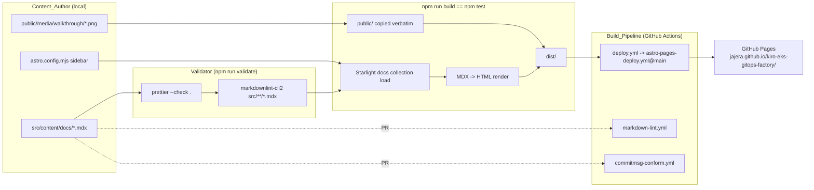
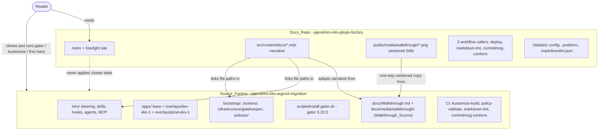

# Design Document

## Overview

This design specifies a greenfield Astro + Starlight **Docs_Site** hosted in the **Docs_Repo**
(`jajera/kiro-eks-gitops-factory`) and published to GitHub Pages at
`https://jajera.github.io/kiro-eks-gitops-factory/`. It is a documentation-only artifact: it
teaches Labs A-C, Vibe vs Spec, and a Done checklist adapted from the **Walkthrough_Source**
in the **Source_Factory** (`jajera/kiro-eks-argocd-migration`), and it never becomes the system
of record for cluster state (Requirement 10.1-10.7).

The **Reference_Site** (`jajera/amazon-vpc-ipam-multi-account-walkthrough`) is the structural
and editorial template. This design mirrors its layout, npm script names, config file set,
Pages deploy caller, and README shape. It deliberately does **not** carry over the
Reference_Site's IPAM/Terraform subject matter (Requirement 10.7), and it drops its
repo-specific `generate:diagram` script.

Two facts shape most of the design and are stated up front rather than assumed away:

1. **Walkthrough_Source is available locally, but not yet on `origin/main`.** At design time the
   public GitHub tree for `jajera/kiro-eks-argocd-migration` has no `docs/` path (404), while the
   local Source_Factory clone at `/home/johna/workspace/jajera/kiro-eks-argocd-migration/docs/`
   contains the full Walkthrough_Source (`Walkthrough.md`, 19 PNG stills, `slideshow.html`,
   `capture.mjs`, `capture-kiro-configs.mjs`) as **untracked** files (`git status` shows
   `?? docs/`). Content adaptation and Still vendoring therefore use that **local clone path** as
   the canonical input for scaffolding. The degraded-mode contract below applies only if that
   local tree is also missing (Requirements 3.3, 7.1, 7.6, 7.7). Pushing `docs/` to the
   Source_Factory remote remains a Source_Factory concern so Readers can follow links; it is not
   a Docs_Repo build dependency.
2. **Astro does not fail a build on a broken `public/` image reference.** Files under `public/`
   are copied verbatim with no processing, and Markdown image paths are not base-path rewritten
   at build time. Requirement 7.3 and Requirement 7.7 therefore need an explicit mechanism, not
   a hope that `astro build` catches it. See "Base-path correctness" and "Missing-Still handling
   and enforcement honesty".

### Product_Thesis placement

The **Product_Thesis** is not a footnote. It surfaces in four places, each traced:

| Surface                                            | Content                                                                                          | Requirement |
| -------------------------------------------------- | ------------------------------------------------------------------------------------------------ | ----------- |
| `astro.config.mjs` `description` + og/twitter meta | One-line compressed thesis, <= 120 ASCII chars                                                   | 2.2         |
| `index.mdx` landing page                           | Full thesis paragraph + link to Source_Factory for clone/run                                     | 3.4         |
| `why.mdx`                                          | Thesis expanded: ~100-app scale table, the human gate, what the factory does and does not remove | 9.1         |
| `README.md`                                        | Thesis compressed into the single-paragraph description + the "What this is / is not" table      | 8.1, 8.2    |

Canonical formula, used verbatim wherever the thesis is stated in short form:
**skills generate -> hooks enforce -> humans approve.**

### Scope expansion: what this revision adds

The first release shipped eight pages that recap what exists. Requirements 11-18 raise the bar from
recap to implementation, and Requirements 2.6-2.9, 3.7-3.9, 9.9, 9.11-9.13, and 10.2 were revised to
match. Everything above and below stays in force; Decisions D1-D10 are unchanged. What is new:

| Addition                                                                         | Where it lives                                         |
| -------------------------------------------------------------------------------- | ------------------------------------------------------ |
| Three pages: `lab-d-reference`, `autonomy-modes`, `gotchas`                      | Data Models / slugs; Per-Page Content Contracts        |
| Sixteen Embedded_Artifacts with verified line counts and excerpt plans           | Source_Factory Artifact Inventory                      |
| The artifact declaration convention and the excerpt grammar                      | Depth_Bar Mechanics; D14                               |
| A restructured `lab-b.mdx` that Requirement 12.6 forces _(superseded — see D19)_ | Per-Page Content Contracts / `lab-b.mdx`               |
| An opt-in maintainer verification mode                                           | Optional Maintainer Verification Mode; D11             |
| Eight new properties (15-22) and revisions to eight existing ones                | Content_Checker Property Table; Correctness Properties |
| Six new decisions (D11-D16)                                                      | Design Decisions and Tradeoffs                         |

Three more facts join the two numbered at the top of this Overview as things the design states
rather than assumes away:

- **The Source_Factory cannot be a build input, so character-for-character verification cannot run
  in CI.** Requirements 3.7 and 12.10 require exact quotes; Requirement 7.1 requires a standalone
  build. Decision D11 splits the obligation into an offline half that always runs and an opt-in half
  that runs only where a clone exists.
- **Prettier rewrites fenced YAML and JSON inside MDX by default**, which silently breaks quoted
  artifacts. Measured, not assumed — see Decision D13 for the observed diff.
- **Requirement 12.6 fails the shipped `lab-b.mdx` on four of six sections, by design**, and it
  collides with Requirement 9.9's two-sentence cap unless a level-2 heading bounds the pairwise
  walk. Decision D12 and the "Reconciling" section resolve both without weakening either
  requirement. _(Superseded in part by the narrative revision below: Requirement 12.6 is now
  evaluated per page, so it no longer fails those four sections. Decision D12 survives on a
  narrower reason — see D20.)_

### Narrative revision: what this revision changes

The eight shipped pages were reviewed against the Product_Thesis and rejected. The finding was not
"too little depth" — it was that the site read as a recap of mechanisms and a table of contents
rather than as one argument. Four defects were named: mechanism stated before problem; Glossary
identifiers rendered literally in Reader prose (`Source_Factory` eleven times across eight pages); a
six-card landing grid acting as a table of contents; and structural page titles that assert nothing.

The uncomfortable part is that **the first scope expansion contributed to the third and fourth
defects.** The Depth_Bar as designed mandated an ordered list, a `## Tradeoff` section with three
literal labels, and a `## Gotcha` section on each of six pages, plus a per-`##`-section table/Still
pairing rule that forced a fence or a numbered list into every section carrying a screenshot. That
is a uniform module template stamped six times, and stamping it at greater length would have made
the "just talk tutorial" feel worse, not better. Requirements 12.1, 12.3-12.6 and 12.9 were revised
to relax the form while keeping the substance, and Requirements 19 and 20 were appended. This design
follows.

| Addition or change                                                           | Where it lives                                                 |
| ---------------------------------------------------------------------------- | -------------------------------------------------------------- |
| Ten new Sidebar labels, each carrying its page's claim; slugs unchanged      | `astro.config.mjs`; Data Models / File paths and slugs; D23    |
| Frontmatter `title` values restated as claims, decoupled from the labels     | Data Models / Frontmatter schema; D23                          |
| A fixed block order for the landing page, and the card grid replaced         | Narrative Spine Mechanics / The landing page; D17              |
| `Before this:` and `Next:` as the spine thread's two declaration lines       | Narrative Spine Mechanics / The where-you-are thread; D18      |
| `lab-b.mdx` re-derived as one proof in five sections, not eight modules      | Per-Page Content Contracts / `lab-b.mdx`; D19                  |
| Requirement 12.6 evaluated per page; the forced per-section pairing retired  | Depth_Bar Mechanics / Requirement 12.6; Property 17            |
| Property 12 restated: no page owes a `## Tradeoff`; heading vocabulary only  | Correctness Properties / Property 12                           |
| A normalised comparison for Requirement 12.15's heading sequences            | Requirement 12.15: comparing heading sequences; D21            |
| A sweep of every string this design specifies as page copy                   | Reader-Facing Vocabulary Mechanics / Specified-copy sweep; D22 |
| Nine new properties (23-31) and revisions to Properties 2, 6, 12, 16, 17, 19 | Content_Checker Property Table; Correctness Properties         |
| Seven new decisions (D17-D23)                                                | Design Decisions and Tradeoffs                                 |

Three more facts the design states rather than assumes away, joining the five above:

- **The shipped `check-content.mjs` hard-fails any lab page that lacks a literal `## Tradeoff`
  heading** (`scripts/check-content.mjs`, the Property 12 block). The retitled and rewritten lab
  pages cannot pass until that check changes, so Property 12's restatement and the content rewrite
  have to land in the same change. Recorded as R8.
- **Requirement 19.4 is a source-order check, not a content check.** It compares the position of the
  first factory-mechanism term against the position of the first app count, hour count, or the word
  "drift" in the landing page **source**, and frontmatter is part of that source. The order of blocks
  on that page — including the order of frontmatter keys — is therefore a design artifact with a
  machine consequence, not an authoring preference. Fixed in Narrative Spine Mechanics; the
  sensitivity is recorded as R9.
- **Relaxing Requirement 12.4 from machine-enforced to review-gated removes the only mechanical
  backstop a tradeoff had.** Requirement 12.12 accepts that trade explicitly and Requirement 12.10's
  standing rule forbids claiming enforcement that does not exist, so the design records the gap
  rather than papering over it with a weaker check that would pass on boilerplate. Recorded as OQ10,
  alongside OQ11 for the two review-gated criteria in Requirement 19.

---

## Architecture

### Static generation pipeline



`validate` runs before `build` in CI because the reusable workflow takes `validate-command` and
`test-command` as separate inputs and runs validate first (Requirements 5.2, 5.4). Locally the
same two commands give byte-identical coverage, which is the local-to-CI parity story: there is
no CI-only check and no local-only check.

### Docs_Repo vs Source_Factory responsibility boundary



Boundary rules, each traced:

- The Docs_Repo holds **no** runnable `.kiro/` factory config, `apps/`, `bootstrap/`,
  `clusters/`, `infrastructure/gatekeeper/`, or `policies/` tree as system of record
  (Requirement 10.1). The `.kiro/specs/` directory in the Docs_Repo holds this spec only, which
  is authoring metadata, not factory config.
- No hand-scaffolded `apps/demo-nginx` manifests are checked in; Lab C teaches generation in the
  Source_Factory (Requirement 10.3).
- Live Lab D (Argo CD Healthy, ALB ADDRESS, curl 200, prod promote) is out of scope
  (Requirement 10.2) and the Done page checklist covers Labs A-C only (Requirement 9.7).
- No invented live-cluster demo and no `kubectl apply` from a chat interface
  (Requirement 10.4).
- Every clone / gator / kustomize / Kiro `add-app` operation links to the Source_Factory
  (Requirement 10.6).
- Vendoring is a **one-way copy**, not a live dependency: the site builds with the
  Source_Factory offline (Requirement 7.1).
- No Cursor/AI attribution footers in commits or PR bodies (Requirement 10.5). This is a
  contributor convention, enforced by review; the Conform_Workflow checks commit message
  _format_, not attribution content.

---

## Repository File Tree

Every file below is either required by an acceptance criterion or is a mechanical consequence of
one. Files marked _(exists)_ are already in the workspace.

```text
kiro-eks-gitops-factory/
├── .github/
│   └── workflows/
│       ├── deploy.yml                      Req 5.1-5.6  Deploy_Workflow caller
│       ├── markdown-lint.yml               Req 6.1, 6.2, 6.5  Linter_Workflow caller
│       └── commitmsg-conform.yml           Req 6.3, 6.4, 6.5  Conform_Workflow caller
├── .kiro/
│   └── specs/docs-site-scaffold/           authoring metadata only (not factory config, Req 10.1)
├── public/
│   ├── favicon.svg                         Req 2.2  favicon target
│   └── media/
│       └── walkthrough/                    Req 7.1  vendored Stills, source filenames preserved
│           ├── 01-repo-tree.png
│           ├── 07-block-infra-denied.png
│           ├── 08-pdb-rule.png
│           ├── 09-gator-verify.png
│           ├── 10-add-app-session.png
│           ├── 10-vibe-mode.png
│           ├── 10b-add-app-scaffolding.png
│           ├── 11-kustomize-build.png
│           ├── 12-add-app-done.png
│           ├── 13-pr-checks.png
│           ├── 14-kiro-explorer-tree.png
│           ├── 15-steering-profile.png
│           ├── 16-steering-archetypes.png
│           ├── 17-skill-add-app.png
│           ├── 18-skill-migrate.png
│           ├── 19-hooks-grid.png
│           ├── 20-agent-config.png
│           ├── 21-mcp-servers.png
│           └── 22-specs-timeline.png       Req 7.2  the 19 named Stills
├── scripts/
│   ├── check-content.mjs                   Req 7.4, 7.7, 9.9, 12.2-12.7, 12.9, 12.11 (see D6)
│   └── verify-artifacts.mjs                Req 3.7, 12.10 opt-in fidelity mode (see D11)
├── src/
│   ├── components/
│   │   └── Still.astro                     Req 7.3, 7.4  base-path-safe image + capped caption
│   ├── content/
│   │   └── docs/
│   │       ├── index.mdx                   Req 3.1, 3.4  landing + Product_Thesis
│   │       ├── why.mdx                     Req 2.6, 9.1
│   │       ├── setup.mdx                   Req 2.6, 9.2
│   │       ├── lab-a.mdx                   Req 2.6, 9.3
│   │       ├── lab-b.mdx                   Req 2.6, 9.4
│   │       ├── lab-c.mdx                   Req 2.6, 9.5, 15
│   │       ├── lab-d-reference.mdx         Req 2.6, 3.9, 10.2, 18   (new)
│   │       ├── autonomy-modes.mdx          Req 2.6, 3.9, 17         (new)
│   │       ├── vibe-vs-spec.mdx            Req 2.6, 9.6, 11.10, 11.11
│   │       ├── gotchas.mdx                 Req 2.6, 3.9, 16         (new)
│   │       └── done.mdx                    Req 2.6, 9.7
│   ├── content.config.ts                   Starlight content collection (see Content Model)
│   └── env.d.ts                            Astro type ambience
├── .gitignore                              Req 1.9  node_modules, dist, .astro
├── .markdownlint.json                      Req 4.3
├── .nvmrc                                  Req 1.8  contains "22"
├── .prettierignore                         Req 4.2  dist, node_modules, pnpm-lock.yaml
├── .prettierrc                             Req 4.1
├── LICENSE                                 Req 1.10  (exists) MIT, John Ajera 2026
├── README.md                               Req 8.1-8.5  (exists; expand per README Contract)
├── astro.config.mjs                        Req 1.3, 2.1-2.6
├── package-lock.json                       generated by npm install, committed
├── package.json                            Req 1.1, 1.2, 1.4-1.6
└── tsconfig.json                           Req 1.7  extends astro/tsconfigs/strict
```

Deliberately absent, with reasons:

| Not present                                                        | Why                                                                                                        |
| ------------------------------------------------------------------ | ---------------------------------------------------------------------------------------------------------- |
| `scripts/generate-architecture-diagram.mjs`                        | Reference_Site-specific; no requirement asks for a generated diagram. Mermaid in MDX covers diagram needs. |
| `src/data/`                                                        | Reference_Site has it for IPAM datasets. No requirement needs structured data here.                        |
| `.vscode/`                                                         | No requirement. Editor config is contributor preference.                                                   |
| `apps/`, `bootstrap/`, `clusters/`, `policies/`, `infrastructure/` | Requirement 10.1, 10.3 forbid them.                                                                        |
| A 4th workflow gating content checks                               | Requirements 5 and 6 fix the workflow set at three callers. See Enforcement Honesty.                       |
| `apps/demo-nginx/` — still absent after Lab C quotes it            | Requirements 15.4, 15.8, 15.9. See the note directly below.                                                |

**`apps/` stays absent even though Lab C now quotes seven files from it.** Requirement 15.1
mandates the `demo-nginx` manifests as page content and Requirement 15.8 forbids the same
manifests as files. Those are not in tension: a fenced block inside
`src/content/docs/lab-c.mdx` is prose that a Reader reads, and the Docs_Repo build never feeds it
to Kustomize, Argo CD, or a policy engine. Requirement 15.4 makes the page say so out loud next
to the first block. Requirement 15.9 makes the checker enforce the file side, and it cites
Property 11 by number, so Property 11's statement is widened below from "no forbidden directory
at the repository root" to "no path anywhere in the tree contains `apps/demo-nginx`" — a Content
Author who pastes a quoted block into a real file to try `kustomize build` locally is exactly the
failure mode 15.9 is aimed at, and a root-level directory check would miss
`src/scratch/apps/demo-nginx/deployment.yaml`.

---

## Components and Interfaces

### `package.json`

Dependency floors come from Requirements 1.1 and 1.2; script strings come from Requirements
1.4-1.6 and must match the Reference_Site exactly where specified.

```json
{
  "name": "kiro-eks-gitops-factory",
  "type": "module",
  "version": "0.0.1",
  "private": true,
  "scripts": {
    "dev": "astro dev",
    "build": "astro build",
    "preview": "astro preview",
    "validate": "prettier --check . && markdownlint-cli2 \"src/**/*.mdx\"",
    "test": "npm run build",
    "format": "prettier --write .",
    "lint": "markdownlint-cli2 \"src/**/*.mdx\"",
    "check:content": "node scripts/check-content.mjs",
    "verify:artifacts": "node scripts/verify-artifacts.mjs"
  },
  "dependencies": {
    "@astrojs/starlight": "^0.41.6",
    "astro": "^7.1.6",
    "starlight-base-path": "^0.2.1",
    "starlight-theme-vintage": "^0.1.0"
  },
  "overrides": {
    "esbuild": "^0.28.1",
    "js-yaml": "^4.2.0",
    "markdown-it": "^14.2.0",
    "sharp": "^0.35.3"
  },
  "devDependencies": {
    "markdownlint-cli2": "^0.22.1",
    "prettier": "^3.5.0",
    "sharp": "^0.35.3",
    "typescript": "^5.8.0"
  }
}
```

Notes on interface decisions:

- `validate` is the literal string from Requirement 1.5. `&&` sequences prettier first,
  markdownlint second, and short-circuits to a non-zero exit on the first failure
  (Requirement 4.4). Nothing else may be appended to this string; see Decision D6.
- `test` is `npm run build`, satisfying Requirement 1.6 and giving the `test-command` input in
  Requirement 5.4 a real meaning.
- `check:content` is an **additional** script. Requirement 1.4 specifies a minimum set, not an
  exhaustive one, and Requirement 1.5 pins only the `validate` string, so adding a sibling
  script does not violate either.
- `verify:artifacts` is the opt-in maintainer mode from Decision D11. The same reasoning applies:
  it is a sibling, not an addition to `validate`. **Requirement 1.5 pins the `validate` string
  character-for-character and nothing may be appended to it**, so `verify:artifacts` is never
  chained into `validate`, never into `test`, and never referenced from any of the three workflow
  callers. Requirement 12.8 names `validate`, `check:content`, and `build` as the three commands
  that must exit 0 — `verify:artifacts` is deliberately not among them, because it depends on a
  Source_Factory clone that CI does not have.
- `overrides` and `sharp` are carried from the Reference_Site: `sharp` is Astro's image
  processing peer, and the three overrides pin transitive advisories. Retained for parity of DX.

### `astro.config.mjs`

```js
import { defineConfig } from "astro/config";
import starlight from "@astrojs/starlight";
import starlightThemeVintage from "starlight-theme-vintage";
import { starlightBasePath } from "starlight-base-path";

const title = "EKS GitOps Factory";
const description =
  "Repeatable EKS and Argo CD app factory: skills generate, hooks enforce, humans approve.";

export default defineConfig({
  site: "https://jajera.github.io",
  base: "/kiro-eks-gitops-factory/",
  integrations: [
    starlight({
      title,
      description,
      favicon: "/favicon.svg",
      head: [
        { tag: "meta", attrs: { property: "og:title", content: title } },
        {
          tag: "meta",
          attrs: { property: "og:description", content: description },
        },
      ],
      plugins: [starlightThemeVintage(), starlightBasePath()],
      social: [
        {
          icon: "github",
          label: "Source Repository",
          href: "https://github.com/jajera/kiro-eks-gitops-factory",
        },
      ],
      editLink: {
        baseUrl: "https://github.com/jajera/kiro-eks-gitops-factory/edit/main/",
      },
      sidebar: [
        { label: "Home", link: "/" },
        { label: "Why manual onboarding breaks", slug: "why" },
        { label: "Install the toolchain", slug: "setup" },
        { label: "Prove policy offline (Lab A)", slug: "lab-a" },
        { label: "What makes prompts safe (Lab B)", slug: "lab-b" },
        { label: "Onboard an app (Lab C)", slug: "lab-c" },
        { label: "Lab D (out of scope)", slug: "lab-d-reference" },
        { label: "Choose an autonomy mode", slug: "autonomy-modes" },
        { label: "Vibe or spec, and when", slug: "vibe-vs-spec" },
        { label: "Known scars and fixes", slug: "gotchas" },
        { label: "Evidence checklist", slug: "done" },
      ],
    }),
  ],
});
```

**Every label changed in the narrative revision; every slug did not.** Requirement 2.6 as revised
fixes these ten label strings, and Requirements 2.10-2.12 fix three constraints on them. The label
now states what its page proves rather than what the page is about, which is Requirement 19.17's
review-gated rule made concrete for the one surface where the strings are pinned exactly.

| Slug              | Label (Requirement 2.6)           | Length | Claim the label carries                             |
| ----------------- | --------------------------------- | -----: | --------------------------------------------------- |
| —                 | `Home`                            |      4 | landing                                             |
| `why`             | `Why manual onboarding breaks`    |     28 | the problem is real and has a cost                  |
| `setup`           | `Install the toolchain`           |     21 | an action, not a topic                              |
| `lab-a`           | `Prove policy offline (Lab A)`    |     28 | policy passes before any cluster exists             |
| `lab-b`           | `What makes prompts safe (Lab B)` |     31 | the configuration is what makes a thin prompt safe  |
| `lab-c`           | `Onboard an app (Lab C)`          |     22 | a thin prompt produces a compliant dual-overlay app |
| `lab-d-reference` | `Lab D (out of scope)`            |     20 | pinned verbatim by Requirement 2.11                 |
| `autonomy-modes`  | `Choose an autonomy mode`         |     23 | a decision the Reader makes                         |
| `vibe-vs-spec`    | `Vibe or spec, and when`          |     22 | a decision with a condition attached                |
| `gotchas`         | `Known scars and fixes`           |     21 | a lookup surface, and what it gives you             |
| `done`            | `Evidence checklist`              |     18 | what you can now show                               |

The longest label is 31 characters, so Requirement 2.12's 32-character cap holds with one character
of headroom on `lab-b`. Property 23 asserts the cap over the whole array rather than over today's
eleven entries, because the next label added is the one that will exceed it.

Five notes on the sidebar (Requirement 2.6 as amended by the scope expansion and again by the
narrative revision):

- **Slugs are immutable while labels churn (Requirement 2.10).** Property 1 asserts set equality
  between Sidebar slugs and page basenames, so a slug rename is a build break and a content-move at
  once. The narrative revision changes ten label strings and zero slugs deliberately: labels are
  prose and can be argued about, slugs are identifiers in links, anchors, and the Property 1
  contract. Property 23 pins the slug set against the list Requirement 2.6 names so a future label
  edit cannot quietly take a slug with it.

- **The label `Lab D (out of scope)` is load-bearing, not cosmetic.** Property 10 requires every
  "Lab D" mention to sit within 80 characters of "out of scope". A label of plain `Lab D` would
  make the requirement that mandates the entry (2.6) and the property that guards the boundary
  (10.2) contradict each other. The parenthetical is what keeps Property 10 satisfiable once the
  checker's Property 10 scan is extended to the sidebar array. See the revised Property 10.
  Requirement 2.11 now pins this one label as an exact string for that reason, so it is the only
  label the narrative revision left untouched.
- **The label is not the title (Requirement 2.13).** The Sidebar label is the claim compressed to
  fit a 32-character column; the frontmatter `title` states the same claim in full and may be
  longer. `lab-b`'s label is `What makes prompts safe (Lab B)` while its title is
  `Lab B: the configuration is what makes a thin prompt safe`. The two caps are independent and
  live in different files, so neither constrains the other — see Data Models / Frontmatter schema
  for the worked lengths and D23 for the reasoning.
- **Requirement 2.8 makes Property 1 a hard gate on this array.** Set equality means the three
  new page files and the three new sidebar entries must land in the same change (Requirement
  2.9). Adding `gotchas.mdx` without its entry fails Property 1 as an orphan page; adding the
  entry without the file fails both Property 1 and `astro build`.
- Slug order is `lab-d-reference` -> `autonomy-modes` -> `vibe-vs-spec` -> `gotchas` -> `done`,
  which is the exact sequence Requirement 2.6 lists. Reading order therefore runs labs, then the
  live-path reference, then the two "how to work" pages, then troubleshooting, then evidence.

Traced decisions:

| Element            | Value                        | Requirement         | Note                                                                                                                                                                                                                                                                        |
| ------------------ | ---------------------------- | ------------------- | --------------------------------------------------------------------------------------------------------------------------------------------------------------------------------------------------------------------------------------------------------------------------- |
| `site`             | `https://jajera.github.io`   | 1.3                 | Origin only; repo path lives in `base`.                                                                                                                                                                                                                                     |
| `base`             | `/kiro-eks-gitops-factory/`  | 1.3                 | Leading and trailing slash both required for correct Pages asset resolution.                                                                                                                                                                                                |
| `title`            | `EKS GitOps Factory`         | 2.1                 | Exact string. **Unchanged by the narrative revision** — this is the site title, pinned by 2.1, not a page title. Nothing keys off the per-page titles that changed.                                                                                                         |
| `description`      | 94 chars, plain ASCII        | 2.2                 | Under the 120 cap; carries the thesis formula. Requirement 20 does not reach it: it renders as a `<meta content="...">` attribute, not an HTML text node, and Requirement 20.2's frontmatter clause scopes to page frontmatter. It carries no banned identifier regardless. |
| `favicon`          | `/favicon.svg`               | 2.2                 | Starlight resolves this against `base` itself.                                                                                                                                                                                                                              |
| `head`             | og:title, og:description     | 2.2                 | Derived from the two consts, so they cannot drift.                                                                                                                                                                                                                          |
| `plugins`          | vintage then base-path       | 2.3                 | Order mirrors the Reference_Site: theme first, path rewriting last so it sees final output.                                                                                                                                                                                 |
| `social`           | github -> **Docs_Repo**      | 2.4                 | **Intentional.** See below.                                                                                                                                                                                                                                                 |
| `editLink.baseUrl` | Docs_Repo `/edit/main/`      | 2.5                 | Edit must land on the file being read, which lives here.                                                                                                                                                                                                                    |
| `sidebar`          | Home + 10 slugs, fixed order | 2.6, 2.8, 2.10-2.13 | Explicit array, no autogenerate. Widened from 7 by the scope expansion; all ten labels restated by the narrative revision, slugs unchanged.                                                                                                                                 |

**On the social link pointing at the Docs_Repo (Requirement 2.4).** A naive reading says the
"Source Repository" link should point at the Source_Factory, since that is where the factory
lives. It does not. The Reference_Site's convention is that the github social icon means "the
source of this website", and Requirement 2.4 names
`https://github.com/jajera/kiro-eks-gitops-factory` explicitly. The Source_Factory is reached
through prose links on the landing, setup, and lab pages instead (Requirements 3.4, 10.6), where
the link text can say what the Reader is being sent there to do. Keeping the chrome link on the
Docs_Repo and the semantic links in content is the clearer split.

**On the `head` array scope.** Requirement 2.2 asks for og:title and og:description. The
Reference_Site additionally sets og:image, og:image dimensions, twitter:card, and twitter:image.
Those are omitted here because they require a social-preview image asset that no requirement
calls for. Adding them later is a one-line change plus one PNG.

### `Still.astro`

A four-line component that exists to make two requirements mechanically true rather than
review-dependent.

```astro
---
interface Props {
  src: string;   // path under public/, e.g. "media/walkthrough/09-gator-verify.png"
  alt: string;
  caption: string;
}
const { src, alt, caption } = Astro.props;
const href = `${import.meta.env.BASE_URL}${src}`.replace(/\/{2,}/g, "/");
---

<figure>
  
  <figcaption>{caption}</figcaption>
</figure>
```

Why it exists:

- `import.meta.env.BASE_URL` is `/kiro-eks-gitops-factory/` at build time, so every Still is
  base-path prefixed by construction (Requirement 7.3). Authors cannot forget the prefix because
  they never type it.
- `caption` is a named prop, which gives `scripts/check-content.mjs` a single deterministic
  pattern to parse when enforcing the one-sentence / 120-character cap
  (Requirements 7.4, 9.9).
- `alt` is required by the interface, so accessibility is not optional.

### Workflow callers

Three separate files, each a thin caller. Requirements 6.2 and 6.4 explicitly forbid collapsing
these into a `markdown-pr-checks` or `astro-docs-pr-checks` bundle.

`.github/workflows/deploy.yml` (Requirements 5.1-5.6):

```yaml
name: Deploy to GitHub Pages
on:
  push:
    branches: [main]
  workflow_dispatch:
concurrency:
  group: pages
  cancel-in-progress: false
permissions:
  contents: read
  pages: write
  id-token: write
jobs:
  pages:
    uses: actionsforge/actions/.github/workflows/astro-pages-deploy.yml@main
    with:
      node-version: "22"
      validate-command: npm run validate
      test-command: npm run test
```

`.github/workflows/markdown-lint.yml` (Requirements 6.1, 6.2, 6.5):

```yaml
name: Markdown Lint
on:
  pull_request: {}
permissions:
  statuses: write
  checks: write
  contents: read
  pull-requests: read
jobs:
  markdown-lint:
    uses: actionsforge/actions/.github/workflows/markdown-lint.yml@main
```

`.github/workflows/commitmsg-conform.yml` (Requirements 6.3, 6.4, 6.5):

```yaml
name: Commit Message Conformance
on:
  pull_request: {}
permissions:
  statuses: write
  checks: write
  contents: read
  pull-requests: read
jobs:
  commitmsg-conform:
    uses: actionsforge/actions/.github/workflows/commitmsg-conform.yml@main
```

Failure propagation (Requirements 5.6, 6.6) is inherited, not implemented: a reusable workflow
whose called job fails marks the calling job failed, which marks the run failed, which lets
branch protection treat each of the three as a required status check. No `continue-on-error`
anywhere.

`node-version: "22"` in `deploy.yml` and `22` in `.nvmrc` are the same value by design
(Requirements 1.8, 5.3). The Reference_Site has `.nvmrc` at `20` while its deploy pins `22`;
Requirement 1.8 exists specifically to remove that mismatch, so local and CI Node majors agree.

### Validator configuration

`.prettierrc` (Requirement 4.1, plus one key the scope expansion forces — see Decision D13):

```json
{
  "semi": true,
  "singleQuote": false,
  "tabWidth": 2,
  "trailingComma": "all",
  "embeddedLanguageFormatting": "off"
}
```

The first four keys are the values Requirement 4.1 names. `embeddedLanguageFormatting: "off"` is
additive and contradicts none of them; it is required because prettier reformats fenced YAML,
JSON, and JS inside MDX by default, which silently rewrites Embedded_Artifacts and breaks
Requirement 3.7. This was measured, not assumed — see Decision D13 for the observed diff.

`.prettierignore` (Requirement 4.2):

```text
dist
node_modules
pnpm-lock.yaml
```

`.markdownlint.json` (Requirement 4.3), verbatim from the Reference_Site:

```json
{
  "default": true,
  "MD013": false,
  "MD033": false,
  "MD041": false
}
```

Why these three are disabled, since it matters for content style:

- `MD013` (line length) off: prose wraps at the author's discretion; prettier owns formatting.
- `MD033` (inline HTML) off: required, because `<Still />` and `<figure>` appear in MDX.
- `MD041` (first line must be H1) off: required, because Starlight MDX starts with frontmatter
  and derives the H1 from `title`.

`.gitignore` (Requirement 1.9):

```text
node_modules/
dist/
.astro/
```

`tsconfig.json` (Requirement 1.7):

```json
{ "extends": "astro/tsconfigs/strict" }
```

`.nvmrc` (Requirement 1.8): the single line `22`.

---

## Data Models

### Content collection configuration

Starlight 0.41 on Astro 7 requires an explicit content collection definition; there is no
implicit docs collection. Astro 6+ also rejects the legacy `src/content/config.ts` location and
demands `src/content.config.ts` with a loader per collection.
[Starlight manual setup](https://starlight.astro.build/manual-setup/) documents the exact shape,
and the Reference_Site carries the same file. _(Content rephrased for compliance with licensing
restrictions.)_

`src/content.config.ts`:

```ts
import { defineCollection } from "astro:content";
import { docsLoader } from "@astrojs/starlight/loaders";
import { docsSchema } from "@astrojs/starlight/schema";

export const collections = {
  docs: defineCollection({ loader: docsLoader(), schema: docsSchema() }),
};
```

This is not optional and not a stylistic choice: without it the `docs` collection does not
exist and `npm run build` fails, which would break Requirements 1.11, 2.7, and 3.6.

### Frontmatter schema

`docsSchema()` supplies the full Starlight frontmatter contract. This design uses a deliberately
small subset so that content stays uniform and machine-checkable:

| Field         | Type                            | Required   | Requirement | Notes                                                 |
| ------------- | ------------------------------- | ---------- | ----------- | ----------------------------------------------------- |
| `title`       | string, non-empty               | yes        | 3.1         | Becomes the page H1 and the `<title>`.                |
| `description` | string, non-empty, <= 160 chars | yes        | 3.1         | Feeds per-page meta description.                      |
| `template`    | `"splash"`                      | index only | 3.4         | Landing page only, for a hero-style thesis statement. |

No other frontmatter keys are used. `sidebar.order` is not used because the sidebar is an
explicit array in `astro.config.mjs` (Requirement 2.6), so ordering has exactly one source of
truth. Requirement 3.1 only mandates title and description on the index page; this design
extends the rule to every page so that the frontmatter property below is checkable uniformly.

**Titles after the narrative revision (Requirement 2.13).** The Sidebar label and the frontmatter
`title` state the same claim at two lengths. The label is capped at 32 characters by Requirement
2.12 because it renders in a fixed-width navigation column; the title has no cap and becomes the
page H1 and the `<title>`, so it states the claim as a sentence. Requirement 2.13 permits the two
to differ, and here they differ on every page.

| Page              | Frontmatter `title`                                          | Chars | Sidebar label                     | Chars |
| ----------------- | ------------------------------------------------------------ | ----: | --------------------------------- | ----: |
| `index`           | `EKS GitOps Factory`                                         |    18 | `Home`                            |     4 |
| `why`             | `Why manual GitOps onboarding breaks at 100 apps`            |    47 | `Why manual onboarding breaks`    |    28 |
| `setup`           | `Install the toolchain before Lab A`                         |    33 | `Install the toolchain`           |    21 |
| `lab-a`           | `Lab A: policy passes before any cluster exists`             |    46 | `Prove policy offline (Lab A)`    |    28 |
| `lab-b`           | `Lab B: the configuration is what makes a thin prompt safe`  |    57 | `What makes prompts safe (Lab B)` |    31 |
| `lab-c`           | `Lab C: a thin prompt produces a compliant dual-overlay app` |    58 | `Onboard an app (Lab C)`          |    22 |
| `lab-d-reference` | `Lab D (out of scope): what the live path looks like`        |    51 | `Lab D (out of scope)`            |    20 |
| `autonomy-modes`  | `Choose an autonomy mode: Autopilot or Supervised`           |    48 | `Choose an autonomy mode`         |    23 |
| `vibe-vs-spec`    | `Vibe or spec, and when each earns its keep`                 |    42 | `Vibe or spec, and when`          |    22 |
| `gotchas`         | `Known scars, and how to get past them`                      |    37 | `Known scars and fixes`           |    21 |
| `done`            | `Evidence checklist: what Labs A-C proved`                   |    40 | `Evidence checklist`              |    18 |

Three consequences worth stating, because each is a thing that could have broken and does not:

- **The `description` cap and the label cap are independent and both representable.** Property 2's
  160-character `description` cap applies to frontmatter; Property 23's 32-character cap applies to
  the `label` strings in `astro.config.mjs`. They live in different files and constrain different
  values, and the longest title (58) is under neither cap because titles have no cap. Requirement
  2.13 is what makes that legal rather than an inconsistency.
- **Nothing else keys off the old titles.** The sidebar uses explicit `label` strings rather than
  `autogenerate`, so it never reads a page title; `editLink` is path-based; Property 1 is
  slug-based; Property 2 asserts a non-empty title, not a particular string; Property 10 scans for
  the substring "Lab D" wherever it appears. The site title in `astro.config.mjs` is a separate
  module-scope constant pinned by Requirement 2.1 and does not change.
- **`index` keeps a topic title on purpose.** It is not a Lesson_Page, so Requirement 19.17 does not
  bind it, and the string feeds the `<title>` element where the site name is what a search result
  should show. The landing page carries its claim in the hero tagline instead, which is where
  Requirement 19.3 puts the obligation.

### File paths and slugs

Starlight derives a slug from the file path under `src/content/docs/`, minus the extension.
Flat files therefore produce exactly the slugs Requirement 2.6 names:

| File                                | Slug           | Sidebar label                     | Requirement     |
| ----------------------------------- | -------------- | --------------------------------- | --------------- |
| `src/content/docs/index.mdx`        | `/` (root)     | `Home`                            | 2.6, 3.1, 3.4   |
| `src/content/docs/why.mdx`          | `why`          | `Why manual onboarding breaks`    | 2.6, 9.1, 19.8  |
| `src/content/docs/setup.mdx`        | `setup`        | `Install the toolchain`           | 2.6, 9.2        |
| `src/content/docs/lab-a.mdx`        | `lab-a`        | `Prove policy offline (Lab A)`    | 2.6, 9.3, 19.9  |
| `src/content/docs/lab-b.mdx`        | `lab-b`        | `What makes prompts safe (Lab B)` | 2.6, 9.4, 19.10 |
| `src/content/docs/lab-c.mdx`        | `lab-c`        | `Onboard an app (Lab C)`          | 2.6, 9.5, 19.11 |
| `lab-d-reference.mdx`               | `lab-d-...`    | `Lab D (out of scope)`            | 2.6, 18.1, 2.11 |
| `autonomy-modes.mdx`                | `autonomy-...` | `Choose an autonomy mode`         | 2.6, 17.1       |
| `src/content/docs/vibe-vs-spec.mdx` | `vibe-vs-spec` | `Vibe or spec, and when`          | 2.6, 9.6        |
| `gotchas.mdx`                       | `gotchas`      | `Known scars and fixes`           | 2.6, 16.1       |
| `src/content/docs/done.mdx`         | `done`         | `Evidence checklist`              | 2.6, 9.7, 19.12 |

**Sidebar order is also the spine order, and the first and last entries matter mechanically.**
Requirements 19.13 and 19.14 exempt "the first page in Sidebar order" and "the last page in Sidebar
order" respectively. Reading the array top to bottom, the first entry is the `Home` link to `/`,
which resolves to `index.mdx`, and the last is `done`. So the chain is
`index -> why -> setup -> lab-a -> lab-b -> lab-c -> lab-d-reference -> autonomy-modes ->
vibe-vs-spec -> gotchas -> done`: `index` owes a next link and no previous link, `done` owes a
previous link and no next link, and the nine pages between owe both. The full pairing is tabled in
Narrative Spine Mechanics.

The three rows added by the scope expansion take the same flat single-segment shape as the
original eight, so Decision D1 stands unchanged: `lab-d-reference` and `autonomy-modes` are bare
slugs, not `labs/lab-d-reference`. Eleven flat files is still one linear reading order.

**Lesson_Pages versus content pages.** Six of the ten non-index pages are Lesson_Pages
(`lab-a`, `lab-b`, `lab-c`, `lab-d-reference`, `autonomy-modes`, `gotchas`) and must clear the
Depth_Bar. `why`, `setup`, `vibe-vs-spec`, and `done` are content pages: they carry parity
obligations (Requirements 9.1, 9.2, 11.10, 11.11, 11.12, 9.7) but not the Depth_Bar. That split
matters for three properties whose page sets are now different from each other, so it is stated
once here and referenced rather than re-derived:

| Page set                | Members                                                                   | Properties scoped to it                                    |
| ----------------------- | ------------------------------------------------------------------------- | ---------------------------------------------------------- |
| All content pages       | all eleven including `index`                                              | 1, 2, 3, 4, 5, 6 (intro conjunct), 7, 8, 9, 10, 22, 29, 30 |
| Lesson_Pages (six)      | `lab-a`, `lab-b`, `lab-c`, `lab-d-reference`, `autonomy-modes`, `gotchas` | 6 (pair conjunct), 12, 17, 19, 31                          |
| Command pages (two)     | `lab-a`, `lab-c`                                                          | 16                                                         |
| Artifact pages (three)  | `lab-a`, `lab-b`, `lab-c`                                                 | 15 (the at-least-one clause)                               |
| Spine pages (six)       | `index`, `why`, `lab-a`, `lab-b`, `lab-c`, `done`                         | 28                                                         |
| Landing page (one)      | `index`                                                                   | 24, 25                                                     |
| Thread pages (ten each) | all but `index` for 26; all but `done` for 27                             | 26, 27                                                     |
| Gotchas_Page (one)      | `gotchas`                                                                 | 20                                                         |
| Sidebar array           | eleven entries in `astro.config.mjs`                                      | 23, and the label half of 10 and 29                        |

The narrative revision adds four page sets to this table and narrows one. Requirement 12.3 splitting
the ordered-list obligation off to `lab-a` and `lab-c` creates the **command pages** set; Requirements
19.15 and 19.16 create the **spine pages** set; Requirements 19.2-19.7 create a one-page set for the
landing page; and Requirements 19.13 and 19.14 create two overlapping ten-page sets that differ by
which end they exempt. Nine sets rather than four is a real increase in what a maintainer has to hold
in their head, which is why the sets are named here once and referenced rather than re-derived per
property.

`.mdx` rather than `.md` for all pages, for two reasons: the `<Still />` component and Mermaid
blocks need MDX, and Requirements 1.4 / 4.4 scope markdownlint to `src/**/*.mdx`, so a `.md`
page under `src/` would silently escape linting.

The optional slideshow bonus page (Requirement 3.5) is **not** included in the initial scaffold.
It is a MAY. The source `slideshow.html` exists in the local Walkthrough_Source, but adding a
ninth page would require a sidebar entry that Requirement 2.6 does not list. It is deferred and
recorded as an open question (OQ4) instead of being served as an unlinked static asset that
Readers cannot discover from navigation.

### Still inventory model

Requirement 7.2 names 19 Stills, grouped by the lab that consumes them. This is the data model
for the media directory and for the content-mapping table below.

| Group            | Stills                                                                                                                                                                                                                                                                 | Requirement   |
| ---------------- | ---------------------------------------------------------------------------------------------------------------------------------------------------------------------------------------------------------------------------------------------------------------------- | ------------- |
| Lab A            | `09-gator-verify.png`                                                                                                                                                                                                                                                  | 7.2, 9.3      |
| Lab B config map | `01-repo-tree.png`, `14-kiro-explorer-tree.png`, `15-steering-profile.png`, `16-steering-archetypes.png`, `17-skill-add-app.png`, `18-skill-migrate.png`, `19-hooks-grid.png`, `08-pdb-rule.png`, `20-agent-config.png`, `21-mcp-servers.png`, `22-specs-timeline.png` | 7.2, 9.4      |
| Lab C / Vibe     | `10-add-app-session.png`, `10b-add-app-scaffolding.png`, `07-block-infra-denied.png`, `11-kustomize-build.png`, `12-add-app-done.png`, `13-pr-checks.png`, `10-vibe-mode.png`                                                                                          | 7.2, 9.5, 9.6 |

Requirement 7.2 says "when present in Walkthrough_Source", so this is a target inventory, not a
precondition. Filenames are preserved exactly, including the `10b-` variant and the two
different `10-` prefixes, so that a future re-vendor is a plain directory copy with no rename
map to maintain (Requirement 7.1).

---

## Content Mapping

Each page adapts a Walkthrough_Source section rather than inventing factory facts
(Requirement 3.3). Where a claim is uncertain, the page links the Source_Factory file path
instead of asserting behaviour.

| Page                  | Walkthrough_Source section adapted                 | Stills referenced                                                                                                                                                                                                                                                      | Source_Factory paths linked                                                                                                                                                                                                                       | Requirements      |
| --------------------- | -------------------------------------------------- | ---------------------------------------------------------------------------------------------------------------------------------------------------------------------------------------------------------------------------------------------------------------------- | ------------------------------------------------------------------------------------------------------------------------------------------------------------------------------------------------------------------------------------------------- | ----------------- |
| `index.mdx`           | Intro / thesis framing                             | none                                                                                                                                                                                                                                                                   | repo root, `README.md`                                                                                                                                                                                                                            | 3.1, 3.4          |
| `why.mdx`             | Why this exists, ~100-app scale table, human gate  | none                                                                                                                                                                                                                                                                   | `.kiro/steering/`, `.kiro/hooks/`                                                                                                                                                                                                                 | 9.1               |
| `setup.mdx`           | Prerequisites and gator install                    | none                                                                                                                                                                                                                                                                   | `scripts/install-gator.sh`, `infrastructure/gatekeeper/`                                                                                                                                                                                          | 9.2               |
| `lab-a.mdx`           | Lab A offline admission                            | `09-gator-verify.png`                                                                                                                                                                                                                                                  | `infrastructure/gatekeeper/tests/`, `policies/overlays/dev-eks-1`, `policies/overlays/prod-eks-1`, `scripts/install-gator.sh`                                                                                                                     | 9.3               |
| `lab-b.mdx`           | Lab B `.kiro/` config map                          | `01-repo-tree.png`, `14-kiro-explorer-tree.png`, `15-steering-profile.png`, `16-steering-archetypes.png`, `17-skill-add-app.png`, `18-skill-migrate.png`, `19-hooks-grid.png`, `08-pdb-rule.png`, `20-agent-config.png`, `21-mcp-servers.png`, `22-specs-timeline.png` | `.kiro/steering/`, `.kiro/skills/add-app`, `.kiro/skills/migrate-workload`, `.kiro/hooks/`, `.kiro/agents/eks-migration`, `.kiro/settings/mcp.json`, `.kiro/specs/`                                                                               | 9.4               |
| `lab-c.mdx`           | Lab C Kiro onboarding of `demo-nginx`              | `10-add-app-session.png`, `10b-add-app-scaffolding.png`, `07-block-infra-denied.png`, `11-kustomize-build.png`, `12-add-app-done.png`, `13-pr-checks.png`                                                                                                              | `.kiro/skills/add-app`, `.kiro/hooks/`, `apps/demo-nginx/` (as generated output, not checked in here)                                                                                                                                             | 9.5, 10.3         |
| `lab-d-reference.mdx` | Lab D - Live path (Walkthrough lines 386-407)      | none (frames 23-25 are pending notes)                                                                                                                                                                                                                                  | `docs/Walkthrough.md`, `apps/demo-nginx/overlays/`                                                                                                                                                                                                | 10.2, 18          |
| `autonomy-modes.mdx`  | Autonomy modes (Walkthrough lines 411-428)         | none                                                                                                                                                                                                                                                                   | `.kiro/hooks/block-infra-commands.kiro.hook`, `.kiro/specs/`                                                                                                                                                                                      | 17                |
| `vibe-vs-spec.mdx`    | Vibe vs Spec mode discussion (lines 310-384)       | `10-vibe-mode.png`                                                                                                                                                                                                                                                     | `.kiro/specs/`, `.kiro/steering/`                                                                                                                                                                                                                 | 9.6, 11.10, 11.11 |
| `gotchas.mdx`         | scars and failure modes (no single source section) | none                                                                                                                                                                                                                                                                   | `scripts/install-gator.sh`, `infrastructure/gatekeeper/base/vendored/chart/gatekeeper/Chart.yaml`, `.kiro/steering/`, `.kiro/hooks/validate-app-scaffold.kiro.hook`, `infrastructure/gatekeeper/constraints/`, `infrastructure/gatekeeper/tests/` | 16                |
| `done.mdx`            | Evidence checklist, Labs A-C only                  | none                                                                                                                                                                                                                                                                   | `.github/workflows/kustomize-build.yml`, `.github/workflows/policy-validate.yml`                                                                                                                                                                  | 9.7, 10.2         |

**The Gotchas_Page has no Walkthrough_Source section to adapt.** Requirement 16 is pure depth-gap
content: Walkthrough_Source mentions the PDB scar and the gator pin in passing but has no
troubleshooting section and no gator failure-mode analysis at all. Every value on that page is
therefore verified against a Source_Factory file rather than adapted from prose, and the verified
values are recorded in "Source_Factory Artifact Inventory" below so review has a reference
(Requirement 11.13).

### Per-page content contracts

These are the specific facts each page must carry. Primary source is the local Walkthrough_Source
(`docs/Walkthrough.md`); secondary verification uses the public Source_Factory trees (`.kiro/`,
`scripts/`, `infrastructure/gatekeeper/`, CI workflows) and README.

**`index.mdx`** (Requirements 3.1, 3.4, and Requirements 19.2-19.7 as added by the narrative
revision). Frontmatter title + description. Product_Thesis in full: manual GitOps onboarding does
not scale at roughly 100 apps; factory + Kiro removes re-deciding tree shape and silent drift; it
does **not** remove workload understanding, IAM shrink, DNS/TLS, or cutover risk; formula skills
generate -> hooks enforce -> humans approve. Explicit statement that Readers clone and run in the
factory repo, with the link.

**The order in which those facts appear is now fixed, not free.** Requirement 19.4 makes the
landing page's source order machine-checked, and Requirements 19.6 and 19.7 constrain how the labs
are presented. The block-by-block contract is specified in Narrative Spine Mechanics / The landing
page and supersedes the free-form reading of this paragraph; Decision D17 records why the card grid
does not survive.

**`why.mdx`** (Requirement 9.1). Adapt the Walkthrough_Source scale table verbatim in spirit
(values from local source):

| Path                    | Per app    | For 100 apps          |
| ----------------------- | ---------- | --------------------- |
| Manual (experienced)    | ~3-6 h     | ~450 h                |
| Manual (mixed)          | ~1-2 days  | ~150 person-days      |
| Factory + Kiro + review | ~45-90 min | ~75-150 h after setup |

Plus the human gate ("accelerate drafting; do not merge or promote to prod without review") and
a two-column "removes / does not remove" table. Tradeoff: this page is where the honest limits
live, so it must not read as a sales page.

Requirement 19.8 makes this the page that carries spine moves 1, 2, and 3 in full, so the scale table
is move 1's evidence, the "prompting harder does not fix it" paragraph is move 2, and the
knowledge/procedure/refusal/bundle paragraph is move 3. The landing page states all three in
compressed form; this page is where each gets its numbers and its reason. Spine thread: `Before this:`
to `../` and `Next:` to `../setup/`. The formula appears here naming why the split exists at all
(Requirements 19.15, 19.16).

**`setup.mdx`** (Requirement 9.2). Clone the factory repo (`jajera/kiro-eks-argocd-migration`; the
page says "the factory repo", never the Glossary identifier — Requirement 20.3). Install gator via
`./scripts/install-gator.sh` (default pin `GATOR_VERSION=3.22.0`). Expect **gator CLI 3.22.0**,
and note explicitly that this is distinct from the Gatekeeper Helm chart `appVersion` /
chart `version` **3.21.1** in
`infrastructure/gatekeeper/base/vendored/chart/gatekeeper/Chart.yaml` — a version skew that will
confuse Readers if left implicit. Prerequisites: `kustomize`, Node/npx, and Kiro for Lab C.
Document (do not require Readers to run) the Still regeneration scripts
`docs/media/walkthrough/capture.mjs` and `capture-kiro-configs.mjs` (Requirement 7.5).
Placeholder-account callout per Requirement 9.8.

**`lab-a.mdx`** (Requirement 9.3). Commands adapted from Walkthrough_Source, which the page
introduces as commands to run "in your clone of the factory repo":

```bash
gator verify infrastructure/gatekeeper/tests/...
kustomize build policies/overlays/dev-eks-1 >/dev/null
kustomize build policies/overlays/prod-eks-1 >/dev/null
```

Expect all suites `ok`, final `PASS`. Still `09-gator-verify.png`. Tradeoff: offline admission
testing with gator versus waiting for a live cluster webhook.

**`lab-b.mdx`** (Requirement 9.4). The `.kiro/` config map as rendered Stills, never a faked
live Kiro UI (Requirement 7.6). Covers: repo tree and `.kiro` tree; steering `always` versus
`fileMatch`; project-profile; archetypes; skills `add-app` and `migrate-workload`; the hooks
grid plus the PDB scar (`minAvailable: 1` only when `replicas >= 2`); agent `eks-migration`; MCP
with docs servers on and live cluster adapters off until credentials exist; specs as build
history. Plus the layer diagram prompt -> agent -> skill -> hooks -> PR -> human -> Argo, drawn
as Mermaid rather than screenshotted. Tradeoff: steering `always` versus `fileMatch` scoping.

**`lab-c.mdx`** (Requirement 9.5). The exact thin `demo-nginx` prompt from Walkthrough_Source,
quoted verbatim inside a fenced `text` block (not paraphrased):

```text
Add a web-service app named demo-nginx.
Image: public.ecr.aws/nginx/nginx:1.27 (retag into our ECR as demo-nginx).
No Secrets Manager. Egress: DNS + HTTPS as required for probes.
Ingress: yes, hostname demo-nginx.dev.example.com on alb.
Replicas: 2 in both overlays (so PDB minAvailable: 1 is valid).
```

Scaffolding Stills in Walkthrough_Source order: thin prompt (`10-add-app-session.png`),
scaffolding (`10b-add-app-scaffolding.png`), Git-only hook allowing `kustomize`
(`07-block-infra-denied.png`), verify (`11-kustomize-build.png`), done dual overlays
(`12-add-app-done.png`), PR checks (`13-pr-checks.png`). Note that ACCESS DENIED for
`kubectl apply` was not in the Lab C recording — hedged statement with a link to
`.kiro/hooks/block-infra-commands.kiro.hook` (Requirement 3.3). Takeaway: vibe prompt, factory
result because steering / skill / hooks / agent did the heavy lifting. No `apps/demo-nginx`
manifests are checked into this repo (Requirement 10.3). Tradeoff: thin prompt plus hard
guardrails versus a long prescriptive prompt.

**`vibe-vs-spec.mdx`** (Requirement 9.6). Still `10-vibe-mode.png` and the Walkthrough_Source
comparison table (input, feedback loop, when to use which). Lab C is the vibe case;
spec-driven fits multi-phase platform work (operator install, policy bundle, CI, bootstrap).

**`done.mdx`** (Requirement 9.7). Evidence checklist for Labs A-C only (Walkthrough_Source Done
rows: Lab A gator `PASS`; Lab B config-map screenshots understood; Lab C dual overlays + PR checks).
Explicitly states that Live Lab D is out of scope (Requirement 10.2), so a Reader does not read
the checklist as incomplete.

Requirement 19.12 makes this the page that closes the spine: humans still merge, and the human gate
is the design rather than a shortfall. That is where the formula's third clause finally gets earned
rather than quoted (Requirements 19.15, 19.16). It is the **last** page in Sidebar order, so
Requirement 19.14 exempts it from a `Next:` line and it carries only `Before this:` to `../gotchas/`.

### Placeholder-account rule

Requirement 9.8 applies wherever `111122223333`, `444455556666`, or `ap-southeast-2` appear.
The rule is mechanical: the first occurrence on any page is immediately followed by a Starlight
`:::caution` callout naming them as placeholders and telling the Reader to replace them before
live IAM/ECR. Subsequent occurrences on the same page do not repeat the callout. Accounts map
`111122223333` -> dev (`dev-eks-1`) and `444455556666` -> prod (`prod-eks-1`).

---

## README Contract

Expands the stub README already in the Docs_Repo to match Requirements 8.1-8.5 and the
Reference_Site pattern. Required shape:

1. Level-1 heading exactly `kiro-eks-gitops-factory`.
2. Single plain-ASCII paragraph matching the GitHub description intent: a repeatable EKS and
   Argo CD app factory with thin Kiro prompts, hard guardrails, and no chat-side cluster apply
   (Requirement 8.1).
3. Link to `https://jajera.github.io/kiro-eks-gitops-factory/` and to
   `https://github.com/jajera/kiro-eks-argocd-migration` (Requirement 8.5).
4. A "What this is / What this is not" table with at least these three rows (Requirement 8.2):

   | This repository                          | Source factory repository                                |
   | ---------------------------------------- | -------------------------------------------------------- |
   | Starlight walkthrough of the factory     | Implementation: `.kiro/`, GitOps trees, Gatekeeper, CI   |
   | Explains why, how, labs, screenshots     | Where you clone, run gator/kustomize, run Kiro `add-app` |
   | May vendor or link to stills from source | Owns manifests, hooks, skills, policy                    |

5. An explicit note that Readers run factory commands in the factory repo; this site only
   documents (Requirement 8.3). Wording, revised for Requirement 20.12: "Run all factory commands
   from the factory repo (`jajera/kiro-eks-argocd-migration`), not from this documentation repo."
   The earlier wording named the Glossary identifier and is retired — README.md is a Reader surface
   on GitHub, so Requirement 20.12 applies the same removal rules there as Requirement 20.5 applies
   to page source. The table's right-hand column header stays `Source factory repository`: that is
   two ordinary words, not the underscored identifier, and Property 29 matches the identifier form.
6. Local development and validation sections with fenced commands `npm install`, `npm run dev`,
   `npm run validate`, and `npm run build` (Requirement 8.4).

`npm run check:content` may be mentioned as an optional authoring aid but is not required by
Requirement 8.

---

## Media Pipeline

### Path and referencing

Stills live at `public/media/walkthrough/<original-filename>.png` (Requirement 7.1). Astro copies
`public/` verbatim into `dist/` with no processing, so the built URL is
`/kiro-eks-gitops-factory/media/walkthrough/<file>.png`.

### Base-path correctness

Astro does **not** rewrite `public/`-relative image paths in Markdown to include `base`. A
Markdown `` renders as a root-absolute URL, which 404s on Pages
because the site is served from a subpath. This is a known and long-standing behaviour
([withastro/astro#5107](https://github.com/withastro/astro/issues/5107)), and it is why
Requirement 7.3 needs a mechanism rather than a convention. _(Content rephrased for compliance
with licensing restrictions.)_

The mechanism is the `<Still />` component, which builds `src` from
`import.meta.env.BASE_URL`. Authors write:

```mdx
<Still
  src="media/walkthrough/09-gator-verify.png"
  alt="gator verify output with all constraint tests passing"
  caption="gator verify runs the full policy suite offline before any cluster exists."
/>
```

Raw Markdown image syntax is prohibited in content pages. `scripts/check-content.mjs` flags any
`` occurrence under `src/content/docs/`. `starlight-base-path` remains configured per
Requirements 1.2 and 2.3 and mirrors the Reference_Site, but this design does not _depend_ on its
rewriting behaviour for Still correctness — the component makes the prefix explicit at build
time regardless.

### Vendoring procedure

One-way copy, performed by a Content_Author, recorded here so it is reproducible:

1. Prefer the local Source_Factory clone that already contains Walkthrough_Source
   (`/home/johna/workspace/jajera/kiro-eks-argocd-migration/docs/media/walkthrough/`). If that
   path is absent, clone/fetch the Source_Factory and ensure `docs/` is present (after it is
   pushed to `origin`, or by obtaining the untracked tree from the author).
2. Copy every `*.png` from `docs/media/walkthrough/` into `public/media/walkthrough/`,
   preserving filenames exactly (Requirement 7.1). Do not copy `node_modules/`, `*.mjs`, or
   `slideshow.html` into `public/` as part of the Still vendor step (slideshow is OQ4).
3. Do not resize, crop, recompress, or composite. Requirement 7.6 prohibits montaged UI, and
   recompression would make future diffs against the source meaningless.
4. Run `npm run check:content` to confirm every referenced Still now resolves.
5. Commit the PNGs in a dedicated commit whose message names the Source_Factory working-tree
   path and, when available, the Source_Factory commit SHA they were taken from. If `docs/` is
   still untracked on the Source_Factory, record the local path and date instead of inventing a
   SHA.

### Regeneration path

Requirement 7.5: the site **documents** the Source_Factory capture scripts
`docs/media/walkthrough/capture.mjs` and `capture-kiro-configs.mjs` as the way Stills are
regenerated. They exist in the local Walkthrough_Source today. The Docs_Site does not ask
Readers to run them, does not vendor them, and the Build_Pipeline never invokes them. They are
named on the Setup page (and optionally in README author notes) as provenance, so a maintainer
knows where refreshed Stills come from.

### Missing-Still handling and enforcement honesty

Requirement 7.7 is a **Content_Author obligation before merge**, not a build gate: vendor the
missing Still, or remove/replace the reference. Never invent a screenshot.

Stating plainly what enforces this:

| Layer                   | Catches a Still referenced but not vendored? | Why                                                                            |
| ----------------------- | -------------------------------------------- | ------------------------------------------------------------------------------ |
| `astro build`           | **No**                                       | `public/` is copied as-is; a dangling URL is a runtime 404, not a build error. |
| `prettier --check`      | No                                           | Formatting only.                                                               |
| `markdownlint-cli2`     | No                                           | No rule resolves `public/` asset existence.                                    |
| `npm run check:content` | **Yes**                                      | Reads every `<Still src=...>`, asserts the file exists under `public/`.        |
| Human review            | Yes                                          | Reviewer sees the rendered preview.                                            |

Because Requirement 1.5 pins the `validate` string and Requirements 5 and 6 pin the workflow set
at three callers, `check:content` is **not** wired into CI. Requirement 7.7 is therefore
enforced by the local script plus review, not by a required status check. That is an accurate
description of the gate, not a workaround. Closing the gap would need a requirements change —
recorded as an open question.

### Primary mode: adapt and vendor from local Walkthrough_Source

Default authoring path (Requirements 3.3, 7.1, 7.2):

1. Read narrative from the local `docs/Walkthrough.md` and adapt into Starlight pages (improve
   navigation; keep facts).
2. Vendor the 19 named PNGs from the local `docs/media/walkthrough/` into
   `public/media/walkthrough/`.
3. Cross-check claims against public Source_Factory paths already on `origin/main` (hooks,
   skills, gator pin, dual overlays). When a claim exists only in unpushed `docs/`, prefer quoting
   Walkthrough_Source and linking the intended Source_Factory path so the page stays honest after
   `docs/` is pushed.

### Degraded mode: local Walkthrough_Source also missing

If neither the local clone nor the remote exposes `docs/Walkthrough.md` / stills, the contract
is:

1. **Narrative from public trees only.** Pages are written from facts verifiable in the
   Source_Factory README and public trees (`.kiro/`, `apps/`, `policies/`,
   `infrastructure/gatekeeper/`, `scripts/`, CI workflows). Anything not verifiable there is
   linked as a file path rather than asserted (Requirement 3.3).
2. **Verbatim material is deferred, not paraphrased.** The exact thin `demo-nginx` prompt
   (Requirement 9.5) and the ~100-app scale table (Requirement 9.1) must not be invented. Use a
   labelled placeholder block until Walkthrough_Source is obtained.
3. **Placeholders are explicit and uniform** (Requirement 7.6). A missing Still renders as:

   ```mdx
   :::note[Still pending]
   Screenshot `09-gator-verify.png` is not vendored yet. It lives at
   `docs/media/walkthrough/09-gator-verify.png` in the factory repo.
   :::
   ```

   Rules: the literal label "Still pending", the exact source filename, the source path.
   No grey box, no mock image, no substituted screenshot from elsewhere.

   The body wording changed in the narrative revision. Requirement 20.7 exempts **the admonition
   title only** — `:::note[Still pending]` is the single piece of Reader-visible text allowed to
   carry a Glossary identifier, because Requirement 18.7 pins that exact string. The body is
   ordinary Reader prose, so it says "the factory repo" and avoids both `Source_Factory` and a
   capitalised `Still`. Property 7 looks for a `.png` filename and a `docs/media/walkthrough/`
   path, neither of which the rewording touches.

4. **`<Still />` is only used for Stills that exist.** A pending Still uses the note block
   instead, which keeps the "every `<Still src>` resolves" property true at all times rather
   than making it conditionally true.
5. **Recovery:** obtain Walkthrough_Source (local untracked tree or pushed remote), re-run
   vendoring, replace pending notes with `<Still />` calls, and replace placeholder blocks with
   verbatim quotes. Both placeholder forms are grep-able.

---

## Source_Factory Artifact Inventory

Requirements 12.11 and 12.7 make line counts a design input, not an implementation detail: a
block over 60 content lines needs an excerpt plan before anyone starts writing the page. Every
row below was read from the Source_Factory working tree at
`/home/johna/workspace/jajera/kiro-eks-argocd-migration` and the counts are `wc -l` values, not
estimates. The Source_Factory is not on the Docs_Repo dependency path; this table is the
authoring input and the review reference.

| Artifact                                                              | Lines | Fence  | Plan                                      | Requirement |
| --------------------------------------------------------------------- | ----- | ------ | ----------------------------------------- | ----------- |
| `infrastructure/gatekeeper/constraint-templates/httpsonly.yaml`       | 71    | `yaml` | **excerpt** `1-4,15-19,35-71` -> 48 lines | 13.2        |
| `infrastructure/gatekeeper/constraints/httpsonly/constraint.yaml`     | 12    | `yaml` | whole                                     | 13.3        |
| `infrastructure/gatekeeper/tests/httpsonly/suite.yaml`                | 15    | `yaml` | whole                                     | 13.4        |
| `infrastructure/gatekeeper/tests/httpsonly/fail.yaml`                 | 17    | `yaml` | whole                                     | 13.5        |
| `.kiro/hooks/block-infra-commands.kiro.hook`                          | 14    | `json` | whole                                     | 14.1        |
| `.kiro/agents/eks-migration.json`                                     | 10    | `json` | whole                                     | 11.7        |
| `.kiro/steering/workload-archetypes.md` (inclusion + archetype rows)  | 111   | `md`   | **excerpt** `1-4,11-13,19-20` -> 11 lines | 14.3        |
| `.kiro/steering/workload-archetypes.md` (web-service contract)        | 111   | `md`   | **excerpt** `44-46,60-76` -> 21 lines     | 14.4        |
| `apps/demo-nginx/base/manifests/deployment.yaml`                      | 56    | `yaml` | whole (4 lines of headroom)               | 15.1        |
| `apps/demo-nginx/base/manifests/ingress.yaml`                         | 23    | `yaml` | whole                                     | 15.1        |
| `apps/demo-nginx/base/manifests/networkpolicy.yaml`                   | 72    | `yaml` | **excerpt** `1-36,55-72` -> 55 lines      | 15.1        |
| `apps/demo-nginx/base/manifests/poddisruptionbudget.yaml`             | 12    | `yaml` | whole                                     | 15.1        |
| `apps/demo-nginx/overlays/dev-eks-1/kustomization.yaml`               | 6     | `yaml` | whole                                     | 15.1        |
| `apps/demo-nginx/overlays/prod-eks-1/kustomization.yaml`              | 6     | `yaml` | whole                                     | 15.1        |
| `apps/demo-nginx/overlays/prod-eks-1/manifests/deployment-patch.yaml` | 18    | `yaml` | whole (**seventh file, see below**)       | 15.2        |
| `docs/Walkthrough.md` Lab D command block                             | 455   | `bash` | **excerpt** `400-404` -> 5 lines          | 18.3        |

Fourteen distinct source files, sixteen blocks. Nothing exceeds 60 content lines after the plans
are applied.

### Excerpt plans in detail

**`httpsonly.yaml` — 71 lines, three segments, two elision markers.** The file is a Gatekeeper
`ConstraintTemplate` whose middle 20 lines are an OpenAPI schema for one boolean parameter
(`tlsOptional`) and whose top 10 lines are a long prose `description`. Neither teaches policy
authoring. The kept segments are:

| Segment | Source lines | Content                                                             | Why kept                                       |
| ------- | ------------ | ------------------------------------------------------------------- | ---------------------------------------------- |
| 1       | 1-4          | `apiVersion`, `kind: ConstraintTemplate`, `metadata.name`           | identifies the artifact                        |
| 2       | 15-19        | `spec.crd.spec.names.kind: K8sHttpsOnly`                            | Requirement 13.6 needs the constraint kind     |
| 3       | 35-71        | `targets`, `rego: \|` and both `violation` rules plus three helpers | Requirement 13.2 needs the Rego violation rule |

Elision markers go between segments 1 and 2 and between segments 2 and 3, each a single line
whose content is `# ...`. Because YAML mappings tolerate omitted sibling keys and a `#` comment,
the excerpt happens to be **valid YAML in its own right** — a reduced ConstraintTemplate with the
schema removed. That is a pleasant side effect, not a requirement, and the block is still labelled
an excerpt with its ranges stated.

**`networkpolicy.yaml` — 72 lines, four YAML documents, two segments.** The four documents are
`default-deny-all` (1-12), `allow-dns-egress` (13-36), `allow-https-egress` (38-54), and
`allow-ingress-alb` (56-72). Kept: `1-36,55-72`, which is deny-all plus DNS egress plus the ALB
ingress allow, 54 content lines with one `# ...` marker between them, 55 total. Segment 2 starts
at line 55 (the `---` separator) so the quoted text remains a well-formed multi-document stream.
The omitted document is `allow-https-egress`; the page names it in prose and links the full file,
which is what Requirement 12.7's "link the full Source_Factory file path" clause is for. Kept
deny-all because it establishes the pattern, DNS because steering makes it mandatory for every
app, and the ALB ingress allow because it is the flow the Lab D `curl` depends on.

**`workload-archetypes.md` — 111 lines, two separate blocks rather than one holed-out excerpt.**
Requirements 14.3 (a steering excerpt including the inclusion-mode frontmatter line) and 14.4 (the
`web-service` Archetype_Contract) are separate criteria, and quoting them as one excerpt would
need five elision markers in a 29-line block. Two blocks need three markers total and each reads
as a coherent unit:

- Block A, `lines 1-4,11-13,19-20`: the `inclusion: fileMatch` / `fileMatchPattern` frontmatter,
  the archetype table header with the `web-service` row, and the two lines stating that every
  archetype except `helm-chart` also gets `serviceaccount.yaml` and `networkpolicy.yaml`.
- Block B, `lines 44-46,60-76`: the "Also required" table row for `web-service` (container port,
  health check path, hostname, readiness + liveness probes) and the whole `## Hardening` section
  through the two PDB lines (`replicas >= 2` -> `minAvailable: 1`, never on a single replica).

The markdown elision marker is `<!-- ... -->` on its own line. Inside a fenced block it is inert
text, so it renders as itself.

**`docs/Walkthrough.md` Lab D command block, lines 400-404.** The declared range is the block
_content_, not the surrounding fence delimiters on lines 399 and 405, which matches the way
Requirement 12.11 counts. There is no interior omission, so no elision marker. Related ranges
recorded here for the same page: the Lab D visual checklist table is lines 390-397 and is
reproduced as a live Markdown table rather than a fenced block, because Requirement 18.2 says
"reproduce" while 18.3 says "as an Embedded_Artifact" — a table inside a fence would not render as
a table.

### The seventh Lab C file, and why Requirement 15.2 needs it

Requirement 15.2 wants one contract-check entry per Archetype_Contract item, and each entry must
name "the quoted file from Requirement 15.1 that carries the item". One of the seven items is a
**placeholder image digest**, and none of the six files Requirement 15.1 names carries a digest:

- `base/manifests/deployment.yaml` line 27 is
  `image: 111122223333.dkr.ecr.ap-southeast-2.amazonaws.com/demo-nginx:1.27` — a mutable tag.
- The digest lives in `overlays/prod-eks-1/manifests/deployment-patch.yaml` line 11 as
  `...demo-nginx:1.27@sha256:REPLACE_WITH_ACTUAL_DIGEST`.

Requirement 15.1 says "at minimum these six named files", so quoting a seventh is permitted, and
without it the digest entry has no file to name. The page therefore carries seven blocks. The
honest observation to state alongside them: the base pins a tag and only the prod overlay pins a
digest placeholder, which is the promotion model (`promote-app` copies a verified digest from dev
to prod) rather than an oversight.

### The two overlay kustomizations are byte-identical

`overlays/dev-eks-1/kustomization.yaml` and `overlays/prod-eks-1/kustomization.yaml` are both
exactly:

```text
apiVersion: kustomize.config.k8s.io/v1beta1
kind: Kustomization
resources:
  - ../../base
patches:
  - path: application-patch.yaml
```

Requirement 15.1 names both, so both are quoted. Quoting two identical six-line files looks like
padding unless the page says why: the dual-overlay guarantee is **structural symmetry**, and the
environment difference lives one level down in `application-patch.yaml` and
`manifests/deployment-patch.yaml` / `manifests/ingress-patch.yaml` (dev host
`demo-nginx.dev.example.com`, prod host `demo-nginx.prod.example.com`, prod digest placeholder).
That is the teaching point, and it is what Requirement 15.2's "presence of both overlays" entry
verifies.

### Verified values the new pages depend on

Recorded here so review has something to check the pages against, per Requirement 11.13.

| Claim                                         | Verified value                                                                                                                                                                                    | Source_Factory path                                                               | Requirement |
| --------------------------------------------- | ------------------------------------------------------------------------------------------------------------------------------------------------------------------------------------------------- | --------------------------------------------------------------------------------- | ----------- |
| gator CLI pin                                 | `GATOR_VERSION="${GATOR_VERSION:-3.22.0}"` (line 14)                                                                                                                                              | `scripts/install-gator.sh`                                                        | 9.13, 16.2  |
| Gatekeeper chart version                      | `3.21.1`                                                                                                                                                                                          | `infrastructure/gatekeeper/base/vendored/chart/gatekeeper/Chart.yaml`             | 9.13, 16.2  |
| Constraint directory count                    | 15                                                                                                                                                                                                | `infrastructure/gatekeeper/constraints/`                                          | 13.8        |
| Gator suite count                             | 14                                                                                                                                                                                                | `infrastructure/gatekeeper/tests/`                                                | 16.9        |
| Hook file count                               | 8                                                                                                                                                                                                 | `.kiro/hooks/`                                                                    | 11.5        |
| Steering file count                           | 6                                                                                                                                                                                                 | `.kiro/steering/`                                                                 | 11.1        |
| Skill count                                   | 4 (`add-app`, `manage-clusters`, `migrate-workload`, `promote-app`)                                                                                                                               | `.kiro/skills/`                                                                   | 11.3        |
| PDB rule encoding, hook side                  | `validate-app-scaffold` prompt step 8: require PDB `minAvailable: 1` when replicas >= 2; remove it at replicas 1                                                                                  | `.kiro/hooks/validate-app-scaffold.kiro.hook`                                     | 16.4        |
| Shell gate event and scope                    | `"when": { "type": "preToolUse", "toolTypes": ["shell"] }`, action `askAgent`                                                                                                                     | `.kiro/hooks/block-infra-commands.kiro.hook`                                      | 14.2        |
| MCP read-only locks                           | `eks` args include `--read-only` and `"disabled": true`; `kubernetes` env `ALLOW_ONLY_NON_DESTRUCTIVE_TOOLS: "true"` and `"disabled": true`; `aws-knowledge` and `filesystem` `"disabled": false` | `.kiro/settings/mcp.json`                                                         | 11.8        |
| Expected `httpsonly` fail-case violation text | `Ingress should be https. tls configuration and allow-http=false annotation are required for test-ingress`                                                                                        | Rego lines 40-47 applied to `fail.yaml` (`test-ingress`, no `tls`, no annotation) | 13.5, 13.6  |

Two discrepancies between Walkthrough_Source and the files themselves, resolved in favour of the
files (Requirement 3.3 forbids inventing facts; a verified file beats a prose summary):

1. **Steering inclusion patterns are narrower than the walkthrough says.** Walkthrough_Source
   summarises three files as conditional on `apps/**` and one on `.github/**`, and Requirement
   11.1 repeats that shorthand. The real `fileMatchPattern` values are
   `["apps/**/*.yaml", "apps/**/*.yml", "apps/**/*.md"]` for `workload-archetypes.md`,
   `["apps/**/*.yaml", "apps/**/*.yml"]` for `identity-and-secrets.md`,
   `["apps/**/*.yaml", "apps/**/*.yml", "policies/**", "scripts/**"]` for `policy-validation.md`,
   and `[".github/workflows/**", ".github/*.json"]` for `ci-workflows.md`. The Lab B steering
   table states the verified globs and notes that `apps/**` is the shorthand. This satisfies
   Requirement 11.1's intent (state the inclusion mode and its file pattern) with a truer value.
2. **`07-block-infra-denied.png` shows an allow, not a deny.** Already recorded as R2. Unchanged
   by the expansion, and Requirement 14.2's field-by-field explanation of the hook is where the
   deny list finally gets shown as text rather than implied by a filename.

---

## Depth_Bar Mechanics

Requirement 12 turns editorial intent into six machine-checkable rules and three review-only
judgments. This section fixes the conventions those rules need, because none of them can be
checked without an agreed surface form.

### What counts as an Embedded_Artifact: the Source declaration line

Requirement 12.2 is precise about the window and silent about the form: the Source_Factory path
must appear "in the 3 source lines immediately preceding the opening fence or in the 3 source
lines immediately following the closing fence". That rules out the obvious candidate. Starlight's
Expressive Code renders a filename header from a `title` attribute on the fence line
(` ```yaml title="..." `), which is exactly one line **too late** — the title is _on_ the opening
fence, not before it. Using it would satisfy a Reader and fail Requirement 12.2 on a literal
reading, and 12.2 is the criterion the checker implements.

The chosen convention is a single visible line immediately preceding the opening fence:

```text
Source: [`infrastructure/gatekeeper/constraint-templates/httpsonly.yaml`](https://github.com/jajera/kiro-eks-argocd-migration/blob/main/infrastructure/gatekeeper/constraint-templates/httpsonly.yaml) lines 1-4,15-19,35-71
```

Grammar, which the checker parses with one regex:

| Part           | Form                                                                                               | Required                          |
| -------------- | -------------------------------------------------------------------------------------------------- | --------------------------------- |
| Literal prefix | the word `Source` followed by a colon and one space                                                | yes                               |
| Path           | one inline-code span holding the Source_Factory-relative path                                      | yes                               |
| Link target    | `<SOURCE_FACTORY_URL>/blob/main/<same path>`                                                       | yes                               |
| Ranges         | one space, the word `lines`, one space, then `A-B` or `A-B,C-D,...` with no spaces inside the list | only when the block is an excerpt |

Why this form and not the alternatives:

| Alternative                                | Why rejected                                                                                                                                                           |
| ------------------------------------------ | ---------------------------------------------------------------------------------------------------------------------------------------------------------------------- |
| Expressive Code `title=` on the fence line | Sits on the fence, not in either 3-line window. Fails Requirement 12.2 literally.                                                                                      |
| MDX comment `{/* source: path */}`         | Machine-parseable and invisible in output — which is the problem. Requirements 3.7 and 12.2 require the path to be **stated on the page**, i.e. visible to the Reader. |
| Free prose ("taken from `x.yaml`:")        | Readable but needs heuristics to parse, and gives the range and the link no fixed slot. Requirement 12.7 needs both to be machine-locatable.                           |
| A frontmatter manifest of artifacts        | Puts the declaration far from the block, so an author reordering blocks silently mismatches paths. Also fails 12.2's adjacency window.                                 |

Four things fall out of this choice for free:

1. The Markdown link supplies the Source_Factory URL, so Requirement 12.7's "link the full
   Source_Factory file path" and Requirement 18.8's per-command linkage are satisfied by
   construction rather than by a separate authoring step.
2. The checker can assert that the path inside the inline-code span equals the path segment after
   `/blob/main/` in the URL. That catches the commonest copy-paste error **offline, with no
   Source_Factory present**.
3. The declaration is the input the opt-in verification mode needs. One convention serves both the
   offline half and the fidelity half of Requirement 3.7.
4. The line costs nothing against Requirement 9.9's two-sentence cap. The Content_Checker strips
   Markdown link text and inline code before counting sentences, so `Source: ... lines 1-4` reduces
   to `Source: lines 1-4`, which has no sentence terminator. The convention therefore mandates
   **no trailing period** on the Source line.

A fence with no Source line is not an Embedded_Artifact and is not checked against Requirements
12.7 or 12.11 — which is exactly what 12.2 says ("counts as an Embedded_Artifact only if"). Reader
commands, expected-output blocks, and Mermaid diagrams are ordinary fences. The residual risk is an
author pasting real Source_Factory YAML with no Source line, which the checker cannot distinguish
from an illustrative snippet. That is a review item and is listed as such, not claimed as covered.

### Excerpt and elision grammar

Requirement 12.7 reads "SHALL quote a contiguous excerpt" and then "SHALL contain exactly one
elision marker line at each omission point", which only cohere under one interpretation, adopted
here: **an excerpt is an order-preserving sequence of one or more contiguous source ranges, and
every gap between consecutive kept ranges carries exactly one marker line.** "Contiguous"
constrains each segment; "each omission point" acknowledges there can be more than one. A single
kept range with nothing before or after it needs no marker, because a leading or trailing
truncation is not an omission point _inside_ the fenced block.

Marker form per language, being the language's comment syntax followed by an ellipsis:

| Fence  | Marker line     | Used by                                 |
| ------ | --------------- | --------------------------------------- |
| `yaml` | `# ...`         | `httpsonly.yaml`, `networkpolicy.yaml`  |
| `md`   | `<!-- ... -->`  | `workload-archetypes.md` blocks A and B |
| `bash` | `# ...`         | none currently                          |
| `json` | **none exists** | see below                               |

**JSON artifacts can never be excerpted.** JSON has no comment syntax, so no marker line can
satisfy Requirement 12.7, so a JSON Embedded_Artifact must be quoted whole and must therefore be
at or below 60 lines. That constraint is satisfiable only because both JSON artifacts in scope are
small: `block-infra-commands.kiro.hook` is 14 lines and `eks-migration.json` is 10. If a future
requirement asked for a larger hook, the options would be quoting the whole file (if <= 60 lines),
linking it, or a requirements change. Recorded as OQ7.

One consequence worth stating for the hook: line 12 of
`block-infra-commands.kiro.hook` is a single string of roughly 3,200 characters holding the whole
gate prompt with `\n` escapes. Requirement 12.11 counts **lines**, so 14 lines passes, but the
block will render as one very long line. The fence carries the Expressive Code `wrap` meta so it
soft-wraps rather than scrolling. `wrap` sits on the fence line and changes no content, so it does
not disturb the Source declaration convention or the character-for-character obligation.

### Requirement 12.6: a table or a Still is evidence, never the lesson — evaluated per page

**Revised by the narrative revision.** Requirement 12.6 now reads: a Lesson_Page that presents a
Markdown table or a screenshot component anywhere on it must also carry, **somewhere on that page**,
at least one Embedded_Artifact or at least one ordered list of 3 or more items. The requirement
states the scope change explicitly and gives the reason: "a per-section rule forces a fenced block
or a numbered list into every section that carries a table and reintroduces the boilerplate this
revision removes."

The previous per-section reading is retired, and so is the `lab-b.mdx` verdict table it produced.
Recording what changed, because the earlier design leaned on it:

| Consequence of the per-section reading                                   | Status now                                                                                                                   |
| ------------------------------------------------------------------------ | ---------------------------------------------------------------------------------------------------------------------------- |
| Four of six shipped `lab-b.mdx` sections fail 12.6                       | **retired.** `lab-b` carries four Embedded_Artifacts, so the page-level rule is satisfied by any one of them                 |
| Every Still-bearing section needs its own fence or 3-item list           | **retired.** This was the forcing function that produced the eight-section `lab-b` layout                                    |
| The eight-section `lab-b.mdx` layout was "what Requirement 12.6 forces"  | **retired.** Re-derived as five sections from the page's own argument — see Per-Page Content Contracts / `lab-b.mdx` and D19 |
| Sections 3 and 6 of that layout existed to give a block or a list a home | **retired.** Folded back into the sections whose argument they belong to                                                     |
| Property 17 quantifies over `##` sections                                | **revised** to quantify over pages. See the revised Property 17                                                              |

What does **not** change: the substance. A page of tables and screenshots still does not clear the
Depth_Bar, because the page-level implication still demands an artifact or ordered steps alongside
them. All six Lesson_Pages satisfy the page-level rule on the content they already owe — `lab-a`,
`lab-b`, `lab-c`, and `lab-d-reference` through their mandated Embedded_Artifacts (Requirements
12.2, 18.3), `autonomy-modes` and `gotchas` through the ordered lists their contracts already carry.
The rule is not weakened to let anything through; it is scoped to what it was actually trying to
prevent.

Requirement 12.14 adds a second scoping note in the same direction: the lesson-page template does
not apply uniformly to `gotchas` and `autonomy-modes`, and Requirement 16.7's symptom-cause-fix
ordering is the Gotchas_Page structure of record. So the `gotchas` triage list stays because it is
genuinely useful to a Reader, not because a criterion demands it.

### Reconciling Requirement 12.6 with Requirement 9.9

**Rewritten by the narrative revision.** The original tension was created by 12.6's per-section
reading, which is now gone. The tension is smaller but it has not disappeared, and the resolution
survives on a narrower reason — Decision D20 records the re-justification and D12 stays in force.

- Requirement 9.9 caps narrative prose between consecutive Stills at two sentences, excluding
  fenced code, admonitions, link text, inline code spans, and headings from the count.
- Requirement 12.3 still mandates an ordered list of 3-15 items on `lab-a` and `lab-c`, and both
  pages carry Stills. Ordered-list items are prose and are **not** in 9.9's exclusion list, so a
  4-item list where each item ends in a period counts as four sentences.
- Requirement 19.13 puts a connective sentence at the top of every page but the first, and
  Requirement 19.14 puts one at the bottom of every page but the last. Both are Reader prose that
  9.9 would count if they landed inside a Still pair window.

Three mechanisms resolve all three, and each is narrower than the thing it replaces:

**1. A `##` heading is a boundary for the pairwise walk (Decision D12, re-justified by D20).**
Property 6 is scoped to consecutive Still pairs _within a single `##` section_. This is still needed
after 12.6 goes per page, and `lab-b` is the proof: its re-derived layout has five Still-bearing
sections separated by tables, artifact walkthroughs, and paragraphs of argument. Under a file-wide
walk the prose between the last Still of one section and the first Still of the next would fail on
every boundary — not because a requirement forced the prose there, but because that is where the
argument goes. What changed is the reason, not the reading: D12 used to be a necessity created by
12.6 and is now a reading justified by the shape of the argument plus Requirement 12.3's surviving
ordered lists.

**2. No `<Still />` appears above the first `##` heading of any page.** This is a new design rule
and it exists to make Requirement 19.13's `Before this:` line free of the cap by construction. The
intro region carries the previous-page link, its one connective sentence, and the page's spine
claim; with no Still in that region, no Still pair window can contain them. Property 6's revised
statement asserts this conjunct directly rather than leaving it as an authoring convention.

**3. The `Next:` line is the last block of the page, with no `<Still />` after it.** Requirement
9.9 only counts prose _between_ consecutive Stills, so text after a section's last Still is already
outside every window. Making the Next line terminal turns that from a happy accident into a
guarantee, and it is what Requirement 19.14's "within the final 500 characters" wants anyway.

The canonical section shape is retained as a **preference, no longer an obligation**. It is good
writing on a Still-dense page and it keeps 9.9's bridge short, but with 12.6 per page a section may
now legitimately carry a table and two screenshots and nothing else, provided the page carries its
artifact or its ordered steps somewhere:

```text
## Section heading
<framing prose, 1-2 sentences>              <- before any Still, uncounted by 9.9
<ordered list, or an artifact, or neither>  <- now optional per section
Source: [`path`](url) lines A-B
<fenced Embedded_Artifact>
<Markdown table>
<Still 1>
<bridge, at most 2 sentences>               <- the only text 9.9 counts
<Still 2>
```

_The scope-expansion version of this section, which argued that Requirements 9.9 and 12.6 were
jointly unsatisfiable and that "everything 12.6 requires sits above the first Still", is retired.
Its premise — 12.6 evaluated per `##` section — no longer holds. The version above replaces it and
Decision D20 records what survives._

### Requirement 12.2 versus the Depth_Bar glossary entry

The Glossary defines Depth_Bar as a page carrying "at least one Embedded_Artifact, step-by-step
ordered guidance, an architecture decision with its reasoning, and a named tradeoff or gotcha".
Requirement 12.2 scopes the artifact obligation to **lab-a, lab-b, and lab-c only**. Those two
statements disagree for `lab-d-reference`, `autonomy-modes`, and `gotchas`.

**Requirement 12.1 is operative.** It defines clearing the Depth_Bar as "carrying all four
elements defined in criteria 2, 3, 4, and 5", so each element is exactly as wide as its own
criterion, and criterion 2 names three pages. The Glossary sentence is a summary written before
the criteria were scoped and is the looser of the two.

The implementation is therefore unambiguous:

| Element                                        | Criterion | Pages the checker requires it on                           | Enforcement             |
| ---------------------------------------------- | --------- | ---------------------------------------------------------- | ----------------------- |
| At least one Embedded_Artifact                 | 12.2      | `lab-a`, `lab-b`, `lab-c`                                  | machine (Property 15)   |
| Ordered list, 3-15 items from 1                | 12.3      | `lab-a`, `lab-c` **only**; four pages exempt               | machine (Property 16)   |
| Tradeoff: choice, named alternative, reason    | 12.4      | all six Lesson_Pages                                       | **review only** (12.12) |
| Tradeoff heading text, where a heading is used | 12.13     | all six Lesson_Pages                                       | machine (Property 12)   |
| Gotcha link or a heading from the vocabulary   | 12.5      | all six Lesson_Pages                                       | machine (Property 19)   |
| Page-level evidence pairing                    | 12.6      | each of the six Lesson_Pages, **per page not per section** | machine (Property 17)   |
| No two Lesson_Pages share a heading sequence   | 12.15     | every pair of Lesson_Pages                                 | machine (Property 31)   |

Three shifts from the scope-expansion version of this table, each traced to a revised criterion:

- **Requirement 12.3 narrowed from six pages to two.** The criterion now scopes the ordered list to
  "each of the pages lab-a and lab-c where a Reader executes commands" and names the four exempt
  pages explicitly, with the reason that "a numbered list of things to read is a template artefact
  rather than guidance." Property 16 is rescoped to match.
- **Requirement 12.4 moved from machine to review.** The criterion keeps choice + named alternative
  - reason as substance, permits running prose with no heading and no labelled fields, and states
    in its own text that it is review-gated. Requirement 12.9 drops criterion 4 from the
    Content_Checker fail list and Requirement 12.12 assigns the judgment to a reviewer. What is left
    for a machine is Requirement 12.13's heading vocabulary, which is what Property 12 is restated to
    assert. The residual gap is OQ10.
- **Requirement 12.6 moved from per section to per page**, retiring the forced pairing. Covered
  above.

`lab-d-reference` happens to carry an Embedded_Artifact anyway (Requirement 18.3 mandates the
command block as one), so in practice only `autonomy-modes` and `gotchas` clear the bar without
one. Both are argumentative pages rather than build-this pages, which is why the requirement
scoped it that way — and the same instinct is now written into 12.3's exemption list and 12.14.

### Gotchas_Page entry shape

Requirement 16.7 requires every entry to present symptom, then cause, then fix, with no other
prose interleaved. Checking that needs an entry boundary, so one is defined: **an entry is a
`###` section whose first three non-empty blocks are lines beginning `**Symptom:**`, `**Cause:**`,
and `**Fix:**`, in that order.** Group headings are `##`, entries are `###`, and the page's
`## What goes wrong` section is not an entry. Anchor slugs come from the `###` headings
and are what the Requirement 12.5 links from other Lesson_Pages target.

### Cross-page gotcha links

Requirement 12.5's link branch requires an anchor fragment that resolves to a heading on the
Gotchas_Page. Links are written **relative** (`../gotchas/#the-pdb-scar-at-replicas-1`) rather
than root-absolute, for the same reason `<Still />` computes its own prefix (Decision D5): a
relative link resolves correctly under any `base` without depending on
`starlight-base-path` rewriting behaviour. The checker resolves the fragment against the slugified
heading set of `gotchas.mdx` and ignores the path form, so an author who writes an absolute link
is not punished for it — only a dangling fragment fails.

Assignment of the Requirement 12.5 element per Lesson_Page:

| Lesson_Page       | Element                      | Target                                                          |
| ----------------- | ---------------------------- | --------------------------------------------------------------- |
| `lab-a`           | anchored link                | `#gator-failure-modes`                                          |
| `lab-b`           | anchored link                | `#the-pdb-scar-at-replicas-1`                                   |
| `lab-c`           | anchored link                | `#placeholder-accounts-and-region`                              |
| `lab-d-reference` | heading `## What bites`      | promoting to prod before the digest is pinned                   |
| `autonomy-modes`  | heading `## What bites`      | Autopilot plus an `askAgent` hook is advisory, not a hard block |
| `gotchas`         | heading `## What goes wrong` | nothing machine-verifies the quoted artifacts                   |

**Requirement 12.5's heading branch is now a vocabulary, not one string.** The criterion accepts a
heading whose text is drawn from `Gotcha`, `Gotchas`, `Known scars`, `What bites`, or
`What goes wrong`, followed by at least one sentence. Three pages take the heading branch, and the
three above pick from the vocabulary rather than all repeating `## Gotcha`, because Requirement
12.15 makes an identical `##` heading sequence across two Lesson_Pages a violation and a uniform
`## Gotcha` + `## Tradeoff` tail on six pages was the single largest contributor to the template
feel. `gotchas` uses `## What goes wrong` so the word does not collide with its own level-3 entry
headings. Property 19 accepts any of the five.

---

## Narrative Spine Mechanics

Requirement 19 turns "maintain the story line" into five machine-checkable rules (19.4, 19.7, 19.13,
19.14, 19.16) and two review-gated ones (19.1, 19.17). This section fixes the surface forms those
rules need, the same way "Depth_Bar Mechanics" did for the artifact declaration.

### The five moves and where each lands

| Move | Statement                                                                                                   | Page(s)           | Requirement      |
| ---- | ----------------------------------------------------------------------------------------------------------- | ----------------- | ---------------- |
| 1    | ~100 apps to onboard, ~450 hours by hand, and the real cost is re-deciding tree shape plus uncaught drift   | `index`, `why`    | 19.2, 19.8       |
| 2    | prompting harder does not fix it: a bare model invents a different tree per app and will apply to a cluster | `index`, `why`    | 19.2, 19.8       |
| 3    | the decisions move into the repository: knowledge, procedure, refusal, and one bundle over the three        | `index`, `why`    | 19.2, 19.8       |
| 4    | the claim is proved in three moves, in order                                                                | `lab-a` → `lab-c` | 19.5, 19.9-19.11 |
| 5    | humans still merge, and that is the design                                                                  | `done`            | 19.12            |

### The landing page

Requirements 19.2, 19.3, 19.6, and 19.7 change this page structurally, and Requirement 19.4 makes
its **source order** machine-checked. The block sequence below is therefore part of the design, not
an authoring preference. `template: splash` is retained — the problem with the shipped hero was its
tagline, not the layout.

| #   | Block                         | Content                                                                                                                        | Mechanism terms   | Requirement  |
| --- | ----------------------------- | ------------------------------------------------------------------------------------------------------------------------------ | ----------------- | ------------ |
| 0   | frontmatter `title`           | `EKS GitOps Factory`                                                                                                           | none              | 3.1          |
| 1   | frontmatter `description`     | **carries the numbers**: about 100 apps, roughly 450 hours, and the word "drift"                                               | none              | 3.1, 19.4    |
| 2   | frontmatter `template`        | `splash`                                                                                                                       | —                 | 3.4          |
| 3   | frontmatter `hero.tagline`    | the cost, stated as a cost                                                                                                     | **none, by 19.3** | 19.3         |
| 4   | frontmatter `hero.actions`    | primary → `why`; minimal → the factory repo                                                                                    | none              | 3.4, 10.6    |
| 5   | body: the cost                | at most three sentences: the app count, the hour count, re-deciding tree shape, drift no reviewer catches                      | none              | 19.2         |
| 6   | body: why prompting fails     | a bare model invents a different tree per app and, given a shell, applies it to a live cluster                                 | none              | 19.2         |
| 7   | body: the move                | **the first block permitted to name a mechanism**: knowledge, ordered procedure, refusal, and the bundle over the three        | yes               | 19.2         |
| 8   | body: the formula             | `skills generate → hooks enforce → humans approve`, with the sentence naming which clause this page is and is not yet claiming | yes               | 19.15, 19.16 |
| 9   | `## Three labs, one argument` | one sentence that each lab rests on the previous conclusion, then a three-item ordered list                                    | yes               | 19.5-19.7    |
| 10  | body: the human gate          | what the factory does not remove; this site documents, you clone and run in the factory repo with its link                     | yes               | 3.4, 10.6    |
| 11  | `Next:` line                  | the spine thread's forward link to `why`                                                                                       | yes               | 19.14        |

Specified copy for the four blocks whose exact wording carries a machine consequence:

```yaml
description: Onboarding about 100 apps by hand costs roughly 450 hours and drifts
  apart app by app. This site shows what to build instead.
template: splash
hero:
  tagline: About 100 apps to onboard. Roughly 450 hours by hand, and drift no
    reviewer catches.
  actions:
    - text: See what it costs
      link: /why/
      icon: right-arrow
      variant: primary
    - text: The factory repo
      link: https://github.com/jajera/kiro-eks-argocd-migration
      icon: external
      variant: minimal
```

Block 9, whose form Requirements 19.6 and 19.7 constrain:

```mdx
## Three labs, one argument

Each lab rests on the conclusion of the one before it, so the order is the point.

1. **First — Lab A** proves policy passes before any cluster exists.
   [Prove policy offline (Lab A)](/lab-a/)
2. **Second — Lab B** proves the configuration in the repository is what makes a thin prompt safe.
   [What makes prompts safe (Lab B)](/lab-b/)
3. **Third — Lab C** proves a thin prompt produces a compliant dual-overlay app.
   [Onboard an app (Lab C)](/lab-c/)
```

Four things this fixes, each traced:

- **19.4 passes on source order, not on intent.** The description at block 1 carries `100`, `450`,
  and `drift`, so the first mechanism term — whichever of `skills`, `hooks`, `agent`, `overlay`
  appears first in block 7 or 8 — is preceded by all three anchors. The shipped page failed this: its
  hero tagline led with "Thin Kiro prompts, hard guardrails, and no chat-side cluster apply", and the
  numbers sat in body text below. Property 24 asserts the ordering.
- **19.3 is satisfied by omission as much as by content.** The tagline names a cost and contains none
  of `steering`, `skill`, `hook`, `agent`, `MCP`, `Gatekeeper`, `gator`, `Kustomize`, `overlay`.
  Property 24's second conjunct scans the tagline for that set directly.
- **19.6 and 19.7 are satisfied twice over.** The three labs are items of a Markdown ordered list, so
  the rendered output is an `<ol>` with real ordinal positions; and each item's leading text carries a
  lexical ordinal (`First`, `Second`, `Third`) so the ordinal survives being read aloud or copied out
  of the list. Property 25 checks the source order of the three lab links and the presence of an
  ordinal token per item.
- **Link form.** The landing page uses root-absolute links (`/lab-a/`) that `starlight-base-path`
  rewrites, matching the hero `actions` that already ship. Every other page uses the relative form
  (`../lab-b/`) per the cross-page link convention, because a relative `../` from the site root would
  escape the base path. This is the one page where the two conventions differ, and it differs for a
  resolution reason rather than a stylistic one.

### The `<CardGrid>` of six does not survive

**Choice**: replace the six-card grid with the three-item ordered list above, and drop the
`Card` / `CardGrid` import from `index.mdx` entirely. Recorded as Decision D17.

| Alternative                                             | Why rejected                                                                                                                                                                                                                                                              |
| ------------------------------------------------------- | ------------------------------------------------------------------------------------------------------------------------------------------------------------------------------------------------------------------------------------------------------------------------- |
| Keep `<CardGrid>`, add ordinals to the three lab titles | Satisfies the letter of 19.7 and misses 19.6. A grid lays equal-weight tiles side by side; the ordinal then fights the layout instead of being expressed by it. Requirement 19.6's own words are "reads as steps rather than as an unordered grid of equal-weight cards". |
| Keep six cards, ordinal-prefix all six                  | Would assert an order across `setup`, the three labs, and `vibe-vs-spec` that the spine does not have — `setup` is a prerequisite and `vibe-vs-spec` is a side argument. Numbering them 1-6 replaces a wrong shape with a wrong sequence.                                 |
| Keep `<CardGrid>` for the three labs only               | Closest surviving option, and the one to revisit if the ordered list reads thin. Rejected for now because a three-tile row still renders as parallel choices, and the review finding was specifically that parallel presentation implied "doable in any order".           |
| Keep the grid and add a sentence saying "in order"      | This is what the shipped page effectively did, and it is what was rejected. A caption cannot undo a layout.                                                                                                                                                               |

Two consequences worth naming. The four non-lab pages the grid used to advertise (`setup`,
`vibe-vs-spec`, and by omission `autonomy-modes` and `gotchas`) are reachable from the Sidebar and
from the spine thread, so removing them from the landing page costs discoverability nothing and buys
back the "six independent modules" implication. And dropping the import is not a vocabulary decision:
Requirement 20.6 exempts JSX component names, so `<Card>` was never a Requirement 20 problem.

### The where-you-are thread

Requirements 19.13 and 19.14 need one surface form and one machine-parseable shape, the way
Decision D14 did for the artifact declaration. Two single-line forms, recorded as Decision D18.

Back line, the first block of the page body, above the first `##`:

```text
Before this: [Prove policy offline (Lab A)](../lab-a/) established that the whole policy set passes with no cluster running.
```

Forward line, the last block of the page:

```text
Next: [What makes prompts safe (Lab B)](../lab-b/) settles why a one-paragraph prompt cannot invent an unsafe tree.
```

Grammar, which the checker parses with one regex per direction:

| Part           | Form                                                                                                                                                                | Required |
| -------------- | ------------------------------------------------------------------------------------------------------------------------------------------------------------------- | -------- |
| Literal prefix | `Before this:` or `Next:` followed by exactly one space, at the start of the line                                                                                   | yes      |
| Link           | exactly one Markdown inline link, first on the line, whose target is `../<slug>/` — or `/<slug>/` on the landing page, or `../` when the target is the landing page | yes      |
| Sentence       | one sentence after the link naming what the previous page established or what the next page settles, ending in a single `.`                                         | yes      |
| Length         | at most 200 characters for the whole line                                                                                                                           | yes      |

**The checker asserts the link target, not the link text.** Link text is Reader prose and is covered
by Property 29's vocabulary scan; coupling it to the Sidebar label would make a label edit cascade
into ten pages and would make Requirement 2.6 and Requirement 19.13 co-dependent for no gain. The
200-character cap exists so Requirement 19.14's "final 500 characters of the page source" window
always contains the whole `Next:` line rather than half of it.

Pairing, derived from Sidebar order (see Data Models / File paths and slugs):

| Page              | `Before this:` target            | `Next:` target                  |
| ----------------- | -------------------------------- | ------------------------------- |
| `index`           | — first in Sidebar order (19.13) | `../why/` written as `/why/`    |
| `why`             | `../`                            | `../setup/`                     |
| `setup`           | `../why/`                        | `../lab-a/`                     |
| `lab-a`           | `../setup/`                      | `../lab-b/`                     |
| `lab-b`           | `../lab-a/`                      | `../lab-c/`                     |
| `lab-c`           | `../lab-b/`                      | `../lab-d-reference/`           |
| `lab-d-reference` | `../lab-c/`                      | `../autonomy-modes/`            |
| `autonomy-modes`  | `../lab-d-reference/`            | `../vibe-vs-spec/`              |
| `vibe-vs-spec`    | `../autonomy-modes/`             | `../gotchas/`                   |
| `gotchas`         | `../vibe-vs-spec/`               | `../done/`                      |
| `done`            | `../gotchas/`                    | — last in Sidebar order (19.14) |

Why a bare line and not something more structured:

| Alternative                                   | Why rejected                                                                                                                                                                                                                                                                                                    |
| --------------------------------------------- | --------------------------------------------------------------------------------------------------------------------------------------------------------------------------------------------------------------------------------------------------------------------------------------------------------------- |
| A `:::note` admonition                        | Requirement 9.9 excludes admonitions from the sentence count, so it would be free of the cap. Rejected anyway: two boxed callouts on every page is chrome, and it makes the thread read as an aside rather than as the argument continuing.                                                                     |
| A `<PrevNext />` component computing the pair | Attractive, and wrong: both criteria require a page-specific sentence naming what was established or settled, which cannot be generated from the sidebar. Passing the sentence as a JSX attribute value is worse — Requirement 20.5 strips JSX attribute names, and attribute prose invites the same treatment. |
| Starlight's built-in prev/next footer links   | Already enabled and left alone. They carry no sentence and render in page chrome below the content, so they satisfy neither criterion. The spine lines are additional, not a replacement.                                                                                                                       |
| A `## Where you are` section                  | Requirement 19.13 requires the previous-page link **before** the first `##`, so a `##` section cannot satisfy it. And a ninth uniform section on ten pages is exactly the template pattern this revision removes.                                                                                               |

Interactions to keep straight:

- **Requirement 9.9.** The `Before this:` line sits above the first `##`, and the design rule that no
  `<Still />` appears above the first `##` means no Still pair window can ever contain it. The `Next:`
  line is the last block of the page, and 9.9 only counts prose _between_ consecutive Stills, so
  nothing follows it to close a window. Property 6's revised statement asserts the no-Still-in-intro
  conjunct so this stays true by check rather than by care.
- **Requirement 20.** Both sentences are Reader prose. They say "the factory repo" and "screenshot",
  never `Source_Factory` or a capitalised `Still`, and Property 29 scans them along with the rest of
  the page.
- **Requirement 12.15.** The two lines are not `##` headings, so they contribute nothing to the
  heading sequences that Property 31 compares. A thread that appears on every page is fine; a
  _section_ that appears on every page is what 12.15 catches.

### Spine claim placement

Requirements 19.8-19.12 assign one claim per page. Each is a sentence in the page's intro region,
above the first `##`, next to the `Before this:` line — which is the natural place for it, since the
back link names what was just established and the claim names what this page will establish.

| Page    | The claim the page states it proves                                                 | Requirement |
| ------- | ----------------------------------------------------------------------------------- | ----------- |
| `why`   | moves 1, 2, and 3 in full: the cost, why prompting harder fails, and the resolution | 19.8        |
| `lab-a` | policy passes before any cluster exists                                             | 19.9        |
| `lab-b` | the configuration in the repository is what makes a thin prompt safe                | 19.10       |
| `lab-c` | a thin prompt produces a compliant dual-overlay app                                 | 19.11       |
| `done`  | humans still merge, and the human gate is the design rather than a shortfall        | 19.12       |

All five are content presence and stay review-gated; Requirement 19.1's continuity judgment and
Requirement 19.17's claim-carrying-title judgment are review-gated by their own text. What is
machine-checked is narrower and stated as such: Property 23 pins the label strings, Property 24 the
landing page's order, Property 25 its lab sequence, Properties 26 and 27 the thread, Property 28 the
formula's three clauses.

### The formula, six times, never as a slogan

Requirement 19.15 puts `skills generate -> hooks enforce -> humans approve` on six pages and adds a
condition: each occurrence names which of the three clauses the page is currently proving. Assignment:

| Page    | Clause the occurrence names                                                                                                |
| ------- | -------------------------------------------------------------------------------------------------------------------------- |
| `index` | none yet — it states the formula as the shape of the argument the rest of the site walks                                   |
| `why`   | why the split exists: generation is what scales, enforcement is what keeps 100 apps matching, approval is what stays human |
| `lab-a` | `hooks enforce` — the policy set passes with no cluster, so enforcement exists before anything is generated                |
| `lab-b` | `skills generate` and `hooks enforce` jointly — the configuration that makes the first safe **is** the second              |
| `lab-c` | `skills generate` — a one-paragraph prompt generates a compliant app                                                       |
| `done`  | `humans approve` — the gate is the design, which is move 5                                                                 |

Property 28 asserts the mechanical half: all three clause strings present in the source of each of
those six pages. Which clause a page names, and whether it names one at all, is review-gated by
19.15's own wording. On `index` the formula sits at block 8 rather than higher, because the clauses
contain `skills` and `hooks` and Requirement 19.4 will not have them before the numbers.

---

## Reader-Facing Vocabulary Mechanics

Requirement 20 bans 27 Glossary identifiers from Reader_Prose. The review found `Source_Factory`
rendered literally, underscore and all, eleven times across the eight shipped pages. This section
fixes the matcher, the removal rules, the two exemptions, and the substitutions — and then sweeps the
copy **this design document itself specifies as page content**, which is where several of those
eleven occurrences came from.

### The banned set and the matcher

The 27 identifiers from Requirement 20.1, grouped by what a Reader would have been reading:

| Group                    | Identifiers                                                                                                                                                       |
| ------------------------ | ----------------------------------------------------------------------------------------------------------------------------------------------------------------- |
| Repositories and sources | `Source_Factory`, `Docs_Site`, `Docs_Repo`, `Walkthrough_Source`, `Reference_Site`                                                                                |
| Editorial machinery      | `Product_Thesis`, `Depth_Bar`, `Lesson_Page`, `Content_Author`, `Content_Checker`, `Build_Pipeline`, `Validator`                                                  |
| Artifacts and content    | `Embedded_Artifact`, `Generated_Manifests`, `Archetype_Contract`, `Constraint_Template`, `Gator_Suite`, `Hook_Definition`, `Media_Provenance`, `Still` / `Stills` |
| Pages and modes          | `Gotchas_Page`, `Autonomy_Page`, `Lab_D_Reference`, `Autonomy_Mode`                                                                                               |
| Workflows                | `Deploy_Workflow`, `Linter_Workflow`, `Conform_Workflow`                                                                                                          |

Matcher: exact, case-sensitive, on word boundaries. Case sensitivity matters in exactly one place —
`Still` and `Stills` are banned **only when capitalised**, so "the screenshot is still pending" is
clean while "the Still is pending" is not. Requirement 20.11 names the trap that follows: a sentence
beginning with the adverb "Still" matches, and the instruction is to rewrite the sentence rather than
add an exception. `Constraint_Template` is banned but `ConstraintTemplate` is not: the second is the
real Gatekeeper kind and belongs on the Lab A page.

### Removal order before matching (Requirement 20.5)

Applied to page source under `src/content/docs/` and to README.md (Requirement 20.12), in this order:

1. Fenced code blocks, including the opening and closing fence lines and any fence meta.
2. Inline code spans.
3. JSX component names and their import statements — `<Still`, `</Still`, `<CardGrid`, and
   `import { Card } from "..."`.
4. JSX attribute names — `src=`, `alt=`, `caption=`.

What remains is Reader_Prose, and every match in it is a violation naming the page path, the line
number, and the identifier (Requirement 20.5). Note what removal step 4 does **not** do: it strips
attribute _names_, not attribute _values_. A caption or `alt` string is Reader prose and Requirement
20.2 names both explicitly, so `caption="The Still showing gator PASS"` is a violation on the value
while `caption=` itself is invisible.

### The two exemptions, and one they do not cover

- **Requirement 20.6**: an identifier inside a fenced block, inside an inline code span, or as a JSX
  component name is not a violation, because that text either quotes a factory file
  character-for-character under Requirement 3.7 or does not render as prose. This is what keeps
  Requirement 20 from colliding with the character-for-character obligation.
- **Requirement 20.7**: the admonition title `:::note[Still pending]` is exempt, and it is the
  **single** exemption for text that does render to a Reader. Requirement 18.7 pins that exact
  string, so banning it would put 18.7 and 20.2 in direct contradiction. The note **body** is not
  exempt — see the reworded body under Media Pipeline / Degraded mode.
- **Not covered, and it has to be handled in the design**: Requirement 20.8 scans `dist/` HTML text
  nodes, and a fenced code block renders as text inside `<pre><code>`. Read literally, 20.8 would
  report every identifier that 20.6 just exempted, and would make Requirement 3.7's exact quoting
  unsatisfiable. **Property 30 therefore excludes the text content of `<pre>` and `<code>` elements
  and the rendered `:::note[Still pending]` title**, which is the only reading under which 20.6, 20.7,
  and 20.8 cohere. Stated here rather than buried in the checker so the choice is reviewable.

### Substitutions

| Instead of                                                     | Reader wording                                                             |
| -------------------------------------------------------------- | -------------------------------------------------------------------------- |
| `Source_Factory`                                               | the factory repo, or `jajera/kiro-eks-argocd-migration` (Requirement 20.3) |
| `Walkthrough_Source`                                           | the walkthrough in the factory repo, or `docs/Walkthrough.md`              |
| `Docs_Site`, `Docs_Repo`                                       | this site; this documentation repo                                         |
| `Still`, `Stills`                                              | screenshot, or frame (Requirement 20.4)                                    |
| `Embedded_Artifact`                                            | the quoted file, or the block below                                        |
| `Generated_Manifests`                                          | the manifests `add-app` produced                                           |
| `Archetype_Contract`                                           | the `web-service` contract                                                 |
| `Constraint_Template`, `Gator_Suite`                           | the ConstraintTemplate; the gator suite                                    |
| `Hook_Definition`                                              | the hook file                                                              |
| `Autonomy_Mode`                                                | autonomy mode (lower case, no underscore)                                  |
| `Media_Provenance`                                             | where each screenshot came from                                            |
| `Content_Checker`, `Validator`, `Build_Pipeline`               | the content checker; `npm run validate`; the build                         |
| `Content_Author`                                               | a maintainer, or "you"                                                     |
| `Gotchas_Page`, `Autonomy_Page`, `Lab_D_Reference`             | the page's own Sidebar label, linked                                       |
| `Deploy_Workflow`, `Linter_Workflow`, `Conform_Workflow`       | the deploy workflow; the lint check; the commit-message check              |
| `Product_Thesis`, `Depth_Bar`, `Lesson_Page`, `Reference_Site` | internal only; these never had a Reader-facing use                         |

### Specified-copy sweep

**The standing rule (Decision D22): this design document's own prose may keep using Glossary
identifiers, because a design document is not Reader_Prose. Any string this design specifies as page
content — body copy, frontmatter value, Sidebar label, caption, or `alt` text — must comply with
Requirement 20.** The two are easy to confuse in a document that spends most of its length
describing pages, so every specified string that carried a banned identifier is listed here with its
replacement, and the edits have been applied at their sources above.

| Design location                                   | Was                                                                                   | Now                                                                                                                      |
| ------------------------------------------------- | ------------------------------------------------------------------------------------- | ------------------------------------------------------------------------------------------------------------------------ |
| README Contract, item 5                           | "Run all factory commands from the Source_Factory, not from this documentation repo." | "Run all factory commands from the factory repo (`jajera/kiro-eks-argocd-migration`), not from this documentation repo." |
| Media Pipeline / Degraded mode, pending note body | "Source: `docs/media/walkthrough/09-gator-verify.png` in the Source_Factory."         | "It lives at `docs/media/walkthrough/09-gator-verify.png` in the factory repo."                                          |
| Per-page contracts, `index.mdx`                   | "Readers clone and run in the Source_Factory, with the link"                          | "Readers clone and run in the factory repo, with the link"                                                               |
| Per-page contracts, `setup.mdx`                   | "Clone the Source_Factory."                                                           | "Clone the factory repo (`jajera/kiro-eks-argocd-migration`)."                                                           |
| Per-page contracts, `lab-a.mdx`                   | "run in the Source_Factory working tree"                                              | "run in your clone of the factory repo"                                                                                  |
| Per-page contracts, `lab-c.mdx` intro (15.5)      | "running the thin prompt against `eks-migration` in the Source_Factory"               | "running the thin prompt against `eks-migration` in your clone of the factory repo"                                      |
| Per-page contracts, `lab-b.mdx` steering table    | "verified `fileMatchPattern` values from the Source_Factory"                          | "verified `fileMatchPattern` values, read from the files themselves in the factory repo"                                 |
| Requirement 7.5 wording on `setup.mdx`            | "the Source_Factory capture scripts"                                                  | "the two capture scripts in the factory repo"                                                                            |

Three strings that look like they need sweeping and do not:

- **The `Source:` declaration line** (Decision D14). `Source` is not one of the 27; `Source_Factory`
  is. The path sits in an inline code span and is removed before matching anyway, and the link target
  is a URL containing no identifier. The convention survives Requirement 20 untouched.
- **The README table header `Source factory repository`.** Two ordinary words with a space, not the
  underscored identifier. Property 29 matches the identifier form on word boundaries, so this is
  clean, and rewording it would lose the table's parallelism for nothing.
- **The site `description` in `astro.config.mjs`.** It contains `skills` and `hooks`, which are
  Requirement 19.2 mechanism terms — but 19.4's ordering check scans the landing page source, not the
  Astro config, and 20.2's frontmatter clause scopes to page frontmatter. It renders as a `<meta>`
  attribute rather than a text node, so Property 30 does not see it either.

Requirement 20.10 makes the sweep of the eight shipped pages an authoring obligation. Property 29 is
what turns that from a one-time cleanup into a standing invariant, which matters because
`Source_Factory` is exactly the word a maintainer who has read this document will type next.

---

## Requirement 12.15: comparing heading sequences

Requirement 12.15 makes an identical ordered sequence of `##` heading texts across two Lesson_Pages
a violation, because identical heading sequences are the observable signature of a template stamped
twice. "Identical" needs a definition to be implementable. Recorded as Decision D21.

**What is collected.** For each Lesson_Page, the ordered list of level-2 heading texts in source
order. Level 3 and deeper are ignored, so the Gotchas_Page's `###` entry headings do not participate.
Headings inside fenced code blocks are not headings and are excluded by the fence index.

**How each heading text is normalised**, in this order:

1. Strip the leading `##` and any surrounding whitespace.
2. Remove Markdown inline markup: backticks, `*`, `_`, and link syntax, keeping link text and
   discarding link targets.
3. Lower-case.
4. Replace every run of characters that is not a letter or a digit with a single space.
5. Trim.

So `## Hooks: the *enforcement* layer` and `## hooks — the enforcement layer` both normalise to
`hooks the enforcement layer`. That is deliberate: a template stamped twice and then lightly
repunctuated is still a template stamped twice, and the check should not be defeated by an em dash.

**What is compared.** The two normalised arrays, as **sequences**: same length, same elements, same
order. Nothing else — no subsequence matching, no set intersection, no similarity score.

**Pages that legitimately share one or two heading names are not a violation**, and this falls out of
comparing whole sequences rather than being an exception to it. `lab-d-reference` and
`autonomy-modes` both end with `## What bites`; `lab-a` and `lab-c` could both reasonably carry a
`## Contract check`. None of that trips the check, because the surrounding sequences differ. What
does trip it is two pages whose entire heading list is the same, which is what stamping a template
produces and what no genuine pair of pages produces by accident.

**One threshold, stated because it is a reading the requirement does not spell out.** The comparison
applies only when both sequences have length 3 or more. Two pages that each carried only
`## Tradeoff` and `## Gotcha` would match on a coincidence rather than on a template, and reporting
that would train a maintainer to ignore the diagnostic. Under the layouts specified below no
Lesson_Page has fewer than four level-2 headings, so the threshold is inert today; it exists so that
a future short page does not produce a false positive. Recorded as OQ12 in case the requirement
should state it.

**The six sequences under the specified layouts**, so the check has something to be verified against:

| Lesson_Page       | Normalised `##` sequence                                                                                                                                                                                                     | Len |
| ----------------- | ---------------------------------------------------------------------------------------------------------------------------------------------------------------------------------------------------------------------------- | --: |
| `lab-a`           | run the offline suite / the constrainttemplate / the constraint / the gator suite / the failing case / reading a violation message / where the rest live                                                                     |   7 |
| `lab-b`           | what the repository already decided / knowledge what the model is told before it starts / procedure what the model does in what order / refusal what cannot happen even if asked / the bundle one prompt activates all three |   5 |
| `lab-c`           | the thin prompt / what add app generated / contract check / done and pr checks / takeaway                                                                                                                                    |   5 |
| `lab-d-reference` | the visual checklist / frames not captured / reading the checklist / what bites                                                                                                                                              |   4 |
| `autonomy-modes`  | what a supervised turn does / choosing a mode / both modes keep the gates / mode is not session type / what bites                                                                                                            |   5 |
| `gotchas`         | how to triage a gator failure / version and placeholder scars / gator failure modes / what goes wrong                                                                                                                        |   4 |

All six are distinct, and three pairs share exactly one element without colliding. Compare that with
the scope-expansion layouts, where all six pages ended `... / tradeoff / gotcha` — the tail 12.15
exists to catch.

---

## Optional Maintainer Verification Mode

### The problem, stated plainly

Requirements 3.7 and 12.10 require every Embedded_Artifact to match its named Source_Factory file
character-for-character. The Source_Factory is not a dependency of the Docs_Repo build
(Requirement 7.1 makes the site build standalone) and will not exist in the GitHub Actions runner.
No CI job can verify the claim. Requirement 12.10 already concedes this: character-for-character
fidelity is one of three judgments it assigns to a human reviewer and forbids claiming as
machine-enforced.

Splitting the obligation into three honest tiers:

| Tier                        | What it verifies                                                                                                                                                                                                                                            | Where it runs                                 | Requirement       |
| --------------------------- | ----------------------------------------------------------------------------------------------------------------------------------------------------------------------------------------------------------------------------------------------------------- | --------------------------------------------- | ----------------- |
| Offline, always             | declaration present in the 12.2 window; inline-code path equals the URL path; block <= 60 content lines; marker count matches the declared gap count; marker form matches the fence language; declared ranges' line counts equal the quoted segment lengths | `npm run check:content`, local and CI-capable | 12.2, 12.7, 12.11 |
| Opt-in, when a clone exists | the quoted bytes equal the declared source lines                                                                                                                                                                                                            | `npm run verify:artifacts`, local only        | 3.7               |
| Review only                 | that the stated observable result matches real command output; that each Reason names a real failure or cost                                                                                                                                                | PR review                                     | 12.10             |

The middle tier is new. The last conjunct of the offline tier is worth noting because it is
stronger than it looks with no Source_Factory present: if a block declares `lines 1-4,15-19,35-71`
then its segments must be 4, 5, and 37 lines. An author who quotes the wrong amount of text is
caught offline even though the checker has never seen `httpsonly.yaml`.

### `scripts/verify-artifacts.mjs` contract

```text
npm run verify:artifacts            # resolves the clone, or skips with a notice
SOURCE_FACTORY_PATH=/path npm run verify:artifacts
```

- **Resolution order**: `SOURCE_FACTORY_PATH` if set; otherwise `../kiro-eks-argocd-migration`
  relative to the Docs_Repo root. A path is accepted only if it is a directory containing `.kiro/`
  and `infrastructure/`, so a wrong-repo sibling is reported as "not a Source_Factory clone"
  rather than producing 16 spurious missing-file errors.
- **Absence is not failure.** If no clone resolves, print
  `NOTICE: no Source_Factory clone at <path>; skipping artifact fidelity verification (Requirement 3.7 stays review-gated)`
  and **exit 0**. This is the whole point of the mode: it must never fail the build for absence and
  must never make the Source_Factory a dependency.
- **Per-artifact algorithm**: parse the Source declaration; read the declared file from the clone;
  if ranges are declared, slice them and drop the marker lines from the quoted block, then compare
  each quoted segment to its declared source range; if no ranges are declared, compare the whole
  quoted block to the whole file. Comparison is exact including trailing whitespace, with only the
  final newline normalised.
- **Output**: one line per mismatch in the checker's format,
  `ARTIFACT <page>:<line> <path> <ranges> <first differing line>`, plus a unified diff of the
  offending segment. Exit 1 if any mismatch, 0 otherwise.
- **Never wired into anything.** Not in `validate` (Requirement 1.5 pins that string and nothing
  may be appended), not in `test`, not in `build`, not in `deploy.yml`, not in either PR caller,
  not in Requirement 12.8's three-command list. Read-only and no network, like `check:content`.
- **A skipped run is not a pass.** The script prints the skip notice on stdout so a maintainer
  cannot mistake exit 0 for verification. Reviewers are told to look for the count line
  (`verified 16 of 16 artifacts`), not the exit code.

### Where this leaves Requirement 3.7

Honestly: the adjacency, sizing, and excerpt-shape half is mechanically enforced everywhere; the
byte-equality half is mechanically enforceable only on a maintainer's machine and stays a review
judgment in CI. That is a strictly better position than the alternative of claiming CI coverage
that does not exist, and it is exactly what Requirement 12.10 asks for. Recorded as Decision D11.

---

## Per-Page Content Contracts: Scope Expansion

The contracts in "Per-page content contracts" above stay in force for `index`, `why`, `setup`, and
`done`. Six pages get rewritten or added. Every one follows the canonical section shape from
"Reconciling Requirement 12.6 with Requirement 9.9".

### `setup.mdx` — two additions, no restructure

Not a Lesson_Page, so the Depth_Bar does not apply and the existing contract stands. Two additions:

1. **Authoritative gator skew explanation** (Requirements 9.13, 16.3). Names gator CLI `3.22.0`
   with its origin as the `GATOR_VERSION` default in `scripts/install-gator.sh`, names Gatekeeper
   Helm chart `version` / `appVersion` `3.21.1` with its origin as
   `infrastructure/gatekeeper/base/vendored/chart/gatekeeper/Chart.yaml`, states that the mismatch
   is expected, and states that the Reader keeps the pinned CLI rather than downgrading it. This
   page owns the reasoning; the Gotchas_Page entry is capped at three sentences plus one link back
   here (Requirement 16.3). The ordering argument is in the requirement itself: the Reader installs
   gator from Setup before ever reaching Gotchas.
2. **Media_Provenance table** (Requirement 11.12), mapping `01`/`09`/`13` to `capture.mjs`,
   `08` and `14`-`22` to `capture-kiro-configs.mjs`, `07`/`10`/`10-vibe-mode`/`10b`/`11`/`12` to
   the Lab C recording, and `23`-`25` to a Reader's own live cluster.

Setup also carries the spine thread: `Before this:` to `../why/` and `Next:` to `../lab-a/`
(Requirements 19.13, 19.14).

**Why Media_Provenance lives on Setup and not on a lab page.** It is a table, and Requirement 12.6
would force any Lesson_Page section carrying it to also carry a fenced block or a 3-item ordered
list. Setup is not a Lesson_Page, so 12.6 does not apply and the table needs no manufactured
companion. Three independent reasons point the same way: (a) the constraint disappears rather than
being worked around; (b) Setup already carries Requirement 7.5's capture-script fence, and
provenance and regeneration are the same subject, so the table lands beside the two `node
docs/media/walkthrough/capture*.mjs` commands it explains; (c) keeping it off the lab pages leaves
those pages spending their section budget on implementation rather than on media bookkeeping. The
alternative considered was a Lesson_Page footer on `lab-b` (the most Still-dense page); rejected
because it would need a filler ordered list purely to satisfy 12.6, which is the exact
tables-as-teaching-content failure 12.6 exists to prevent.

**Reason (a) is retired by the narrative revision; (b) and (c) carry D16 on their own.** With
Requirement 12.6 evaluated per page, putting the provenance table on `lab-b` would no longer force a
filler list — `lab-b` already carries four Embedded_Artifacts. So the mechanical argument is gone and
the editorial ones are what remain: provenance sits beside the regeneration commands it explains, and
a lab page that is proving one claim should not also be carrying media bookkeeping. D16 stands on
those two, and it is worth saying that it now stands on judgment rather than on a constraint.

### `lab-a.mdx` — policy authoring chain (Requirement 13)

Sections, in order, each satisfying 12.6 by construction:

| Section                          | Contents                                                                                                                                                                                                                                                                                              | Requirements                   |
| -------------------------------- | ----------------------------------------------------------------------------------------------------------------------------------------------------------------------------------------------------------------------------------------------------------------------------------------------------- | ------------------------------ |
| intro (no heading)               | `Before this:` line to `../setup/`; the spine claim that policy passes before any cluster exists; the formula naming `hooks enforce` as the clause this page earns; offline-admission framing; the chain ConstraintTemplate -> Constraint -> gator suite -> `gator verify` PASS                       | 19.13, 19.9, 19.15, 13.1       |
| `## Run the offline suite`       | ordered list of 3 steps (install gator, `gator verify`, both policy overlay builds); `bash` fence; Still `09-gator-verify.png`                                                                                                                                                                        | 9.3, 13.9, 12.3                |
| `## The ConstraintTemplate`      | Source line + `yaml` excerpt `1-4,15-19,35-71`; prose walking `spec.crd.spec.names.kind` and the two `violation` rules                                                                                                                                                                                | 13.2                           |
| `## The Constraint`              | Source line + `yaml` whole (12 lines); prose on `enforcementAction: dryrun` and the `match.kinds` scope                                                                                                                                                                                               | 13.3                           |
| `## The gator suite`             | Source line + `yaml` whole (15 lines); prose on how a case binds an `object:` file to a `violations: "yes"`/`"no"` assertion                                                                                                                                                                          | 13.4                           |
| `## The failing case`            | Source line + `yaml` whole (17 lines) for `fail.yaml`; then a `text` fence carrying the expected violation message                                                                                                                                                                                    | 13.5, 13.7                     |
| `## Reading a violation message` | named parts: constraint kind `K8sHttpsOnly`, reviewed object identity `test-ingress` in namespace `my-app`, and the string built by the Rego `sprintf`                                                                                                                                                | 13.6                           |
| `## Where the rest live`         | links to `infrastructure/gatekeeper/constraints/` (15 directories) and `infrastructure/gatekeeper/tests/` (14 suites)                                                                                                                                                                                 | 13.8                           |
| tail of `## Where the rest live` | the tradeoff argued in running prose with no heading — offline gator over waiting for a live admission webhook, because a webhook needs a cluster and this lab's whole claim is that you do not have one; the anchored gotcha link `../gotchas/#gator-failure-modes`; the `Next:` line to `../lab-b/` | 9.11, 12.4, 12.13, 12.5, 19.14 |

**The `## Tradeoff` heading is gone from this page and from the other five.** Requirement 12.13
retires the exact-heading check and Requirement 12.4 permits running prose with no heading and no
labelled fields. The tradeoff still has to be present, with a real named alternative and a real cost
— that is now Requirement 12.12's review judgment, and Property 12 no longer asserts it. Argued in
place, the tradeoff reads as part of the page's conclusion rather than as a form field, which is the
point of the relaxation. The same applies to the `## Gotcha` heading: three pages keep a heading and
draw its text from Requirement 12.5's vocabulary, and three use an anchored link with no heading at
all.

Two specifics that must not drift. The expected-output block on `## The failing case` is labelled
as **the expected result of the `ingress-without-tls` case**, not a captured terminal session,
because no failing-run Still exists in Walkthrough_Source (Requirement 13.7) — and it carries no
Source declaration, so it is deliberately not an Embedded_Artifact. The message text is
`Ingress should be https. tls configuration and allow-http=false annotation are required for
test-ingress`, derived from Rego lines 40-47 applied to `fail.yaml`: `test-ingress` has no
`spec.tls` and no `kubernetes.io/ingress.allow-http` annotation, and `tlsOptional` is unset, so the
first `violation` rule fires and the second does not.

### `lab-b.mdx` — re-derived as one proof, five sections

**This layout replaces the eight-section version the scope expansion specified.** That version was
derived from a constraint rather than from the page: Requirement 12.6 read per section forced a fence
or a 3-item ordered list into every section carrying a screenshot, and the earlier design said so
out loud — "Section 6 exists precisely because a `##` boundary is now a safe place to put prose."
That is a template artefact admitting to being one. Requirement 12.6 is now evaluated per page and
Requirement 12.3 exempts `lab-b` from the ordered list entirely, so the forcing function is gone and
the layout can be derived from the argument instead.

**The claim this page proves (Requirement 19.10): the configuration in the repository is what makes
a thin prompt safe.** Everything on the page is evidence for that one sentence, and the five sections
are the four parts of the answer plus the setup. The three middle sections are deliberately named for
what each layer _does to the model_ rather than for what the layer _is called_, because "Steering",
"Skills", "Hooks" is a glossary and "knowledge, procedure, refusal" is an argument.

| #   | Section                                                 | Carries                                                                                                                                                                                                                                                                                        | Screenshots                                              | Requirements                        |
| --- | ------------------------------------------------------- | ---------------------------------------------------------------------------------------------------------------------------------------------------------------------------------------------------------------------------------------------------------------------------------------------- | -------------------------------------------------------- | ----------------------------------- |
| —   | intro (no heading)                                      | `Before this:` line to `../lab-a/`; the spine claim; the formula naming `skills generate` and `hooks enforce` as the pair this page joins                                                                                                                                                      | none, by the no-Still-in-intro rule                      | 19.13, 19.10, 19.15                 |
| 1   | `## What the repository already decided`                | the Mermaid layer diagram prompt -> agent -> skill -> hooks -> PR -> human -> Argo, **moved to the front** because it is the shape of the argument rather than its summary; the repo and `.kiro` trees                                                                                         | `01-repo-tree`, `14-kiro-explorer-tree`                  | 9.4, 14.7                           |
| 2   | `## Knowledge: what the model is told before it starts` | six-row steering table with the verified `fileMatchPattern` globs; the context-budget reasoning for `always` versus conditional; steering excerpt block A (`1-4,11-13,19-20`) and block B (`44-46,60-76`)                                                                                      | `15-steering-profile`, `16-steering-archetypes`          | 11.1, 11.2, 14.3, 14.4, 14.5        |
| 3   | `## Procedure: what the model does, in what order`      | four-skill table with trigger and key behaviour; `migrate-workload`'s progressive disclosure via `references/`; the decision that a procedure belongs in a skill not in steering, with its reason                                                                                              | `17-skill-add-app`, `18-skill-migrate`                   | 11.3, 11.4, 14.5                    |
| 4   | `## Refusal: what cannot happen even if asked`          | the whole `block-infra-commands.kiro.hook` JSON (14 lines, `wrap`) walked field by field; the eight hooks in three categories with their IDE events; why the shell gate is the most critical; how to write a new hook                                                                          | `19-hooks-grid`, `08-pdb-rule`                           | 11.5, 11.6, 14.1, 14.2, 14.6        |
| 5   | `## The bundle: one prompt activates all three`         | the whole `eks-migration.json` (10 lines) with the hooks-are-IDE-level explanation; four-row MCP table with the read-only locks and the no-path-to-mutation conclusion; the specs structure and the two named specs; the tradeoff in running prose; the anchored gotcha link; the `Next:` line | `20-agent-config`, `21-mcp-servers`, `22-specs-timeline` | 11.7, 11.8, 11.9, 12.4, 12.5, 19.14 |

**What moved, and why each move is a narrative gain rather than a reshuffle.**

| Old section                      | Now                                                        | Reason                                                                                                                                                                                              |
| -------------------------------- | ---------------------------------------------------------- | --------------------------------------------------------------------------------------------------------------------------------------------------------------------------------------------------- |
| 8 `## How the layers connect`    | opens section 1                                            | The diagram tells a Reader the shape of the answer before the details. As a closing section it summarised what they had already read one layer at a time. Requirement 14.7 says keep it, not where. |
| 3 `## The web-service contract`  | folded into section 2                                      | Block B **is** knowledge the model is given, and it is the contract Lab C is checked against. It had its own section only so block B could satisfy a per-section rule.                              |
| 6 `## Writing your own hook`     | folded into section 4                                      | Authoring guidance for a hook belongs beside the hook being read field by field. Requirement 14.6's content survives intact; the heading does not.                                                  |
| 1 `## The layered contract` list | removed                                                    | A 3-item "read steering, read the skill, watch the hooks fire" list is a numbered list of things to read, which Requirement 12.3 now names as a template artefact and exempts `lab-b` from.         |
| `## Tradeoff` heading            | running prose at the end of section 5                      | Requirements 12.4 and 12.13. `always` for cheap global facts against `fileMatch` for heavy archetype rules, argued where the layers have just been assembled.                                       |
| `## Agent, MCP, and specs`       | renamed to `## The bundle: one prompt activates all three` | The old title lists three nouns; the new one states what the section proves, which is the whole reason the page exists (Requirement 19.17).                                                         |

**Requirement obligations preserved in full.** Nothing from Requirements 11 or 14 is dropped: the
six-file steering table with verified globs (11.1), the context-budget reasoning (11.2), the
four-skill table with progressive disclosure (11.3), the skill-not-steering decision (11.4), eight
hooks in three categories with IDE events (11.5), the shell gate as most critical (11.6), the agent
JSON with the hooks-are-IDE-level explanation (11.7), four MCP servers with the read-only locks and
the conclusion (11.8), the specs structure with both named specs (11.9), the hook JSON (14.1), the
field-by-field walk (14.2), the steering excerpt with its inclusion-mode frontmatter (14.3), the
`web-service` contract excerpt (14.4), every abstraction anchored to an artifact or a link (14.5),
hook-authoring guidance (14.6), and the layer diagram plus the formula (14.7). All eleven screenshots
from Requirement 9.4 are still here. Every excerpt plan from the artifact inventory is unchanged:
block A `1-4,11-13,19-20`, block B `44-46,60-76`, both JSON files quoted whole.

**Requirement 12.6 on the new layout.** Evaluated per page: `lab-b` carries four Embedded_Artifacts
(two steering excerpts, two whole JSON files), so the page-level implication holds with three to
spare. No section needs a companion fence or a filler list, which is what let sections 3 and 6
disappear.

**Requirement 9.9 on the new layout, and what it says about Decision D12.** Four of the five sections
carry screenshots, and the prose between them is tables and argument. Within each section the pairs
are short: section 1 has one bridge sentence between the two trees; section 2 one sentence between
the profile and archetypes frames; section 4 one sentence about the PDB scar being encoded in
steering _and_ in the `validate-app-scaffold` hook; section 5 at most two sentences between each of
its three frames. Across section boundaries the prose is far more than two sentences — section 2's
six-row table and two excerpt walkthroughs sit between `14-kiro-explorer-tree` and
`15-steering-profile`, for instance.

So a file-wide reading of Requirement 9.9 would still fail this page on every section boundary, and
**Decision D12 is still load-bearing** — but its justification has changed and the design says which.
It used to be a necessity created by Requirement 12.6 ("12.6 mandates the prose that 9.9 then caps").
That reason is retired. The surviving reason is narrower and, if anything, more honest: the prose at
a section boundary is there because that is where the argument goes, and 9.9's editorial intent is
about not walling off a run of screenshots with narrative, which a `##` heading ends. Recorded as
Decision D20.

Field-by-field explanation of the hook (Requirement 14.2), from the verified file: `enabled`,
`name`, `description`, `version`, then `when.type: preToolUse` with `when.toolTypes: ["shell"]`
naming the IDE event and the tool scope, then `then.type: askAgent` with `then.prompt` carrying
the DENY / ALLOW / USER OVERRIDE lists and the exact refusal string
`ACCESS DENIED — Git-only repo.` The page must state what the file itself states in its closing
line: `askAgent` is a **soft** gate that instructs the agent rather than hard-blocking the process.
That is the honest reading and it is why Requirement 11.6's "denies anything that could mutate" is
paired on the page with the merge-and-sync guarantee rather than presented as a kernel-level block.
The same fact drives the `autonomy-modes` gotcha. It also sharpens section 4's title: refusal is what
the layer is _for_, and the page has to say plainly that the mechanism is advice to the agent plus a
merge gate, not a kernel-level block.

### `lab-c.mdx` — generated manifests and the contract check (Requirement 15)

| Section                     | Contents                                                                                                                                                                                                                                                                                                                                                                                                                                                                                                                                                                                    | Requirements                              |
| --------------------------- | ------------------------------------------------------------------------------------------------------------------------------------------------------------------------------------------------------------------------------------------------------------------------------------------------------------------------------------------------------------------------------------------------------------------------------------------------------------------------------------------------------------------------------------------------------------------------------------------- | ----------------------------------------- |
| intro                       | `Before this:` line to `../lab-b/`; the spine claim that a thin prompt produces a compliant dual-overlay app; the formula naming `skills generate` as the clause this page earns. Requirement 15.4 statement: the YAML below is teaching material on a documentation page, not a system of record, not a Kustomize input, not an Argo CD source. Requirement 15.5, reworded for Requirement 20: "you get these files by running the prompt below against the `eks-migration` agent in your clone of the factory repo", and copying them into this repository as files is prohibited by 10.3 | 19.13, 19.11, 19.15, 15.4, 15.5           |
| `## The thin prompt`        | `text` fence with the exact prompt (Walkthrough lines 259-264); Stills `10-add-app-session`, `10b-add-app-scaffolding`                                                                                                                                                                                                                                                                                                                                                                                                                                                                      | 9.5, 15.6                                 |
| `## What add-app generated` | seven Source lines + seven `yaml` blocks per the inventory; Stills `07-block-infra-denied`, `11-kustomize-build`                                                                                                                                                                                                                                                                                                                                                                                                                                                                            | 15.1, 15.2                                |
| `## Contract check`         | 3-item ordered list (build dev overlay, build prod overlay, run `gator verify`); the seven-row contract table                                                                                                                                                                                                                                                                                                                                                                                                                                                                               | 15.2, 15.3, 12.3, 12.6                    |
| `## Done and PR checks`     | 3-item ordered list of the done state; Stills `12-add-app-done`, `13-pr-checks`                                                                                                                                                                                                                                                                                                                                                                                                                                                                                                             | 9.5, 15.6                                 |
| `## Takeaway`               | vibe prompt, factory result: steering + skill + hooks + agent did the work; the tradeoff in running prose with no heading — a thin prompt plus hard guardrails over a long prescriptive prompt, because a prescriptive prompt has to be rewritten for every app while the guardrails are written once; the anchored gotcha link `../gotchas/#placeholder-accounts-and-region`; the `Next:` line to `../lab-d-reference/`                                                                                                                                                                    | 9.5, 15.6, 9.11, 12.4, 12.13, 12.5, 19.14 |

`## Contract check`'s ordered list stays: `lab-c` is one of the two pages Requirement 12.3 still
binds, because it is a page where a Reader executes commands. `## Done and PR checks` keeps its list
for the same reason — it is a sequence of things to do, not a numbered list of things to read.

The `## Contract check` table, one row per Archetype_Contract item, each naming the quoted file,
the satisfying field, a verdict, and exactly one supplying factory layer with its path
(Requirements 15.2, 15.3):

| Contract item              | Quoted file                                                                          | Field                                                       | Verdict   | Supplying layer                                    |
| -------------------------- | ------------------------------------------------------------------------------------ | ----------------------------------------------------------- | --------- | -------------------------------------------------- |
| readiness probe            | `base/manifests/deployment.yaml`                                                     | `readinessProbe.httpGet` path `/` port `http` (lines 32-37) | satisfied | steering `.kiro/steering/workload-archetypes.md`   |
| liveness probe             | `base/manifests/deployment.yaml`                                                     | `livenessProbe.httpGet` (lines 38-43)                       | satisfied | steering `.kiro/steering/workload-archetypes.md`   |
| Ingress                    | `base/manifests/ingress.yaml`                                                        | `ingressClassName: alb`, `rules[0].host`                    | satisfied | steering `.kiro/steering/workload-archetypes.md`   |
| NetworkPolicy              | `base/manifests/networkpolicy.yaml`                                                  | `default-deny-all` plus one allow per flow                  | satisfied | steering `.kiro/steering/workload-archetypes.md`   |
| PDB valid at `replicas: 2` | `base/manifests/poddisruptionbudget.yaml`                                            | `minAvailable: 1` against `replicas: 2` in the Deployment   | satisfied | hook `.kiro/hooks/validate-app-scaffold.kiro.hook` |
| placeholder image digest   | `overlays/prod-eks-1/manifests/deployment-patch.yaml`                                | `image: ...@sha256:REPLACE_WITH_ACTUAL_DIGEST` (line 11)    | satisfied | skill `.kiro/skills/add-app`                       |
| both overlays present      | `overlays/dev-eks-1/kustomization.yaml` and `overlays/prod-eks-1/kustomization.yaml` | `resources: [../../base]` in each                           | satisfied | skill `.kiro/skills/add-app`                       |

Requirement 15.7's fallback stays available per file: if a named file is absent, unreadable, or
differs from what an author would quote, omit that block, list the paths `add-app` creates, and
link the skill definition. Do not show reconstructed YAML. All seven files were present and
readable at design time.

### `lab-d-reference.mdx` — new (Requirements 10.2, 18)

| Section                    | Contents                                                                                                                                                                                                                                              | Requirements      |
| -------------------------- | ----------------------------------------------------------------------------------------------------------------------------------------------------------------------------------------------------------------------------------------------------- | ----------------- |
| frontmatter                | `title: Lab D (out of scope): what the live path looks like`; description under 160 chars                                                                                                                                                             | 18.1, 3.9, 2.13   |
| intro                      | `Before this:` line to `../lab-c/`; framing: this is what the live path looks like, not a lab you run from this site; it starts only after human PR review, and changes reach the cluster through Git merge and Argo CD sync, never a chat-side apply | 19.13, 18.4, 18.6 |
| `## The visual checklist`  | Walkthrough lines 390-397 reproduced as a live Markdown table (step / capture / pass-when); paired in the same section with the command fence below so 12.6 is satisfied                                                                              | 18.2, 12.6        |
| same section               | Source line + `bash` fence, `docs/Walkthrough.md` lines 400-404: two `argocd app get`, two `kubectl -n demo-nginx get`, one `curl`                                                                                                                    | 18.3, 18.8        |
| `## Frames not captured`   | one `:::note[Still pending]` naming `23-argocd-healthy.png`, `24-alb-ingress.png`, `25-curl-ok.png` and their `docs/media/walkthrough/` paths                                                                                                         | 18.7              |
| `## Reading the checklist` | prose mapping each pass-when to what a Reader would look at, plus the tradeoff in running prose: reference-only reproduction over a runnable Lab D, because running it needs a live cluster this site has no honest way to show                       | 9.11, 12.4, 12.13 |
| `## What bites`            | promoting to the prod overlay before the digest is pinned, then the `Next:` line to `../autonomy-modes/`                                                                                                                                              | 12.5, 19.14       |

Two changes from the scope-expansion contract. The 4-item ordered list on `## Reading the checklist`
is **gone**: Requirement 12.3 now exempts `lab-d-reference` by name, and a numbered list mapping
table rows to what you would look at is precisely the "numbered list of things to read" the criterion
calls a template artefact. The page still clears the Depth_Bar through its Embedded_Artifact
(Requirement 18.3). And `## Gotcha` becomes `## What bites`, drawn from Requirement 12.5's
vocabulary, so this page and `autonomy-modes` no longer both end with the same two headings — see
Requirement 12.15 and Property 31.

Three interactions to get right on this page.

**Requirement 18.5 and Property 10.** Every "Lab D" mention needs "out of scope" within 80
characters. Rather than spraying the disclaimer, the page names the phrase once in its frontmatter
title (`Lab D (out of scope)`, which satisfies the window in the same string) and thereafter refers
to **"the live path"**. The sidebar label carries the same parenthetical. That keeps the page
readable and Property 10 green without weakening either.

**Requirement 18.7 against Properties 7 and 3.** Frames 23-25 are not vendored, so they must never
appear in a `<Still />`. Property 3 only inspects `<Still />` usages, so an absent frame in note
form is invisible to it — the property stays unconditionally true. Property 7 inspects
`:::note[Still pending]` blocks and requires a `.png` filename and a `docs/media/walkthrough/`
path in the body; one note listing all three filenames and the shared directory satisfies it. The
two properties compose exactly as the original design intended (Property 7 is what makes Property 3
safe to state unconditionally), so 18.7 needs no new detector. The reproduced checklist table also
names those three filenames in its capture column; that is table text, not a `<Still />` and not a
pending note, so neither property fires on it and no vendoring obligation is created.

**Requirement 18.8 and the token list.** The page's commands are `argocd`, `kubectl`, and `curl`,
none of which is among the five tokens Requirement 9.12 enumerates, so Property 9 does not fire
here. Two things cover it instead. Structurally, Requirement 18.3 makes the command block an
Embedded_Artifact, so it carries a Source declaration line, so it carries a Source_Factory URL by
construction. Explicitly, new Property 22 asserts the linkage over the live-cluster token set.
Property 9's token list is deliberately **not** extended: it validates Requirements 9.12 and 10.6,
which name exactly five tokens, and adding `curl` — a token that appears in unrelated prose — would
make the checker enforce a rule no requirement states while making Property 9's traceability
false. Two requirements, two token sets, two properties.

Residual risk: the Source declaration for the command block points at
`docs/Walkthrough.md`, which is still untracked upstream (OQ1), so the link 404s until `docs/` is
pushed. That is OQ1's known cost, now with one more page depending on it.

### `autonomy-modes.mdx` — new (Requirement 17)

Adapted from Walkthrough_Source lines 411-428. No Stills, no Embedded_Artifact (Requirement 12.2
does not scope one here).

| Section                          | Contents                                                                                                                                                                                                                                                                                                                                                                                                                                  | Requirements                   |
| -------------------------------- | ----------------------------------------------------------------------------------------------------------------------------------------------------------------------------------------------------------------------------------------------------------------------------------------------------------------------------------------------------------------------------------------------------------------------------------------- | ------------------------------ |
| intro                            | `Before this:` line to `../lab-d-reference/`; both modes defined: Autopilot is the default; Supervised yields for approval after each file-editing turn                                                                                                                                                                                                                                                                                   | 19.13, 17.2                    |
| `## What a Supervised turn does` | 3-item ordered list of what one Supervised turn does, adapted from the walkthrough: Kiro proposes edits as individual hunks, the Reader accepts or rejects each, the turn yields before continuing                                                                                                                                                                                                                                        | 17.2                           |
| same section                     | the two-mode comparison table                                                                                                                                                                                                                                                                                                                                                                                                             | 17.4, 17.5                     |
| `## Choosing a mode`             | Autopilot fits scaffolding a known archetype, running validation, bulk file creation, with hooks and PR review as the safety net; Supervised fits editing live bootstrap manifests and changing policy enforcement actions, where one wrong line blocks cluster syncs                                                                                                                                                                     | 17.4, 17.5                     |
| `## Both modes keep the gates`   | hooks fire in both, including the shell gate in Supervised; both require a human merge before Argo CD sees anything                                                                                                                                                                                                                                                                                                                       | 17.6, 17.7                     |
| `## Mode is not session type`    | Autonomy_Mode and vibe-versus-spec are independent: mode controls when a Reader reviews edits, session type controls whether requirements are negotiated before implementation; links `vibe-vs-spec`                                                                                                                                                                                                                                      | 17.8                           |
| `## What bites`                  | the tradeoff in running prose — Autopilot by default with hooks as the net, over Supervised everywhere, because Supervised everywhere turns a 45-minute scaffold into an afternoon of clicking; then the gotcha itself: `block-infra-commands` is an `askAgent` hook, so it instructs rather than hard-blocks, and Autopilot plus a soft gate is why merge review is still the real boundary; then the `Next:` line to `../vibe-vs-spec/` | 9.11, 12.4, 12.13, 12.5, 19.14 |

Three changes from the scope-expansion contract, all traced to Requirement 12.14's rule that the
lesson-page template does not apply uniformly here. The `## What a Supervised turn does` list stays
because it describes a real sequence a Reader watches, but it is no longer **required** — Requirement
12.3 exempts this page, so the list is now editorial rather than mandated. Requirement 12.6 is
satisfied per page by that same list. And the `## Tradeoff` / `## Gotcha` pair collapses into
`## What bites`, drawn from Requirement 12.5's vocabulary, which is also what keeps this page's
heading sequence distinct from `lab-d-reference`'s under Requirement 12.15.

Requirement 17.3 (Lab C ran in Autopilot) is stated in the intro and cross-links `lab-c`. The
ordered list is drawn from the walkthrough rather than invented: the source states that
Supervised "yields for approval after each turn that edits files" and that "changes are presented
as individual hunks you can accept or reject". Nothing about Kiro's UI beyond that is asserted
(Requirements 3.3, 11.13).

### `gotchas.mdx` — new (Requirement 16)

Six entries, each a `###` section in Symptom / Cause / Fix order with no interleaved prose
(Requirement 16.7).

| Section                                                     | Kind         | Contents                                                                                                                                                                                                                                                                                                                                                                                                                                          | Requirements                   |
| ----------------------------------------------------------- | ------------ | ------------------------------------------------------------------------------------------------------------------------------------------------------------------------------------------------------------------------------------------------------------------------------------------------------------------------------------------------------------------------------------------------------------------------------------------------- | ------------------------------ |
| `## How to triage a gator failure`                          | ordered list | 4 steps: confirm the suite count is 14, re-read the failing case name, open the case object, open the constraint match scope                                                                                                                                                                                                                                                                                                                      | 12.3                           |
| `## Version and placeholder scars`                          | group        | —                                                                                                                                                                                                                                                                                                                                                                                                                                                 | —                              |
| `### Gator version skew`                                    | entry        | gator CLI `3.22.0` from the `GATOR_VERSION` default in `scripts/install-gator.sh`; chart `version`/`appVersion` `3.21.1` from `.../chart/gatekeeper/Chart.yaml`; fix is keep the pinned CLI. **At most three sentences plus one link to Setup**                                                                                                                                                                                                   | 16.2, 16.3                     |
| `### The PDB scar at replicas 1`                            | entry        | `minAvailable: 1` is valid only at `replicas >= 2`; encoded in both `.kiro/steering/` and `validate-app-scaffold`; a hook failure blocks the scaffold and names the offending manifest with the conflicting values; fix is raise replicas or drop the PDB                                                                                                                                                                                         | 16.4                           |
| `### Placeholder accounts and region`                       | entry        | `111122223333` (dev, `dev-eks-1`), `444455556666` (prod, `prod-eks-1`), `ap-southeast-2`; includes a `:::caution` whose body says **replace** before any live IAM or ECR operation                                                                                                                                                                                                                                                                | 16.5, 9.8                      |
| `## Gator failure modes`                                    | group        | exactly three entries                                                                                                                                                                                                                                                                                                                                                                                                                             | 16.6                           |
| `### Suite path resolves to no tests`                       | entry        | symptom: exits without executing any case, test count zero. cause: the path does not resolve to any `suite.yaml` under `infrastructure/gatekeeper/tests/<name>/`. fix: rerun against a path resolving to all 14 suites and confirm the count is 14                                                                                                                                                                                                | 16.9                           |
| `### A case asserts the wrong violation count`              | entry        | symptom: reported expected count differs from actual while the Constraint behaves as designed. cause: the asserted count in the sibling `pass.yaml` or `fail.yaml` does not match what the template rule produces. fix: reconcile and rerun to a zero exit                                                                                                                                                                                        | 16.10                          |
| `### A constraint match scope excludes the reviewed object` | entry        | symptom: a `fail.yaml` object produces zero violations so the negative case passes without exercising the rule. cause: the `match` scope in `constraints/<name>/constraint.yaml` excludes the object's kind or namespace. fix: align the scope and confirm the fail case reports at least one violation                                                                                                                                           | 16.11                          |
| `## What goes wrong`                                        | element      | the tradeoff in running prose — one consolidated troubleshooting page over inline callouts on every lab page, because duplicated explanations drift, which is why 16.3 makes Setup authoritative for the skew; then the gotcha this page owes about itself: nothing machine-verifies that a quoted file still matches its source in CI, because `verify:artifacts` needs a local clone and skips without one; then the `Next:` line to `../done/` | 9.11, 12.4, 12.13, 12.5, 19.14 |

The `Before this:` line to `../vibe-vs-spec/` opens the page, above `## How to triage a gator
failure` (Requirement 19.13).

Four placement notes. Requirement 16.8 wants every entry that requires file inspection to link a
factory-repo path; Property 9 only checks that the **page** carries the URL, so per-entry coverage is
a review item and the property table says so rather than implying otherwise. No `##` section on this
page carries a table or a screenshot, so Requirement 12.6 is satisfied by the triage list — the
`:::caution` in the placeholder entry is an admonition, not a table. Requirement 12.3 exempts this
page, so the triage list is editorial rather than mandated, and it stays because triage order is
genuinely what a Reader arriving here needs first. And Requirement 12.14 names Requirement 16.7's
symptom-cause-fix ordering as this page's structure of record, which is why the lesson-page shape
does not apply: a lookup surface is scanned, not walked, and Property 20 enforces the entry shape
that scanning depends on.

### `vibe-vs-spec.mdx` — rewritten, still not a Lesson_Page

Requirements 11.10 and 11.11 expand it well past the current 31 lines, but it is not in the
Lesson_Page set, so the Depth_Bar does not apply and no artifact, ordered-list, tradeoff, or
gotcha element is required. It does owe the spine thread both lines — `Before this:` to
`../autonomy-modes/` and `Next:` to `../gotchas/` — because Requirements 19.13 and 19.14 quantify
over every page, not only Lesson_Pages. Contents: Still `10-vibe-mode.png`; the full five-dimension comparison
(input, feedback loop, traceability, best for, risk surface); the three-document description of a
spec session; the "when vibe is the right call" list; the "when spec-driven earns its keep" list;
the "they compose, not compete" pattern where a spec session builds the platform and vibe sessions
onboard apps on top of it; and the statement that neither mode bypasses the human gate — specs are
reviewed before implementation starts, vibe output is reviewed before merge. Cross-links
`autonomy-modes` for the independent mode-versus-session-type point (Requirement 17.8).

---

## Content_Checker Property Table

Requirements now cite Content_Checker properties **by number**: 10.1 and 15.9 cite Property 11,
16.1 cites Properties 1 and 2, 16.5 cites Property 8, 16.8 cites Property 9, and 18.5 cites "the
Content_Checker Lab D property", which is Property 10. **Every existing number is frozen.** A
property whose statement widens keeps its number; new properties take unused numbers.

One correction to the numbering assumption behind the expansion: Property 13 is **not** unused.
The original design assigns 13 to formatting idempotence, which is verified by running
`npm run format` twice rather than by the checker, so the checker never emits `PROPERTY 13`. The
emitted-number set is `{1..12, 14}` while the design's set is `{1..14}`. Reusing 13 for a Depth_Bar
rule would give one number two meanings across the two documents. New properties therefore start
at **15**.

| #   | Name                                                    | Requirements                                                   | Status this revision                                                             | Enforcement                                            |
| --- | ------------------------------------------------------- | -------------------------------------------------------------- | -------------------------------------------------------------------------------- | ------------------------------------------------------ |
| 1   | Sidebar and pages in exact correspondence               | 2.6, 2.8, 2.9, 3.2, 3.9, 16.1                                  | widened corpus                                                                   | machine (`check:content` + `astro build`)              |
| 2   | Every content page has usable frontmatter               | 3.1, 3.9, 16.1, 17.1, 18.1                                     | widened corpus                                                                   | machine (+ `docsSchema()` partial)                     |
| 3   | Every referenced Still resolves                         | 7.1, 7.7, 18.7                                                 | unchanged                                                                        | machine                                                |
| 4   | Every image reference is base-path prefixed             | 7.3                                                            | unchanged                                                                        | machine                                                |
| 5   | Every Still caption fits the editorial cap              | 7.4, 9.9                                                       | unchanged                                                                        | machine                                                |
| 6   | Lesson pages stay visual-first                          | 9.9, 19.13                                                     | **revised again**: section-scoped, plus no Still above the first `##`            | machine                                                |
| 7   | Pending Stills are labelled, never faked                | 7.6, 18.7                                                      | widened corpus                                                                   | machine                                                |
| 8   | Placeholder identifiers carry a warning                 | 9.8, 16.5                                                      | widened corpus                                                                   | machine                                                |
| 9   | Factory operations point at the Source_Factory          | 9.12, 10.6, 16.8 (page level)                                  | unchanged token set                                                              | machine                                                |
| 10  | No page presents the live path as in scope              | 9.7, 10.2, 18.5                                                | **revised**: sidebar labels included                                             | machine                                                |
| 11  | No Source_Factory implementation tree present           | 10.1, 10.3, 15.8, 15.9                                         | **revised**: tree-wide `apps/demo-nginx`                                         | machine                                                |
| 12  | Tradeoff heading vocabulary, where a heading is used    | 12.13                                                          | **restated**: the `## Tradeoff` requirement is retired; 12.4 is now review-gated | machine (narrowed)                                     |
| 13  | Formatting is idempotent, Validator green               | 4.5, 4.6                                                       | unchanged                                                                        | `format` twice + `validate` (not the checker)          |
| 14  | PR workflows declare required permissions               | 6.5                                                            | unchanged                                                                        | machine                                                |
| 15  | Embedded_Artifacts declare their source                 | 3.7 (adjacency), 12.2, 13.2-13.5, 14.1, 14.3, 14.4, 15.1, 18.3 | **new**                                                                          | machine                                                |
| 16  | Command pages carry followable steps                    | 12.3                                                           | **revised**: `lab-a` and `lab-c` only                                            | machine                                                |
| 17  | A table or Still never stands alone **on a page**       | 12.6, 14.5 (structural half)                                   | **revised**: per page, not per section                                           | machine                                                |
| 18  | Embedded_Artifact blocks obey size and excerpt contract | 12.7, 12.11                                                    | **new**                                                                          | machine                                                |
| 19  | Every lesson page names a gotcha                        | 12.5                                                           | **revised**: five-word heading vocabulary                                        | machine                                                |
| 20  | Gotchas entries are symptom, cause, fix                 | 16.7                                                           | **new**                                                                          | machine                                                |
| 21  | Quoted artifacts match their source                     | 3.7 (fidelity), 12.10                                          | **new**                                                                          | **opt-in** (`verify:artifacts`, skips without a clone) |
| 22  | Live-cluster commands link the Source_Factory           | 18.8                                                           | unchanged                                                                        | machine                                                |
| 23  | Sidebar labels obey the cap, the pin, and the slug set  | 2.10, 2.11, 2.12                                               | **new**                                                                          | machine                                                |
| 24  | Landing page states the problem before any mechanism    | 19.2 (ordering half), 19.3, 19.4                               | **new**                                                                          | machine                                                |
| 25  | Landing page presents the labs as an ordered sequence   | 19.6, 19.7                                                     | **new**                                                                          | machine                                                |
| 26  | Every page but the first links the previous page        | 19.13                                                          | **new**                                                                          | machine                                                |
| 27  | Every page but the last links the next page             | 19.14                                                          | **new**                                                                          | machine                                                |
| 28  | The formula's three clauses appear on the six pages     | 19.15 (structural half), 19.16                                 | **new**                                                                          | machine                                                |
| 29  | Reader prose carries no spec vocabulary                 | 20.1, 20.2, 20.5, 20.6, 20.7, 20.9, 20.10, 20.12               | **new**                                                                          | machine                                                |
| 30  | Rendered output carries no spec vocabulary              | 20.8                                                           | **new**                                                                          | machine, **skips without `dist/`**                     |
| 31  | No two lesson pages share a heading sequence            | 12.15                                                          | **new**                                                                          | machine                                                |

Review-gated and deliberately not given numbers: Requirement 12.10's three judgments
(byte-fidelity in CI, observable results matching real output, Reason naming a real cost),
Requirement 12.12's two further judgments (the tradeoff is argued in the page's own words and names
a real alternative and a real cost; the page reads as one stage of the spine rather than a standalone
module), Requirement 12.4's substance now that 12.9 excludes it from the fail list, Requirements 19.1
and 19.17 by their own text, Requirement 19.2's content half and 19.5, 19.8-19.12, and 19.15's
which-clause half, Requirements 20.3, 20.4, and 20.11's positive wording rules,
Requirement 16.3's three-sentence cap on the skew entry, Requirement 16.8's per-entry link
coverage, Requirements 11.1-11.6 and 11.8-11.11 content presence, Requirements 13.1/13.6-13.8,
14.2/14.5-14.7, 15.2/15.3/15.5, and 17.2-17.8.

**Two numbering facts, stated because both documents depend on them.** Existing numbers stay frozen:
Requirements 10.1 and 15.9 cite Property 11, 16.1 cites Properties 1 and 2, 16.5 cites Property 8,
16.8 cites Property 9, and 18.5 cites the Lab D property, which is Property 10. Every one of those
citations still resolves. And **Property 12 keeps its number rather than being deleted**, restated
from "every lesson page carries a labelled tradeoff" to "where a lesson page uses a dedicated tradeoff
heading, the text comes from Requirement 12.13's vocabulary". Deleting it would punch a hole in the
emitted-number set (`{1..12, 14..20, 22..31}`) and would leave Requirement 12.13's one machine-
checkable clause homeless. What is lost is real and is not disguised: no property asserts that a
tradeoff exists at all any more. That is Requirement 12.12's judgment and OQ10's risk.

---

## Correctness Properties

_A property is a characteristic or behavior that should hold true across all valid executions of
a system — essentially, a formal statement about what the system should do. Properties serve as
the bridge between human-readable specifications and machine-verifiable correctness guarantees._

Scoping note, stated honestly: this feature has a large number of acceptance criteria that are
single-value configuration assertions (one exact string in one file). Those are classified as
smoke checks, not properties, because they have no input space. The properties below are the
subset of criteria that quantify over a **set** — the content-page corpus, the Still references,
the sidebar entries, the workflow files, or the repository tree — and therefore keep holding, or
keep failing, as the repository grows. That is where the bug-catching value is: every one of
these is a rule an author can silently break by adding one more page.

Each property states its invariant, its input space, and how it is checked. Unless noted
otherwise, checks are performed by `scripts/check-content.mjs` over the exhaustively enumerated
corpus, which is stronger than sampling a fixed 8-element set.

### Property 1: Sidebar and content pages are in exact correspondence

_For all_ sidebar entries that declare a `slug`, a content page exists at
`src/content/docs/<slug>.mdx`; and _for all_ content pages other than `index.mdx`, a sidebar
entry declares that page's slug. The two sets are equal — no dangling navigation entry, no
orphan page.

- **Input space**: the sidebar array in `astro.config.mjs` paired with the file set under
  `src/content/docs/`.
- **Input space**: the sidebar array in `astro.config.mjs` paired with the file set under
  `src/content/docs/`, now eleven pages and ten slugs.
- **Check**: build the two slug sets and assert set equality. Additionally, `astro build` fails
  independently on an unresolvable sidebar slug, so the dangling-entry half has two detectors.

Requirement 2.8 restates this property as a requirement and Requirement 2.9 states the authoring
consequence: the three pages and the three sidebar entries added by the scope expansion must land
in one change. Requirement 16.1 cites this property by number for the Gotchas_Page.

**Validates: Requirements 2.6, 2.8, 2.9, 3.2, 3.9, 16.1**

### Property 2: Every content page has usable frontmatter

_For all_ files under `src/content/docs/`, the frontmatter contains `title` and `description`,
both strings, both non-empty after trimming, with `description` at most 160 characters.

- **Input space**: every `.mdx` file under `src/content/docs/`, now eleven files.
- **Check**: parse YAML frontmatter, assert both fields and the length cap. `docsSchema()` already
  fails the build on a missing `title`; the non-empty, `description`-required, and length parts are
  the checker's job.

The 160-character cap was already the design's frontmatter contract; Requirement 16.1 makes it an
explicit criterion for the Gotchas_Page, so it is now asserted rather than assumed. Requirements
3.9, 17.1, and 18.1 add the three new pages to the corpus without changing the statement.

The narrative revision adds no conjunct and removes none. It is worth stating what it does **not**
do, because ten `title` values changed: this property asserts that `title` is present and non-empty,
never that it equals a particular string, and it applies no length cap to `title`. Requirement 2.13
permits a `title` to differ from and exceed its Sidebar label, so the 58-character `lab-c` title and
the 22-character `lab-c` label are both legal and are checked by different properties — the label cap
lives in Property 23 over `astro.config.mjs`, the description cap lives here over frontmatter. The
two are representable together because they constrain different values in different files.

**Validates: Requirements 3.1, 3.9, 16.1, 17.1, 18.1**

### Property 3: Every referenced Still resolves to a vendored file

_For all_ `<Still />` usages in content pages, the file `public/<src>` exists on disk.

- **Input space**: every `src` prop value across every content page.
- **Check**: extract `src` props, `fs.existsSync` each against `public/`. This is the only
  automated detector — `astro build` does not fail on a dangling `public/` reference, so without
  this check Requirement 7.7 has no mechanism at all.

**Validates: Requirements 7.1, 7.7**

### Property 4: Every image reference is base-path prefixed

_For all_ local `` elements in the built `dist/` HTML, the `src` attribute begins with
`/kiro-eks-gitops-factory/`; and _for all_ content pages, no raw Markdown image syntax
`` appears.

- **Input space**: every `` in every emitted HTML file, plus every line of every content
  page.
- **Check**: scan `dist/**/*.html` for `` and assert the prefix; grep content
  sources for `![`. The two conjuncts stay in one property because raw Markdown image syntax is
  the only realistic way to produce an unprefixed path — Astro leaves `public/` paths in Markdown
  untouched — so splitting them would give two tests for one failure mode.

**Validates: Requirements 7.3**

### Property 5: Every Still caption fits the editorial cap

_For all_ `<Still />` usages, the `caption` prop is at most 120 characters and is exactly one
sentence — a single terminal `.`, `!`, or `?` occurring at the end of the string.

- **Input space**: every `caption` prop value across every content page.
- **Check**: length assertion plus a sentence-terminator count that tolerates common
  abbreviations only if a false positive is observed.

**Validates: Requirements 7.4, 9.9**

### Property 6: Lesson pages stay visual-first (revised)

_For all_ six Lesson_Pages (`lab-a`, `lab-b`, `lab-c`, `lab-d-reference`, `autonomy-modes`,
`gotchas`), _for all_ `##` sections of that page, and _for all_ adjacent pairs of `<Still />`
blocks **within the same section**, the prose between the pair contains at most two sentences after
fenced code blocks, admonition blocks, Markdown link text, inline code spans, and headings are
stripped; **and** _for all_ content pages, no `<Still />` appears above the page's first `##`
heading.

- **Input space**: every consecutive within-section Still pair on every Lesson_Page, plus the intro
  region of every one of the eleven content pages.
- **Check**: split each Lesson_Page on level-2 heading boundaries; within each section split on `<Still`
  boundaries; strip the five excluded constructs from the intervening text; count sentence
  terminators; assert `<= 2`. Separately, for every content page, assert no `<Still` occurrence
  precedes the first level-2 heading line.

Three revisions, the first two from the scope expansion and the third from the narrative revision.
None weakens the cap:

1. **Page set widened from three to six.** Requirement 9.11 binds all six Lesson_Pages, so
   hard-coding the three lab slugs would leave `lab-d-reference` uncapped. Three of the six carry no
   Stills today, which makes the check vacuous there and future-proof if one gains a Still later.
2. **Pairing is scoped within a `##` section (Decision D12).** A heading is a boundary for the
   pairwise walk rather than merely an uncounted token. The original reason — that Requirement 12.6
   read per section forced an ordered list or fence into every Still-bearing section, and
   ordered-list items are not in 9.9's exclusion list — **is retired** now that 12.6 is evaluated per
   page. D12 survives on a narrower reason recorded in Decision D20: Requirement 12.3 still mandates
   ordered lists on `lab-a` and `lab-c`, and on the re-derived `lab-b` the prose at a section
   boundary is a six-row table plus two artifact walkthroughs — the argument's own weight, not a
   requirement's. A file-wide walk would still fail that page on every boundary.
3. **The intro region is Still-free by check, not by care.** This conjunct is new and exists to make
   Requirement 19.13's `Before this:` line and its connective sentence free of the cap by
   construction: with no Still above the first `##`, no pair window can contain them. It is stated
   over all eleven content pages rather than the six Lesson_Pages because the spine thread is on
   every page. The matching guarantee for Requirement 19.14's `Next:` line needs no conjunct — 9.9
   only counts prose _between_ consecutive Stills, and the `Next:` line is the last block of the
   page, so nothing follows it to close a window.

**Validates: Requirements 9.9, 19.13**

### Property 7: Pending Stills are labelled, never faked

_For all_ "Still pending" note blocks in content pages, the block names a PNG filename and a
Source_Factory path under `docs/media/walkthrough/`.

- **Input space**: every `:::note[Still pending]` block across all content pages.
- **Check**: regex the block body for a `*.png` filename and a `docs/media/walkthrough/` path.
  This property is what makes Property 3 safe to state unconditionally: a Still that has not been
  vendored yet must use the note form, never a `<Still />` call.

Requirement 18.7 is the first real user of this property. Frames `23-argocd-healthy.png`,
`24-alb-ingress.png`, and `25-curl-ok.png` are not vendored and must appear only in a pending note
on `lab-d-reference`. One note naming all three filenames plus the shared
`docs/media/walkthrough/` path satisfies the check, and because Property 3 inspects only
`<Still />` usages, no vendoring obligation is created. No new detector is needed for 18.7.

**Validates: Requirements 7.6, 18.7**

### Property 8: Placeholder identifiers always carry a replacement warning

_For all_ content pages containing `111122223333`, `444455556666`, or `ap-southeast-2`, that page
contains a caution callout instructing the Reader to replace the value before live IAM/ECR use.

- **Input space**: every content page, filtered to those mentioning any of the three identifiers.
- **Check**: for each matching page, assert a `:::caution` block exists whose body mentions
  replacement.

Requirement 16.5 cites this property by number for the Gotchas_Page, whose placeholder entry names
all three identifiers and carries the required caution. `lab-c` also mentions the dev account in the
quoted `deployment.yaml` image reference, so the property fires there too and the caution belongs on
that page as well.

**Validates: Requirements 9.8, 16.5**

### Property 9: Factory operations always point at the Source_Factory

_For all_ content pages containing a Reader-run factory command (`git clone`,
`install-gator.sh`, `gator verify`, `kustomize build`, or a Kiro `add-app` invocation), the page
links `https://github.com/jajera/kiro-eks-argocd-migration`.

- **Input space**: every content page, filtered to those containing a factory command token.
- **Check**: token scan to select pages, then assert the Source_Factory URL appears on each.

**The token list stays at those five and is not extended.** Requirement 9.12 enumerates exactly
five tokens and this property validates that criterion, so adding `argocd`, `kubectl`, or `curl`
would make the checker enforce a rule no requirement states and would make this property's
traceability false. `curl` in particular is generic enough to appear in unrelated prose. The
live-cluster commands on `lab-d-reference` are covered by new Property 22 over their own token set.

Requirement 16.8 cites this property by number for the Gotchas_Page. Stating the limit honestly:
this property is **page level**. It proves the Gotchas_Page carries the Source_Factory URL at least
once; it does not prove that each entry requiring file inspection carries its own link. Per-entry
coverage is a review item, listed as such in the property table.

Coverage of Requirement 16.8 is page level only, as stated above.

**Validates: Requirements 9.12, 10.6, 16.8**

### Property 10: No page presents the live path as in scope (revised)

_For all_ occurrences of "Lab D" in any content page **and in any sidebar label**, the text
"out of scope" or "not in scope" occurs within 80 characters of that occurrence.

- **Input space**: every content page plus every `label` string in the sidebar array.
- **Check**: scan for `/Lab D/i`, take an 80-character window either side, assert the disclaimer
  appears in it.

The revision is a straight reversal of one clause. The original statement asserted "no sidebar entry
labelled Lab D", which Requirement 2.6 now **mandates** — the entry is
`{ label: "Lab D (out of scope)", slug: "lab-d-reference" }`. A ban would put 2.6 and 10.2 in direct
contradiction. The parenthetical in the mandated label satisfies the 80-character window inside the
same string, so the sidebar half becomes an ordinary case of the proximity rule rather than an
exception to it. Requirement 18.5 cites this property as "the Content_Checker Lab D property" and
specifies the same 80-character window, which is what the checker already implemented.

Requirement 10.2 as revised now permits the Lab_D_Reference page to reproduce the Walkthrough_Source
checklist table and command block. That widens what content is allowed; it does not change what is
checked. The page keeps the proximity rule cheap by naming the phrase once in its frontmatter title
and saying "the live path" thereafter.

**Validates: Requirements 9.7, 10.2, 18.5**

### Property 11: No Source_Factory implementation tree is present (revised)

_For all_ paths in the forbidden set — `apps/`, `bootstrap/`, `clusters/`, `policies/`,
`infrastructure/`, and any runnable factory config under `.kiro/` other than `.kiro/specs/` — the
path does not exist at the Docs_Repo root; **and** _for all_ paths anywhere in the Docs_Repo tree
excluding `node_modules/`, `dist/`, `.astro/`, and `.git/`, the path does not contain the substring
`apps/demo-nginx`.

- **Input space**: the forbidden-path list against the repository root listing, plus a full tree
  walk for the `apps/demo-nginx` substring.
- **Check**: assert non-existence of each root entry; walk the tree and assert no path matches.

The second conjunct is new and comes from Requirement 15.9, which cites this property by number and
asks about "a file whose path contains `apps/demo-nginx`" rather than a root-level directory. The
failure mode it targets is concrete: Lab C now quotes seven files from that tree, and the natural
next step for a Content_Author who wants to check a quoted block is to paste it into a real file and
run `kustomize build`. A root-level check would miss
`src/scratch/apps/demo-nginx/deployment.yaml`. Requirement 15.8 states the same prohibition, and
Requirement 15.4's on-page statement is the prose half of the same boundary. Requirement 10.1 also
cites this property by number.

**Validates: Requirements 10.1, 10.3, 15.8, 15.9**

### Property 12: A dedicated tradeoff heading uses the allowed vocabulary (restated)

_For all_ six Lesson_Pages, the page is accepted with **no** heading whose text is `Tradeoff`; and
_for all_ headings on a Lesson_Page whose normalised text is one of `tradeoff`, `tradeoffs`,
`why this way`, or `what this costs`, that heading's text matches one of those four exactly — so a
near-miss such as `## Trade-offs and costs` is reported rather than silently accepted as a tradeoff
section.

- **Input space**: every heading on every Lesson_Page.
- **Check**: remove the previous `/^## Tradeoff\s*$/m` presence assertion entirely; enumerate
  headings, normalise per the Requirement 12.15 rules, and assert that any heading whose normalised
  text begins with `tradeoff`, or contains `this way` or `this costs`, is an exact member of the
  four-item vocabulary.

**This is a retirement, not a tightening, and the design says so plainly.** Requirement 12.13
instructs the Content_Checker to accept a lesson page carrying no `Tradeoff` heading, retiring the
exact-heading check the first scope expansion introduced. Requirement 12.4 now permits the tradeoff
as running prose with no heading and no labelled fields and declares itself review-gated.
Requirement 12.9 drops criterion 4 from the Content_Checker fail list. Requirement 12.12 assigns two
judgments to a reviewer, one of which is that the tradeoff is present, argued in the page's own
words, and names a real alternative and a real cost.

What that leaves is honest and thin: **no property asserts that a tradeoff exists.** The three labels
`Choice`, `Alternative`, `Reason` are no longer required or checked, because a labelled triple is
exactly the form the review rejected. All this property does is keep a reviewer's scan predictable —
where an author does choose a heading, the word is one of four rather than one of infinity. The gap
is recorded as OQ10 and is the price the requirements revision consciously paid.

One consequence for sequencing: the shipped `scripts/check-content.mjs` currently emits
`PROPERTY 12 <file>:1 lab page missing "## Tradeoff" heading` for any of `lab-a`, `lab-b`, `lab-c`
without that heading. Every one of those pages loses the heading under this revision, so the checker
edit and the content rewrite must land together. Recorded as R8.

**Validates: Requirements 12.13**

### Property 13: Formatting is idempotent and leaves the Validator green

_For all_ repository states, running `npm run format` twice produces no change on the second run,
and `npm run validate` exits 0 immediately after a successful `format`.

- **Input space**: the repository working tree in any state reachable by editing content.
- **Check**: `npm run format`, capture tree hash, `npm run format` again, assert no diff, then
  assert `npm run validate` exits 0. This is the property that catches a genuine class of bug:
  a prettier rule and a markdownlint rule that disagree, making the repo unformattable-and-clean
  at the same time.

**Validates: Requirements 4.5, 4.6**

### Property 14: Every PR workflow declares the required permissions

_For all_ workflow files under `.github/workflows/` triggered by `pull_request`, the
`permissions` block equals exactly `statuses: write`, `checks: write`, `contents: read`,
`pull-requests: read`.

- **Input space**: every workflow file, filtered to those with a `pull_request` trigger.
- **Check**: parse each workflow's YAML, filter by trigger, deep-equal the permissions map. Two
  files satisfy this today; the property is stated over the set so that a third caller added
  later cannot ship under-permissioned and silently fail to report a status.

**Validates: Requirements 6.5**

### Property 15: Every Embedded_Artifact declares its source

_For all_ fenced code blocks on any content page that carry a Source declaration line, that line
matches the declaration grammar, sits within the 3 source lines preceding the opening fence or the 3
following the closing fence, and its inline-code path is identical to the path segment following
`/blob/main/` in its link URL; _and for all_ of `lab-a`, `lab-b`, and `lab-c`, at least one such
block exists.

- **Input space**: every fenced block on every content page, plus the three-page artifact set.
- **Check**: enumerate fences with their opening and closing line numbers; scan the two 3-line
  windows for a line matching the declaration regex; assert the path/URL agreement; assert the
  at-least-one clause per page in the artifact set.

Two design notes that bound what this property claims. It is the **offline half** of Requirement
3.7: it proves a path is declared, visible, adjacent, and internally consistent, without the
Source_Factory being present. It does not prove the quoted bytes match — that is Property 21. And a
fence with no Source line is not an Embedded_Artifact and is not checked, which is exactly
Requirement 12.2's "counts as an Embedded_Artifact only if" wording; Reader command blocks,
expected-output blocks, and Mermaid diagrams are ordinary fences. The residual gap — real
Source_Factory YAML pasted with no declaration — is a review item, not a covered case.

Of Requirement 3.7 this covers the adjacency and declaration half only; Property 21 covers the
byte-fidelity half.

**Validates: Requirements 3.7, 12.2, 13.2, 13.3, 13.4, 13.5, 14.1, 14.3, 14.4, 15.1, 18.3**

### Property 16: Command pages carry followable steps (revised)

_For all_ pages in the set {`lab-a`, `lab-c`}, at least one Markdown ordered list exists whose item
count is between 3 and 15 inclusive and whose visible numbers run consecutively from 1.

- **Input space**: every ordered list on `lab-a` and `lab-c`.
- **Check**: parse ordered lists by leading `N.` markers at a consistent indent; assert at least one
  list per page satisfies the count range and the consecutive-from-1 numbering.

**Rescoped from six pages to two by the narrative revision.** Requirement 12.3 now applies the
ordered-list obligation only to "the pages lab-a and lab-c where a Reader executes commands" and
exempts `lab-b`, `lab-d-reference`, `autonomy-modes`, and `gotchas` by name, with its own reason:
"a numbered list of things to read is a template artefact rather than guidance." Three lists
disappear as a direct result — `lab-b`'s three-item "read steering, read the skill, watch the hooks
fire", `lab-d-reference`'s four-item checklist-reading walk, and the mandate behind
`autonomy-modes`'s and `gotchas`'s lists (both of which stay on editorial merit, because both
describe a real sequence).

The exempt pages still clear the Depth_Bar: `lab-b` and `lab-d-reference` through their mandated
Embedded_Artifacts (Requirements 12.2, 18.3), `autonomy-modes` and `gotchas` through their reasoning,
which is what Requirement 12.3's own second clause says. Requirement 12.14 makes the same point for
`gotchas` and `autonomy-modes` from the other direction.

The numbering conjunct is worth keeping even though Markdown renderers renumber automatically: a
list authored `1. 1. 1.` renders correctly and reads wrongly in the source, and a list that restarts
mid-sequence is usually two lists that lost a blank line. Requirement 12.3's other clause — that
each item state one action and its observable result — is partly editorial; the "observable result
in the same item or in the fenced block immediately following it" half is not asserted here because
a checker cannot tell a stated result from a restated action. That is the second of Requirement
12.10's three review judgments.

**Validates: Requirements 12.3**

### Property 17: A table or a Still never stands alone on a page (revised)

_For all_ Lesson_Pages, if the page contains a Markdown table or a `<Still />` component anywhere on
it, then the page also contains at least one Embedded_Artifact or at least one ordered list of at
least 3 items, anywhere on it.

- **Input space**: the six Lesson_Pages.
- **Check**: per page detect tables (a line of `|` cells followed by a delimiter row), `<Still`
  occurrences, Source-declared fences, and ordered lists; assert the implication **at page scope**.

**Rescoped from `##` sections to pages by the narrative revision.** Requirement 12.6 now says the
Content_Checker "SHALL evaluate this criterion per page and SHALL NOT evaluate it per `##` section,
because a per-section rule forces a fenced block or a numbered list into every section that carries a
table and reintroduces the boilerplate this revision removes."

What that costs and what it keeps:

- **Lost:** the guarantee that a _particular_ screenshot sits next to its evidence. A section may now
  be a table and two frames with the page's artifact three sections away. That is a real reduction in
  what the check proves, and it is the reduction the requirement chose.
- **Kept:** the thing 12.6 was actually for. A page that is nothing but tables and screenshots still
  fails, because a page-level implication with no artifact and no ordered list anywhere is still an
  unsatisfied implication. Recognition-only pages are still caught.
- **Retired:** the four-of-six `lab-b.mdx` failure this property used to produce, and with it the
  eight-section layout that failure forced. `lab-b` carries four Embedded_Artifacts, so it passes at
  page scope on any one of them. The re-derived five-section layout is in Per-Page Content Contracts
  and Decision D19.

Requirement 14.5's "anchor each table to a concrete artifact or link" is covered structurally here at
the weaker page scope; whether a specific table is anchored to a specific artifact was never checkable
and is now not even structurally implied per section. That moves 14.5 further toward review, and the
"not tested automatically" list says so.

**Validates: Requirements 12.6, 14.5**

### Property 18: Embedded_Artifact blocks obey the size and excerpt contract

_For all_ Embedded_Artifacts, the content between the fence delimiters is at most 60 lines; _and for
all_ Embedded_Artifacts whose declaration states N ranges, the block contains exactly N-1 elision
marker lines, each marker is the declared fence language's comment syntax followed by an ellipsis,
and the k-th quoted segment has exactly as many lines as the k-th declared range.

- **Input space**: every Embedded_Artifact block and its declared range list.
- **Check**: count content lines and assert `<= 60`; split the block on marker lines; assert the
  segment count equals the range count, the marker count equals the gap count, each marker matches
  the language's marker form, and each segment's length equals its declared range's length.

Properties 12.7 and 12.11 are combined rather than numbered separately because they quantify over the
same set and are found by the same parse; splitting them would give two tests for one authoring
mistake. Three things this catches with no Source_Factory present, which is the whole reason the
declaration carries ranges: a block that declares `lines 1-4,15-19,35-71` must have segments of 4, 5,
and 37 lines, so quoting the wrong amount of text fails offline; a missing marker at a gap fails; and
a `# ...` marker inside a `json` fence fails, which is the mechanical form of the rule that JSON
artifacts can never be excerpted because JSON has no comment syntax.

**Validates: Requirements 12.7, 12.11**

### Property 19: Every lesson page names a gotcha (revised)

_For all_ six Lesson_Pages, either a heading exists whose text is one of `Gotcha`, `Gotchas`,
`Known scars`, `What bites`, or `What goes wrong`, followed by at least one sentence, or a link
exists whose target ends in an anchor fragment that is a member of the slugified heading set of
`gotchas.mdx`.

- **Input space**: the six Lesson_Pages, plus the heading set of `gotchas.mdx`.
- **Check**: build the slugified heading set from `gotchas.mdx` (both `##` and `###` levels); per
  page assert the vocabulary-heading branch or scan link targets for a fragment in that set.

**The heading branch widened from one string to five.** Requirement 12.5 now names the vocabulary
explicitly, which is the pattern this revision uses wherever a rigid form is dropped: replace one
exact string with a small closed set rather than with editorial judgement, so a machine check still
applies. It matters more than it looks, because six pages all ending `## Gotcha` was half of the
identical-heading-sequence signature that Requirement 12.15 and Property 31 now catch — the
vocabulary is what lets three pages take the heading branch without producing three identical tails.
The five-item set is closed: `## Known problems` fails, and that is intentional.

The anchor branch is a genuine cross-file property, which is why it is worth checking rather than
reviewing: a heading rename on the Gotchas_Page silently dangles every inbound anchor, and nothing
else in the toolchain notices. Fragment membership is checked independent of the path form, so the
relative-link convention (`../gotchas/#the-pdb-scar-at-replicas-1`) is a readability choice rather
than a checker dependency.

**Validates: Requirements 12.5**

### Property 20: Gotchas entries are symptom, then cause, then fix

_For all_ `###` sections of `gotchas.mdx`, the first three non-empty blocks of the section body begin
with `**Symptom:**`, `**Cause:**`, and `**Fix:**`, in that order, and no other block appears between
them.

- **Input space**: every `###` section of the Gotchas_Page.
- **Check**: split on level-3 headings; take the first three non-empty blocks; assert the label prefixes and
  their order.

Requirement 16.7's "no other prose interleaved between those three parts" is the checkable core, and
it needs an entry boundary to be checkable at all — hence the convention that entries are `###`
sections and that group headings and the page's `## What goes wrong` element are `##` and therefore
not entries. The property is stated over the entry set rather than over today's six entries
because a seventh entry added later is exactly the one that will be written in a different order.
Requirement 12.14 now names this ordering as the Gotchas_Page's structure of record, so the entry
shape is the one uniform template the revision deliberately keeps — a lookup surface is scanned, and
scanning depends on every entry looking the same.

**Validates: Requirements 16.7**

### Property 21: Quoted artifacts match their source (opt-in)

_For all_ Embedded_Artifacts, **when a Source_Factory clone is resolvable**, each quoted segment is
byte-identical to the declared line range of the declared file in that clone.

- **Input space**: every Embedded_Artifact, gated on clone availability.
- **Check**: `npm run verify:artifacts`. Resolve the clone from `SOURCE_FACTORY_PATH` or
  `../kiro-eks-argocd-migration`; read each declared file; slice declared ranges; compare exactly.
  When no clone resolves, print a skip notice and exit 0.

This is the only property in the set with a precondition, and the precondition is honest rather than
convenient: Requirement 7.1 makes the Docs_Site build standalone, so the Source_Factory is absent in
GitHub Actions and no CI job can verify byte fidelity. Requirement 12.10 already assigns that
judgment to a human reviewer and forbids claiming it as machine-enforced, so this property is
recorded as **opt-in, local only**, never wired into `validate`, `test`, `build`, or any workflow
caller. A skipped run prints a notice precisely so that exit 0 cannot be mistaken for verification.
Full contract in "Optional Maintainer Verification Mode" and Decision D11.

Of Requirement 3.7 this covers the byte-fidelity half; the declaration half is Property 15. Of
Requirement 12.10 it covers only the one judgment a local clone can assist with, and only locally.

**Validates: Requirements 3.7, 12.10**

### Property 22: Live-cluster command blocks link the Source_Factory

_For all_ content pages containing a live-cluster command token (`argocd`, `kubectl`, or `curl` as a leading command word)
inside a fenced code block, the page links `https://github.com/jajera/kiro-eks-argocd-migration`.

- **Input space**: every content page, filtered to those whose fenced blocks contain a live-cluster
  token.
- **Check**: scan fenced block contents only (not prose) for the three tokens; assert the
  Source_Factory URL appears on each matching page.

A separate number rather than three extra entries in Property 9's list, for a reason that matters to
traceability: Property 9 validates Requirements 9.12 and 10.6, which enumerate exactly five tokens,
while this validates Requirement 18.8, which is about live-cluster commands. Conflating them would
make one property's stated requirement set false. Restricting the scan to fenced block contents keeps
`curl` from firing on prose that merely mentions it. In practice `lab-d-reference` satisfies this by
construction, because Requirement 18.3 makes its command block an Embedded_Artifact and every
Embedded_Artifact carries a Source declaration line containing the URL.

**Validates: Requirements 18.8**

### Property 23: Sidebar labels obey the cap, the pin, and the slug set

_For all_ entries in the sidebar array, the `label` string is at most 32 characters; _and_ the entry
whose `slug` is `lab-d-reference` has the `label` exactly `Lab D (out of scope)`; _and_ the set of
`slug` values equals the ten slugs Requirement 2.6 names.

- **Input space**: every entry in the sidebar array in `astro.config.mjs`.
- **Check**: parse the array; assert the length cap per entry, the one pinned string, and set
  equality against a hard-coded ten-slug list.

Three conjuncts because they fail three different ways and each one is a thing the narrative revision
made newly breakable. The cap (Requirement 2.12) is the reason `What makes prompts safe (Lab B)` at 31
characters is as long as any label gets — a twelfth entry is where a maintainer discovers the limit,
and this asserts it over the array rather than over today's eleven entries. The pin (Requirement 2.11)
is load-bearing for Property 10: without the parenthetical, "Lab D" in a label has no "out of scope"
within 80 characters and Requirements 2.6 and 10.2 contradict each other. And the slug set
(Requirement 2.10) is what stops a label rewrite from carrying a slug with it — this revision changed
ten labels, and a checker that only compared slugs to page basenames (Property 1) would pass a
coordinated rename that silently broke every inbound link and anchor.

**Validates: Requirements 2.10, 2.11, 2.12**

### Property 24: The landing page states the problem before any mechanism

_For all_ factory-mechanism terms in Requirement 19.2's set — `steering`, `skill`, `hook`, `agent`,
`MCP`, `Gatekeeper`, `gator`, `Kustomize`, `overlay`, matched case-insensitively with an optional
plural `s` — the first occurrence of any of them in the landing page source is preceded by the first
occurrence of the app count, the hour count, or the word `drift`; **and** the `hero.tagline` value
contains none of those terms; **and** all three of the app count, the hour count, and `drift` appear
somewhere on the page.

- **Input space**: the full source of `src/content/docs/index.mdx`, frontmatter included, plus the
  `hero.tagline` value in isolation.
- **Check**: locate the first index of any mechanism term and the first index of any of `100`, `450`,
  `drift`; assert the second is smaller; scan the tagline separately for the mechanism set; assert
  each of the three anchors is present at least once.

**The check is on source position, so the design fixes block order rather than trusting intent.** The
description at frontmatter block 1 carries all three anchors, which puts them ahead of anything blocks
5 through 11 can say. The shipped page failed this: the hero tagline led with "Thin Kiro prompts, hard
guardrails, and no chat-side cluster apply" and the numbers sat in body text below the fold, which is
defect one from the review verbatim. Two limits stated rather than papered over. Term matching is
lexical, so "hooked on this idea" would false-positive — accepted, because the alternative is
part-of-speech tagging in a zero-dependency checker, and the phrase does not appear. And Requirement
19.2's content half — that the page states re-deciding tree shape and drift no reviewer catches, not
merely the tokens — stays review-gated.

Of Requirement 19.2 this covers the ordering half only; whether the page's sentences state the cost
rather than merely containing its numbers stays review-gated.

**Validates: Requirements 19.2, 19.3, 19.4**

### Property 25: The landing page presents the labs as an ordered sequence

On the landing page, the first occurrences of `Lab A`, `Lab B`, and `Lab C` appear in that source
order; _and for all_ three of them, the enclosing block is an ordered-list item or carries an ordinal
token from {`First`, `Second`, `Third`, `1.`, `2.`, `3.`}; _and for all_ `<Card>` elements on the
page, the `title` attribute does not name a lab without such an ordinal token.

- **Input space**: the landing page source, its ordered-list index, and its `<Card>` elements if any.
- **Check**: locate the three lab mentions and assert source order; map each to its enclosing list
  item or block and assert an ordinal token; enumerate `<Card>` titles and assert the negative
  clause.

The third conjunct is Requirement 19.7 stated as the requirement states it — a violation **if** the
labs are sibling `<Card>` elements whose titles carry no ordinal position. The design satisfies it by
removing the cards (Decision D17), which makes the conjunct vacuous today. It is kept anyway, because
`<CardGrid>` is the obvious thing for a future author to reach for on a splash page and the criterion
exists to catch exactly that. The first two conjuncts cover Requirement 19.6's ordinal and ordering
clauses; whether the ordered list _reads_ as steps is Requirement 19.1's review judgment.

**Validates: Requirements 19.6, 19.7**

### Property 26: Every page but the first links the previous page

_For all_ content pages except the first in Sidebar order, a line matching the `Before this:` grammar
appears in the page source **before the first `##` heading**, and its link target is the slug of the
immediately preceding page in Sidebar order.

- **Input space**: ten of the eleven content pages (all but `index`), each paired with its Sidebar
  predecessor.
- **Check**: build the ordered slug chain from the sidebar array; per page slice the source above the
  first level-2 heading line; assert one line matching `/^Before this: \[[^\]]+\]\(([^)]+)\)\s+\S/`; resolve
  the captured target to a slug and assert it equals the predecessor.

Two things this catches that nothing else does. A reordered sidebar silently breaks every thread link
on the pages either side of the move, and the sidebar is the one file a maintainer edits when adding a
page — deriving the expected target from the array rather than hard-coding pairs is what makes the
property survive that edit. And the position clause is the whole point of Requirement 19.13's "within
the page source that precedes the first `##` heading": a back link in a footer is chrome, a back link
in the intro is the argument continuing. What is not checked is the sentence's content — that it names
what the Reader established there is Requirement 19.1's review judgment. Property 6's third conjunct
is what keeps this line outside Requirement 9.9's sentence cap.

**Validates: Requirements 19.13**

### Property 27: Every page but the last links the next page

_For all_ content pages except the last in Sidebar order, a line matching the `Next:` grammar appears
**within the final 500 characters** of the page source, and its link target is the slug of the
immediately following page in Sidebar order.

- **Input space**: ten of the eleven content pages (all but `done`), each paired with its Sidebar
  successor.
- **Check**: build the ordered slug chain; per page take the last 500 characters of source; assert one
  line matching `/^Next: \[[^\]]+\]\(([^)]+)\)\s+\S/m` inside that window; resolve and compare to the
  successor.

The 500-character window is Requirement 19.14's, and the design's 200-character cap on the line is
what guarantees the whole line falls inside it rather than being bisected by the window boundary — a
failure mode that would produce a confusing diagnostic on a correct page. Splitting this from Property
26 rather than making one bidirectional property is deliberate: the two criteria have different page
exemptions (`index` versus `done`) and different position rules (before the first `##` versus the last
500 characters), so one property would need two input spaces and two checks anyway, and its
traceability line would name two criteria that can fail independently.

**Validates: Requirements 19.14**

### Property 28: The formula's three clauses appear on the six named pages

_For all_ pages in the set {`index`, `why`, `lab-a`, `lab-b`, `lab-c`, `done`}, the page source
contains all three of the strings `skills generate`, `hooks enforce`, and `humans approve`.

- **Input space**: the six pages Requirements 19.15 and 19.16 name.
- **Check**: per page assert each of the three substrings is present, case-insensitively.

Requirement 19.16 is the machine half of Requirement 19.15 and this property is a direct transcription
of it. The condition 19.15 attaches — that each occurrence names which of the three clauses the page is
currently proving rather than presenting the formula as a standalone slogan — is not checkable and is
review-gated; the per-page clause assignment is tabled in Narrative Spine Mechanics so a reviewer has
something to check against. One interaction worth noting: on `index` the three strings contain
`skills` and `hooks`, which are Requirement 19.2 mechanism terms, so Property 24 forces the formula
below the block carrying the numbers. Two properties over the same page, pulling in compatible
directions only because the block order was designed for it.

Of Requirement 19.15 this covers the structural half only; which clause a page names is review-gated.

**Validates: Requirements 19.15, 19.16**

### Property 29: Reader prose carries no spec vocabulary

_For all_ pages under `src/content/docs/` and _for_ `README.md`, after removing fenced code blocks,
inline code spans, JSX component names and their imports, and JSX attribute names, no member of the
27-identifier Spec_Vocabulary appears; _and for all_ frontmatter `title` and `description` values and
_for all_ sidebar `label` strings, the same holds. The rendered admonition title
`:::note[Still pending]` is the single exemption.

- **Input space**: eleven page sources, `README.md`, twenty-two frontmatter values, eleven label
  strings.
- **Check**: apply the four removal steps of Requirement 20.5 in order; exempt the
  `:::note[Still pending]` title; match the 27 identifiers case-sensitively on word boundaries; emit
  one violation per remaining match naming the file, the line, and the identifier.

The removal steps are what make this property compatible with Requirement 3.7 rather than in conflict
with it: an Embedded_Artifact quotes a factory file character-for-character, and if that file happened
to contain one of these strings, banning it would make the two requirements jointly unsatisfiable.
Requirement 20.6 resolves it by exempting code, and step 1 of the removal implements the exemption.
Note that step 4 strips attribute _names_ and not attribute _values_ — a `caption` or `alt` string is
Reader prose that Requirement 20.2 names explicitly, so `caption="The Still showing gator PASS"` is a
violation on its value.

The case-sensitive matcher is what makes the `Still` entry workable: "the screenshot is still pending"
is clean, "the Still is pending" is not. Requirement 20.11 names the residual trap — a sentence
beginning with the adverb "Still" matches — and instructs a rewrite rather than an exception, which is
the right call, because an exception for sentence-initial position would also exempt
"Still pending" prose that genuinely means the noun. This property is what turns Requirement 20.10's
one-time cleanup of the eleven shipped `Source_Factory` occurrences into a standing invariant, which
matters because it is exactly the word a maintainer who has read this design will type next.

**Validates: Requirements 20.1, 20.2, 20.5, 20.6, 20.7, 20.9, 20.10, 20.12**

### Property 30: Rendered output carries no spec vocabulary

_For all_ HTML text nodes in `dist/`, **excluding** the text content of `<pre>` and `<code>` elements
and excluding the rendered `Still pending` admonition title, no member of the Spec_Vocabulary appears.

- **Input space**: every text node of every emitted HTML file, gated on `dist/` existing.
- **Check**: walk `dist/**/*.html`, extract text nodes, drop the excluded subtrees, match the 27
  identifiers; emit one violation per match naming the HTML file path. When `dist/` is absent, print
  a skip notice and pass — the same treatment Property 4 already gets.

**The two exclusions are a design decision, not an implementation shortcut.** Read literally,
Requirement 20.8 would scan the text inside `<pre><code>`, which is where every Embedded_Artifact
lands after rendering — and would therefore report exactly the identifiers Requirement 20.6 exempts,
making Requirement 3.7's character-for-character obligation unsatisfiable. Excluding code subtrees is
the only reading under which 20.6 and 20.8 cohere. The admonition-title exclusion is Requirement 20.7
carried through to rendered output, since 20.7's exemption would be pointless if the source passed and
the build failed.

Why a separate property from 29 rather than a conjunct: the input spaces differ (source text versus
rendered text), the precondition differs (29 always runs, 30 needs a prior build), and they catch
different failures. Source-clean output can still render an identifier — a component default, a
Starlight-generated label, or an `aria-label` — and only 30 sees that. Conversely a stale `dist/` gives
30 a false pass on freshly edited source, which is recorded as R10.

**Validates: Requirements 20.8**

### Property 31: No two lesson pages share a heading sequence

_For all_ unordered pairs of distinct Lesson_Pages whose normalised `##` heading sequences both have
length 3 or more, the two sequences are not equal.

- **Input space**: the 15 unordered pairs from the six Lesson_Pages.
- **Check**: per page collect level-2 heading texts in source order, normalise per the rules in
  "Requirement 12.15: comparing heading sequences", and compare pairwise as sequences. On a match,
  report a violation naming both page paths.

This is the only property in the set whose input space is pairs rather than items, and it is the one
that would have caught the defect the review found by hand. Under the scope-expansion layouts all six
Lesson_Pages ended `... / tradeoff / gotcha`; three of them were within one heading of being
sequence-identical, and the sixfold repetition of that tail is what made the site read as one module
stamped six times. Whole-sequence comparison is deliberately blunt: two pages sharing one or two
heading names are not reported, because that is normal, and only a page whose entire heading list
matches another's is reported, because that is a template. The length-3 floor is a reading the
requirement does not state and is recorded as OQ12; under the specified layouts no Lesson_Page has
fewer than four level-2 headings, so it is inert today.

**Validates: Requirements 12.15**

### Criteria deliberately outside the property set

| Criteria                                                     | Why not a property                                                                                                                                                                                                                                             |
| ------------------------------------------------------------ | -------------------------------------------------------------------------------------------------------------------------------------------------------------------------------------------------------------------------------------------------------------- |
| 1.1-1.10, 2.1-2.5, 4.1-4.3, 5.1-5.5, 6.1-6.4                 | Single fixed values in single files. Smoke assertions, no input space.                                                                                                                                                                                         |
| 1.11, 2.7, 3.6, 5.6, 6.6                                     | One deterministic build or one platform behaviour. Integration checks; 100 runs give the same answer.                                                                                                                                                          |
| 7.2                                                          | Conditional on Walkthrough_Source presence. With the local clone available, treat as a target inventory checked by the reported `vendored N of 19` count; still not a hard gate because Requirement 7.2 says "when present".                                   |
| 3.3, 7.6 (fabrication half), 9.1-9.6, 9.10, 10.4, 10.5, 10.7 | Editorial faithfulness, intent, and image authenticity are not computable. Review-gated.                                                                                                                                                                       |
| 3.5                                                          | A MAY, deferred. Nothing to assert.                                                                                                                                                                                                                            |
| 8.1-8.5                                                      | README structure is smoke-checked by review against the README contract section; not a corpus property.                                                                                                                                                        |
| 3.8, 15.7                                                    | Conditional fallbacks that fire when a source file cannot be read or differs. Nothing on the page distinguishes "could not read" from "chose not to quote", so no checker can detect a violation. Degraded-mode contract plus review.                          |
| 9.13, 16.3                                                   | One entry on one page. The two version strings are fixed values; "single authoritative explanation" is a cross-page editorial rule whose violation reads as ordinary prose. Review, aided by the entry-shape convention.                                       |
| 11.1-11.6, 11.8-11.11                                        | Content presence on one page. Grepping six filenames or four skill names proves the strings appear and nothing about whether a row states the right inclusion mode or purpose. Verified values are tabled in the artifact inventory so review has a reference. |
| 11.12                                                        | One table with fixed rows on `setup.mdx`. No input space.                                                                                                                                                                                                      |
| 11.13                                                        | No checker can distinguish a verified restatement from an unverified one.                                                                                                                                                                                      |
| 12.1                                                         | The umbrella. It is the conjunction of 12.2-12.5 over the same six-page set, and Properties 15, 16, 12, and 19 already assert those conjuncts. A separate umbrella property would restate its own parts.                                                       |
| 12.8                                                         | One deterministic run of three commands. A hundred repetitions give the same answer. Integration check — and see Decision D13 for the one thing that makes it fail today.                                                                                      |
| 12.9                                                         | The diagnostic format is a fixed string shape. "Leaves all page content unmodified" is a real invariant, but its input space is the checker's own behaviour rather than the content corpus, so it lives in the `check-content.mjs` contract.                   |
| 12.10                                                        | A meta-requirement about the honesty of claims. Not computable. It constrains what this design and the checker output may assert, and the property table is written to obey it.                                                                                |
| 13.1, 13.6-13.9                                              | Single-page content obligations. The expected violation message and the constraint and suite counts are recorded in the artifact inventory so review checks verified values.                                                                                   |
| 14.2, 14.6, 14.7                                             | Field-by-field explanation, hook-authoring guidance, and keeping the layer diagram are content presence, not quantified.                                                                                                                                       |
| 15.2, 15.3, 15.5                                             | Seven fixed rows and two prose statements on one page. A "table has seven rows" assertion proves nothing about whether the verdicts or the supplying-layer attributions are right. The verified attribution table is in the Lab C contract.                    |
| 16.2, 16.4, 16.6, 16.9-16.11                                 | Fixed content on one page. The values are verifiable on disk and are tabled, but the check is string presence, not a property.                                                                                                                                 |
| 17.2-17.8                                                    | Content statements adapted from Walkthrough_Source lines 411-428. None universally quantified.                                                                                                                                                                 |
| 18.2, 18.4, 18.6                                             | Reproduce one table; two framing statements. Content presence.                                                                                                                                                                                                 |

Added by the narrative revision:

| Criteria                  | Why not a property                                                                                                                                                                                                                                                                                                       |
| ------------------------- | ------------------------------------------------------------------------------------------------------------------------------------------------------------------------------------------------------------------------------------------------------------------------------------------------------------------------ |
| 2.13                      | A permission, not an obligation. It licenses `title` to differ from and exceed the label; Properties 2 and 23 assert what each one must satisfy, and there is nothing left to violate.                                                                                                                                   |
| 12.4                      | **Moved out of the property set by this revision.** It declares itself review-gated, 12.9 drops it from the fail list, and 12.12 assigns it to a reviewer. A weaker presence check on the words "instead of" or "rather than" would pass on boilerplate and fail on good prose, which is worse than an honest gap. OQ10. |
| 12.12                     | Two review judgments by their own text, and a meta-requirement about what may be claimed as enforced. Not computable, and 12.10's standing rule requires it to be labelled as such.                                                                                                                                      |
| 12.14                     | A scoping statement about which criteria reach which pages. It has no independent failure mode: Properties 16, 17, 19, and 20 already implement the scoping it describes.                                                                                                                                                |
| 19.1                      | Review-gated by its own text. Spine continuity across eleven pages is the judgment this whole revision exists to serve and the one no checker can make. OQ11.                                                                                                                                                            |
| 19.2 (content half), 19.5 | Whether the page states re-deciding tree shape, drift no reviewer catches, and that the labs form one ordered argument. Property 24 checks the tokens and the ordering; that the sentences mean it is review.                                                                                                            |
| 19.8-19.12                | One claim sentence per page, five fixed strings on five pages. Grepping them would prove the words appear and nothing about whether the page then earns the claim. The claims are tabled in Narrative Spine Mechanics so review has a reference.                                                                         |
| 19.15 (which-clause half) | Requires each formula occurrence to name the clause the page is proving. Property 28 asserts the three clause strings are present; which one a page names, and whether it names one at all, reads as ordinary prose.                                                                                                     |
| 19.17                     | Review-gated by its own text "beyond the exact label strings pinned in Requirement 2.6", and those strings are Property 23's business. Whether a title asserts a claim rather than naming a topic is a judgment. OQ11.                                                                                                   |
| 20.3, 20.4                | Positive wording rules. A checker can prove `Source_Factory` is absent (Property 29) but not that what replaced it is "the factory repo" rather than some other paraphrase. The link-target half of 20.3 is already Property 9's.                                                                                        |
| 20.11                     | An authoring instruction about how to fix a Property 29 violation, not an independent invariant. Its outcome is what Property 29 measures.                                                                                                                                                                               |

---

## Error Handling

| Condition                                 | Detected by                                  | Behaviour                                                    | Requirement |
| ----------------------------------------- | -------------------------------------------- | ------------------------------------------------------------ | ----------- |
| Prettier formatting violation             | `prettier --check .`                         | Non-zero exit, `validate` short-circuits before markdownlint | 4.4         |
| Markdown lint violation in `src/**/*.mdx` | `markdownlint-cli2`                          | Non-zero exit from `validate`                                | 4.4         |
| All files conform                         | `validate`                                   | Exit 0, no error output                                      | 4.6         |
| Missing `src/content.config.ts`           | `astro build`                                | Build fails: `docs` collection undefined                     | 3.6         |
| Frontmatter missing `title`               | `docsSchema()` at build                      | Build fails with a schema error naming the file              | 3.1, 3.6    |
| Sidebar slug with no matching page        | `astro build`                                | Starlight errors on an unresolvable sidebar entry            | 2.6, 2.7    |
| Still referenced but not vendored         | `npm run check:content` only                 | Script exits non-zero; `astro build` does **not** fail       | 7.7         |
| Caption over 120 chars or multi-sentence  | `npm run check:content` only                 | Script exits non-zero                                        | 7.4, 9.9    |
| Raw Markdown image in content             | `npm run check:content` only                 | Script exits non-zero (base path would be wrong)             | 7.3         |
| Validate or build fails in CI             | `deploy.yml`                                 | Run fails, no deployment                                     | 5.6         |
| PR lint or conform fails                  | `markdown-lint.yml`, `commitmsg-conform.yml` | Run concludes failed, blockable by branch protection         | 6.6         |
| Broken Still URL reaches production       | Nothing automated                            | Reader sees a broken image; fix forward                      | 7.7         |

The last row is the honest residual risk. It is bounded by the fact that every Still reference
goes through one component and one checker, and that `check:content` is cheap to run.

Conditions added by the scope expansion:

| Condition                                              | Detected by                                                 | Behaviour                                                                                                                        | Requirement |
| ------------------------------------------------------ | ----------------------------------------------------------- | -------------------------------------------------------------------------------------------------------------------------------- | ----------- |
| Prettier rewrites a fenced YAML or JSON artifact       | `prettier --check .`                                        | `validate` exits non-zero, or `format` silently breaks fidelity. Prevented by `embeddedLanguageFormatting: "off"` (Decision D13) | 3.7, 4.4    |
| Fence quotes a source file with no Source line         | Nothing automated                                           | Not treated as an Embedded_Artifact; caught only by review                                                                       | 3.7, 12.2   |
| Source declaration path disagrees with its link URL    | `npm run check:content`                                     | Property 15 violation, non-zero exit                                                                                             | 12.2        |
| Embedded_Artifact over 60 content lines                | `npm run check:content`                                     | Property 18 violation, non-zero exit                                                                                             | 12.11       |
| Excerpt segment length differs from its declared range | `npm run check:content`                                     | Property 18 violation, non-zero exit, offline with no clone present                                                              | 12.7        |
| Missing or malformed elision marker                    | `npm run check:content`                                     | Property 18 violation, non-zero exit                                                                                             | 12.7        |
| `# ...` marker inside a `json` fence                   | `npm run check:content`                                     | Property 18 violation — the mechanical form of "JSON cannot be excerpted"                                                        | 12.7        |
| Page carries only tables and screenshots               | `npm run check:content`                                     | Property 17 violation, non-zero exit. **Now page-scoped**: no longer fires on four sections of `lab-b.mdx`                       | 12.6        |
| Ordered list absent, too short, too long, misnumbered  | `npm run check:content`                                     | Property 16 violation, non-zero exit, on `lab-a` and `lab-c` only                                                                | 12.3        |
| A lesson page has no tradeoff at all                   | **Nothing automated**                                       | Review only. 12.9 excludes criterion 4 from the fail list, 12.12 assigns it to a reviewer. See OQ10                              | 12.4, 12.12 |
| A tradeoff heading uses an off-vocabulary word         | `npm run check:content`                                     | Property 12 violation, non-zero exit                                                                                             | 12.13       |
| Gotcha anchor dangles after a heading rename           | `npm run check:content`                                     | Property 19 violation, non-zero exit. Nothing else in the toolchain notices                                                      | 12.5        |
| Gotchas entry out of symptom/cause/fix order           | `npm run check:content`                                     | Property 20 violation, non-zero exit                                                                                             | 16.7        |
| `apps/demo-nginx` file pasted anywhere in the tree     | `npm run check:content`                                     | Property 11 violation, non-zero exit                                                                                             | 15.8, 15.9  |
| Sidebar entry added without its page, or vice versa    | `check:content` + `astro build`                             | Property 1 violation; the dangling-slug half also fails the build                                                                | 2.8, 2.9    |
| Quoted artifact drifts from its source                 | `npm run verify:artifacts` **only when a clone is present** | Non-zero exit with a diff. **Undetected in CI** — review-gated there                                                             | 3.7, 12.10  |
| No Source_Factory clone available                      | `npm run verify:artifacts`                                  | Prints a skip notice and exits **0**. Never fails a build for absence                                                            | 3.7, 7.1    |

Conditions added by the narrative revision:

| Condition                                                    | Detected by                                     | Behaviour                                                                                                                   | Requirement      |
| ------------------------------------------------------------ | ----------------------------------------------- | --------------------------------------------------------------------------------------------------------------------------- | ---------------- |
| A Sidebar label exceeds 32 characters                        | `npm run check:content`                         | Property 23 violation, non-zero exit                                                                                        | 2.12             |
| The `lab-d-reference` label loses its parenthetical          | `npm run check:content`                         | Property 23 violation, and Property 10 fires as well because the label then has no disclaimer within 80 characters          | 2.11, 10.2       |
| A slug is renamed alongside a label edit                     | `check:content` + `astro build`                 | Property 23 violation on set inequality; Property 1 and the build fail too if the page basename did not follow              | 2.10             |
| A mechanism term reaches the landing page before the numbers | `npm run check:content`                         | Property 24 violation, non-zero exit. **The shipped `index.mdx` fails this today**                                          | 19.4             |
| The hero tagline names a mechanism                           | `npm run check:content`                         | Property 24 violation. The shipped tagline fails on `prompts`-adjacent mechanism nouns and on leading with them             | 19.3             |
| The labs appear as unordered sibling cards                   | `npm run check:content`                         | Property 25 violation naming the landing page path. The shipped six-card grid fails this                                    | 19.7             |
| A `Before this:` line is missing, misplaced, or points wrong | `npm run check:content`                         | Property 26 violation, non-zero exit. All ten non-index pages fail today because the thread does not exist yet              | 19.13            |
| A `Next:` line falls outside the final 500 characters        | `npm run check:content`                         | Property 27 violation, non-zero exit                                                                                        | 19.14            |
| The sidebar is reordered without updating the thread         | `npm run check:content`                         | Properties 26 and 27 violations on the pages either side of the move, because the expected target is derived from the array | 19.13, 19.14     |
| A spine page drops one clause of the formula                 | `npm run check:content`                         | Property 28 violation, non-zero exit                                                                                        | 19.16            |
| A Glossary identifier appears in Reader prose                | `npm run check:content`                         | Property 29 violation naming file, line, and identifier. **Eleven occurrences across eight pages fail today**               | 20.2, 20.5, 20.9 |
| A Glossary identifier appears in `README.md` prose           | `npm run check:content`                         | Property 29 violation. The current README wording fails on one sentence                                                     | 20.12            |
| A Glossary identifier survives into rendered HTML            | `npm run check:content` **when `dist/` exists** | Property 30 violation naming the HTML file path                                                                             | 20.8             |
| `dist/` absent                                               | `npm run check:content`                         | Property 30 skipped with a printed notice, exit unaffected — same treatment Property 4 already gets                         | 20.8             |
| Two lesson pages end up with the same heading sequence       | `npm run check:content`                         | Property 31 violation naming both page paths                                                                                | 12.15            |
| A tradeoff quietly disappears from a lesson page             | **Nothing automated**                           | Review only, by design. Requirement 12.12's judgment. See OQ10                                                              | 12.4, 12.12      |
| The spine stops being continuous                             | **Nothing automated**                           | Review only, by design. Requirements 19.1 and 19.17. See OQ11                                                               | 19.1, 19.17      |

Six of those rows describe failures the **currently shipped** content produces, which is the sequencing
constraint R8 records: the checker changes and the content rewrite have to land in one change, or
`main` carries a red `check:content` in between.

The last two rows are the third honest residual gap in this document, and they are of a different kind
from the other two. The broken-Still and artifact-drift gaps are gaps in _where_ a check can run. These
are gaps in whether a check can exist at all: "the tradeoff names a real cost" and "the page reads as
one stage of the argument" are judgments, and Requirement 12.10's standing rule means the design has to
say so rather than substitute a proxy that passes on boilerplate.

On the two `verify:artifacts` rows in the scope-expansion table above: those are the second honest
residual risk, alongside the broken-Still row. A quoted artifact can drift from its source and reach
production if nobody runs the opt-in mode before merge. Requirement 12.10 anticipates exactly that and
assigns the judgment to a reviewer. It is bounded by the offline half being genuinely strong —
declaration presence, path/URL agreement, block size, and segment lengths against declared ranges all
fail without a clone — so a drifted artifact has to drift in content while keeping its line counts
intact.

---

## Testing Strategy

This feature is a documentation site scaffold: config files, MDX content, and workflow callers.
Most of it is configuration and prose, where snapshot-style and schema-style checks fit better
than randomized generation. There is, however, a real corpus of content files with invariants
that must hold across **all** of them, and those are expressed as correctness properties below
and checked by a single executable script.

### Layers

| Layer              | Command                        | Covers                                                                                                                                                                                                                                      | Requirements                                           |
| ------------------ | ------------------------------ | ------------------------------------------------------------------------------------------------------------------------------------------------------------------------------------------------------------------------------------------- | ------------------------------------------------------ |
| Format + lint      | `npm run validate`             | Prettier conformance across the repo; markdownlint across `src/**/*.mdx`; exit-code contract                                                                                                                                                | 1.4, 1.5, 4.4, 4.6                                     |
| Build              | `npm run build` (= `npm test`) | Collection loads, frontmatter schema, every sidebar slug resolves, MDX compiles, `dist/` produced, zero exit                                                                                                                                | 1.11, 2.7, 3.6                                         |
| Content invariants | `npm run check:content`        | Still existence, caption cap, no raw Markdown images, frontmatter non-empty, placeholder-form conformance                                                                                                                                   | 7.3, 7.4, 7.7, 9.9                                     |
| Depth_Bar          | `npm run check:content`        | Artifact declaration and adjacency, block size, excerpt and elision form, ordered steps on the two command pages, page-level evidence pairing, tradeoff heading vocabulary, gotcha anchors, Gotchas entry order, distinct heading sequences | 12.2, 12.3, 12.5-12.7, 12.9, 12.11, 12.13, 12.15, 16.7 |
| Narrative spine    | `npm run check:content`        | Sidebar label cap and pins, landing page source order and lab sequence, previous and next links across the whole chain, the formula's three clauses                                                                                         | 2.10-2.12, 19.3, 19.4, 19.6, 19.7, 19.13, 19.14, 19.16 |
| Reader vocabulary  | `npm run check:content`        | The 27 banned identifiers in page source, frontmatter, Sidebar labels, captions, `alt` text, and `README.md`; and in `dist/` HTML text nodes when a build is present                                                                        | 20.1, 20.2, 20.5-20.10, 20.12                          |
| Artifact fidelity  | `npm run verify:artifacts`     | Quoted bytes against the declared source ranges. **Opt-in, local only, skips with a notice when no Source_Factory clone resolves**                                                                                                          | 3.7                                                    |
| CI parity          | 3 workflow callers             | Same two commands as local; failure propagation                                                                                                                                                                                             | 5.1-5.6, 6.1-6.6                                       |
| Human review       | PR review                      | Editorial judgement: thesis accuracy, tradeoff quality, no fabricated UI, no AI attribution footers, plus Requirement 12.10's three Depth_Bar judgments                                                                                     | 3.3, 7.6, 9.11, 10.4, 10.5, 12.10                      |

Requirement 12.8 names three commands that must each exit 0 after Embedded_Artifacts are added:
`validate`, `check:content`, and `build`. `verify:artifacts` is deliberately not one of them, because
it depends on a clone CI does not have.

### Property-based testing scope

Property-based testing applies here in a narrow, data-driven form. The properties below are
universally quantified over the checked-in corpus (content pages, Still references, sidebar
entries) rather than over randomly generated inputs, because the input space _is_ the repository
content. `scripts/check-content.mjs` enumerates the corpus exhaustively, which is stronger than
sampling it: 100 random draws from 8 pages would just re-check the same 8 pages.

Two properties (prettier idempotence, `check:content` idempotence) are classic idempotence
properties and are the only ones where repeated execution is the point.

No property-based testing library is introduced. Adding one would mean a randomized runner over
a fixed corpus, which buys nothing and adds a dependency no requirement asks for. If
a future expansion adds generated content or a transformation function, that decision should be
revisited.

The scope expansion strengthens rather than weakens that argument. Eight new properties arrived and
every one is a rule over an enumerable set — fenced blocks, `##` sections, ordered lists, Gotchas
entries, heading anchors — where exhaustive enumeration is both cheaper and stronger than sampling.
The corpus grew from 8 pages to 11 pages, 16 Embedded_Artifacts, roughly 30 lesson-page sections, and
6 Gotchas entries; a randomized runner over those sets would re-check the same members with a random
order and call it 100 iterations. One structural note for the checker's own correctness: Requirement
12.9 requires the checker to leave all page content unmodified. That is asserted by the contract below
(read-only, no write calls) and is cheap to confirm by hashing `src/content/docs/` before and after a
run. It is not in the property set because its input space is the checker's behaviour, not the
content.

### Explicitly not tested automatically

- Whether narrative content faithfully adapts Walkthrough_Source (Requirement 3.3) — review.
- Whether a Still is real rather than fabricated (Requirement 7.6) — review.
- Whether each lesson page carries a tradeoff **at all**, and whether it is substantive (Requirements
  9.11, 12.4, 12.12) — review. This is stronger than the previous entry admitted: the checker no
  longer confirms a heading and no longer confirms the three Choice / Alternative / Reason labels,
  because Requirements 12.13 and 12.4 retired both. Property 12 checks only that a heading, if one is
  used, comes from a four-word vocabulary. OQ10.
- Whether the page reads as one stage of the argument rather than a standalone module (Requirement
  12.12) — review, by the criterion's own text.
- Whether the site's argument is continuous in Sidebar order, and whether each title asserts a claim
  rather than naming a topic (Requirements 19.1, 19.17) — review, by both criteria's own text. What is
  machine-checked is narrower and enumerated in the Narrative spine layer above. OQ11.
- Whether a spine claim sentence, once stated, is then earned by the page (Requirements 19.8-19.12) —
  review. The claims are tabled in Narrative Spine Mechanics so a reviewer has a reference.
- Whether each formula occurrence names the clause the page is proving rather than sitting there as a
  slogan (Requirement 19.15) — review. Property 28 proves the three clause strings are present.
- Whether the replacement for a removed identifier is the intended wording (Requirements 20.3, 20.4) —
  review. Property 29 proves the identifier is gone, not that "the factory repo" took its place.
- Whether a specific table is anchored to a specific artifact (Requirement 14.5) — review, and more so
  than before: Property 17 now implies the pairing only at page scope, not per section.
- Whether the README's "is / is not" rows are meaningful (Requirement 8.2) — review.
- Whether commits carry AI attribution footers (Requirement 10.5) — review.
- Whether an Embedded_Artifact matches its source character-for-character **in CI** (Requirements
  3.7, 12.10) — review. Mechanically assisted locally by `npm run verify:artifacts` when a
  Source_Factory clone exists, which the CI runner does not have.
- Whether a stated observable result matches what the named command actually prints (Requirement
  12.10) — review.
- Whether the Gotchas skew entry stays inside three sentences plus one link (Requirement 16.3) —
  review.
- Whether every Gotchas entry that requires file inspection carries its own Source_Factory link
  (Requirement 16.8) — review. Property 9 proves the page carries the URL, not each entry.

### Property to check mapping

| Property                                 | Enforced by                                 | Runs where                        |
| ---------------------------------------- | ------------------------------------------- | --------------------------------- |
| 1 Sidebar/page correspondence            | `astro build` + `check:content`             | CI and local                      |
| 2 Frontmatter non-empty                  | `docsSchema()` (partial) + `check:content`  | CI (partial) and local            |
| 3 Still resolves                         | `check:content` only                        | local                             |
| 4 Base-path prefixed images              | `check:content` (over `dist/`)              | local                             |
| 5 Caption cap                            | `check:content` only                        | local                             |
| 6 Prose between Stills, Still-free intro | `check:content` only                        | local                             |
| 7 Pending-Still form                     | `check:content` only                        | local                             |
| 8 Placeholder callout                    | `check:content` only                        | local                             |
| 9 Source_Factory link                    | `check:content` only                        | local                             |
| 10 No in-scope Lab D                     | `check:content` only                        | local                             |
| 11 No forbidden paths                    | `check:content` only                        | local                             |
| 12 Tradeoff heading vocabulary           | `check:content` only                        | local                             |
| 13 Format idempotence                    | `npm run format` + `npm run validate`       | CI (validate half) and local      |
| 14 PR workflow permissions               | `check:content` only                        | local                             |
| 15 Artifact declaration                  | `check:content` only                        | local                             |
| 16 Ordered steps                         | `check:content` only                        | local                             |
| 17 Section evidence pairing              | `check:content` only                        | local                             |
| 18 Artifact size and excerpt             | `check:content` only                        | local                             |
| 19 Gotcha element and anchors            | `check:content` only                        | local                             |
| 20 Gotchas entry order                   | `check:content` only                        | local                             |
| 21 Artifact fidelity                     | `verify:artifacts`, **opt-in**              | local only, skips without a clone |
| 22 Live-cluster command links            | `check:content` only                        | local                             |
| 23 Sidebar label cap and pins            | `check:content` + `astro build` (slug half) | CI (partial) and local            |
| 24 Landing page source order             | `check:content` only                        | local                             |
| 25 Landing page lab sequence             | `check:content` only                        | local                             |
| 26 Previous-page link                    | `check:content` only                        | local                             |
| 27 Next-page link                        | `check:content` only                        | local                             |
| 28 Formula clauses                       | `check:content` only                        | local                             |
| 29 Vocabulary in source                  | `check:content` only                        | local                             |
| 30 Vocabulary in `dist/`                 | `check:content` (over `dist/`)              | local, skips without a build      |
| 31 Distinct heading sequences            | `check:content` only                        | local                             |

Twenty-seven of the thirty-one properties are local-only, and the nine added by the narrative
revision are all in that group. That is a direct consequence of Requirement 1.5
pinning the `validate` string and Requirements 5 and 6 pinning the workflow set at three callers.
The design does not pretend otherwise, and Decision D6 plus Open Question OQ3 record the choice
and the way out. The ratio getting worse rather than better is worth naming: this revision moved the
site's most editorially important invariants — is the argument continuous, is the vocabulary the
Reader's — into checks that no required status check runs. OQ3's option (b) or (c) is now more
valuable than it was, and still needs a requirements change.

### `scripts/check-content.mjs` contract

A single zero-dependency Node script, invoked as `npm run check:content`. Contract:

- Reads `astro.config.mjs` as text, `package.json` and the three workflow files as data, every
  `.mdx` under `src/content/docs/`, the `public/` tree listing, and `dist/**/*.html` when it
  exists (Property 4 is skipped with a printed notice if `dist/` is absent).
- Emits one line per violation: `PROPERTY <n> <file>:<line> <message>`.
- Exits 1 if any violation, 0 otherwise. Also prints the Still inventory coverage count
  (`vendored N of 19 named Stills`) as information, never as a failure, because Requirement 7.2
  is conditional ("when present") rather than an absolute vendoring mandate before scaffold
  greenfield.
- No network access, no dependency on the Source_Factory remote being reachable; vendoring is
  expected from the local Walkthrough_Source path when available.

Additions for the scope expansion:

- **Read-only, enforced by construction** (Requirement 12.9). The script opens files for reading
  only; it has no write, rename, or delete call anywhere. A run leaves every page byte-identical.
- **New parse products.** A fence index (opening line, closing line, language, meta, content lines)
  per page; a Source declaration index keyed to fences; a `##` and `###` section index with each
  section's contents classified as table, Still, fence, ordered list, or admonition; the slugified
  heading set of `gotchas.mdx`; and the ordered-list index with item counts and visible numbers.
  Properties 15-20 and 22 are all assertions over those products, so the parse happens once.
- **Same diagnostic format**, `PROPERTY <n> <file>:<line> <message>`, extended to the new numbers.
  Property 18's messages name the declared ranges and the observed segment lengths, because "segment
  2 is 6 lines, declared 15-19 is 5 lines" is actionable and "excerpt malformed" is not.
- **Emitted-number set is `{1..12, 14..20, 22}`.** Property 13 is verified by running `format` twice
  and Property 21 by `verify:artifacts`, so neither is ever emitted by this script. That is why new
  Depth_Bar properties start at 15 rather than reusing 13.
- **The Still inventory count line stays informational.** A second count line is added for artifacts
  (`16 declared Embedded_Artifacts`) so a reviewer can see at a glance whether a page lost a block.

Additions for the narrative revision:

- **Emitted-number set widens to `{1..12, 14..20, 22..31}`.** Thirteen and twenty-one are still never
  emitted, for the reasons above. Property 12 keeps its number with a new meaning rather than leaving a
  hole; the diagnostic message changes from `lab page missing "## Tradeoff" heading` to a
  vocabulary-mismatch message naming the offending heading.
- **One check is deleted, not weakened.** The `/^## Tradeoff\s*$/m` presence assertion on `lab-a`,
  `lab-b`, and `lab-c` is removed outright (Requirement 12.13), and no replacement asserts that a
  tradeoff exists (Requirements 12.4, 12.9, 12.12). This is the only place in the document where a
  revision removes coverage without substituting any, and it is stated here so nobody re-adds the
  check believing it was an oversight.
- **New parse products.** The ordered slug chain from the sidebar array, so Properties 26 and 27 derive
  the expected previous and next targets rather than hard-coding pairs; per-page level-2 heading
  sequences, normalised per the Requirement 12.15 rules, for Property 31; a Reader-prose projection of
  each page produced by applying Requirement 20.5's four removal steps in order, for Property 29; a
  `dist/` HTML text-node walk with `<pre>` and `<code>` subtrees excluded, for Property 30; and the
  landing page's first-mechanism-term and first-anchor indices, for Property 24.
- **`README.md` joins the corpus.** Requirement 20.12 makes it a Reader surface, so Property 29 reads
  it under the same removal rules as page source. It is the only file outside `src/content/docs/` that
  the vocabulary scan touches.
- **Two more informational count lines**, so a reviewer can see the spine is wired without reading
  eleven files: `spine thread: 10 previous links, 10 next links, chain intact` and
  `vocabulary: 0 matches in 11 pages, README, and 11 labels`. Both are information, never a pass
  condition — the pass condition is the absence of violations.
- **Still read-only** (Requirement 12.9). Nine new properties, zero new writes.

---

## Design Decisions and Tradeoffs

### D1: Flat MDX files, not per-page directories

**Choice**: `src/content/docs/why.mdx`, `lab-a.mdx`, and so on, all flat.

**Alternative considered**: per-page directories (`src/content/docs/lab-a/index.mdx`) or topical
subdirectories mirroring the Reference_Site's `walkthrough/`, `reference/`, `architecture/`.

**Reason**: Requirement 2.6 fixes the slugs as bare single-segment strings (`why`, `lab-a`,
`vibe-vs-spec`). Starlight derives slugs from paths, so a subdirectory would produce
`walkthrough/lab-a` and the sidebar entry would no longer match the required slug. Eight pages
with no nesting also do not need directory grouping. The Reference_Site nests because it has
three distinct content classes; this site has one linear reading order. Flat keeps
Property 1 trivially checkable and the requirement literally satisfied.

**Cost accepted**: if the site later grows a second content class, a restructure is needed. That
is cheap at eight files.

### D2: Vendor Stills, not submodule, not hotlink

**Choice**: one-way copy of PNGs into `public/media/walkthrough/`, filenames preserved.

**Alternatives considered**:

| Alternative                                   | Why rejected                                                                                                                                                                                                                                                                                                                                                                                                                        |
| --------------------------------------------- | ----------------------------------------------------------------------------------------------------------------------------------------------------------------------------------------------------------------------------------------------------------------------------------------------------------------------------------------------------------------------------------------------------------------------------------- |
| Git submodule pointing at the Source_Factory  | Requirement 7.1 requires the site to build without runtime dependency on the Source_Factory. A submodule makes `npm run build` depend on a successful `git submodule update`, which the `actionsforge` reusable deploy workflow does not guarantee it performs. It also drags the entire factory tree in, which brushes against Requirement 10.1. And the Source_Factory rename risk in the Glossary would break the submodule URL. |
| Remote hotlink to `raw.githubusercontent.com` | Violates the standalone-build intent of Requirement 7.1: images would 404 for Readers if the source repo is renamed, made private, or the path moves. Also leaks Reader traffic to a third-party path and cannot be reviewed in a PR preview.                                                                                                                                                                                       |
| Astro `src/assets/` with the image pipeline   | Would give hash-named optimised output, which loses the filename preservation Requirement 7.1 asks for and makes re-vendoring a rename exercise.                                                                                                                                                                                                                                                                                    |

**Reason**: Requirement 7.1 mandates vendoring into `public/`. Vendoring is the only option that
makes the build hermetic and keeps filenames stable, so a refresh is `cp -r` plus a commit.

**Cost accepted**: PNGs live in git history and the repo grows. Nineteen screenshots is a
tolerable size, and provenance is preserved by recording the source commit SHA in the vendoring
commit message.

### D3: Three individual workflow caller files, not a bundle

**Choice**: `deploy.yml`, `markdown-lint.yml`, `commitmsg-conform.yml` as separate files.

**Alternative considered**: a single `astro-docs-pr-checks.yml` or `markdown-pr-checks.yml`
bundle from the same `actionsforge` collection.

**Reason**: Requirements 6.2 and 6.4 explicitly forbid the bundle form. The functional reason
behind that constraint is status-check granularity: branch protection selects required checks by
job name, and a bundle collapses lint and commit-message conformance into one check, so a repo
cannot require one without the other or tell which failed from the check list alone
(Requirement 6.6).

**Cost accepted**: three files to keep in sync instead of one. Property 14 exists precisely to
stop them drifting.

### D4: `.nvmrc` pinned to `22`, not the Reference_Site's `20`

**Choice**: `.nvmrc` contains `22`, matching `node-version: "22"` in `deploy.yml`.

**Alternative considered**: copy the Reference_Site's `20`.

**Reason**: The Reference_Site has a real mismatch — `.nvmrc` says `20`, its deploy caller pins
`22`. That means a contributor running `nvm use` locally builds on a different major than CI, so
a Node-version-sensitive failure appears only after push. Requirement 1.8 exists specifically to
close that gap, and it names `22`. Aligning local to CI, rather than CI down to local, keeps the
published artifact's toolchain authoritative.

**Cost accepted**: divergence from the Reference_Site on one line. This is an intentional
improvement, not accidental drift, and is worth noting in the PR that introduces it.

### D5: A `<Still />` component rather than raw Markdown images

**Choice**: one component, three required props, base path computed from
`import.meta.env.BASE_URL`.

**Alternatives considered**: raw Markdown `` with the
prefix typed by hand; or relying on `starlight-base-path` to rewrite unprefixed paths.

**Reason**: hand-typed prefixes are the classic silent breakage — they work in `astro dev` and
404 in production, or vice versa, and there is no build error either way. Relying on plugin
rewriting means Property 4's correctness depends on a third-party plugin's undocumented handling
of Markdown image nodes; the plugin stays configured per Requirements 1.2 and 2.3, but the design
does not stake base-path correctness on it. Computing the prefix in one component makes
Requirement 7.3 true by construction and gives Requirements 7.4 and 9.9 a single parseable
anchor for the caption checks.

**Cost accepted**: content pages import a component, so they must be `.mdx` not `.md`. That is
already required by the markdownlint glob in Requirement 1.4.

### D6: Include a `scripts/` directory with one content checker

**Choice**: add `scripts/check-content.mjs` and a `check:content` npm script.

**Alternatives considered**:

| Alternative                                                                | Why rejected                                                                                                                                                                                                       |
| -------------------------------------------------------------------------- | ------------------------------------------------------------------------------------------------------------------------------------------------------------------------------------------------------------------ |
| No `scripts/` at all; rely purely on review                                | Requirement 7.7 would then have zero mechanical support, and Properties 3-12 would be unverifiable. Ten distinct invariants left entirely to human attention will not survive contact with a real content backlog. |
| Fold the checks into `npm run validate`                                    | Requirement 1.5 pins `validate` to an exact two-command string. Appending a third command violates it.                                                                                                             |
| Add a fourth workflow that runs the checker on PRs                         | Requirements 5 and 6 enumerate the workflow set; adding a caller the requirements do not name would be introducing scope the spec has not authorised. Raised as OQ3 instead.                                       |
| Use a property-based testing library (fast-check) with a randomized runner | The corpus is eight pages and a fixed Still list. Randomised sampling over a set that small is strictly worse than enumerating it, and it adds a dependency no requirement calls for.                              |

**Reason**: Requirement 7.7 assigns the duty to a Content_Author ("SHALL either vendor the
missing Still or remove/replace the reference before merge"). It is written as a human
obligation, not a CI gate, so a local tool that makes that obligation cheap to discharge is
support for the requirement rather than an unrequested feature. The script is zero-dependency
and read-only.

**Cost accepted**: the checks are advisory in CI terms. That limitation is stated plainly in
"Missing-Still handling and enforcement honesty" and in the property mapping table rather than
glossed over.

### D7: Copy the Reference_Site's `overrides` and `sharp`, drop `generate:diagram`

**Choice**: keep `overrides` (esbuild, js-yaml, markdown-it) and `sharp`; omit the diagram
generation script and `src/data/`.

**Alternative considered**: a clean-room `package.json` with only what Requirements 1.1-1.6 name.

**Reason**: the overrides pin transitive advisories and `sharp` is Astro's image processing peer;
both are DX parity items the Reference_Site template legitimately carries, and Requirement 1 is
explicitly about matching that DX. `generate:diagram` and `src/data/` are IPAM-specific, and
carrying them would edge toward Requirement 10.7's prohibition on importing Reference_Site
subject matter. Mermaid blocks in MDX cover every diagram this site needs.

### D8: Defer the optional slideshow page

**Choice**: no `slideshow` page in the initial scaffold.

**Alternative considered**: port local Walkthrough_Source `slideshow.html` as a ninth page, or
drop it into `public/` without a sidebar entry.

**Reason**: Requirement 3.5 is a MAY. A ninth page would need a sidebar entry that Requirement
2.6 does not list — adding one would make Property 1 pass but put the sidebar out of step with
the requirement's fixed sequence. Serving an unlinked static HTML file is discoverability debt.
Deferring keeps both Requirement 2.6 and Requirement 3.5 true. Recorded as OQ4.

### D9: Ship og:image and twitter card meta with local assets

**Choice**: `head` carries og:title, og:description, og:image (+ width/height),
twitter:card=`summary_large_image`, and twitter:image — matching the Reference_Site.

**Assets**: `public/favicon.svg` (factory stack + approve mark), `public/og-image.svg`
(source art), and `public/og-image.png` (1200x630 raster for crawlers). Absolute URLs use
`https://jajera.github.io/kiro-eks-gitops-factory/og-image.png`.

**Supersedes**: earlier omit-only decision (no asset yet). Tags without a real PNG would 404;
with the PNG present, the fuller meta set is correct.

### D10: Centralise the Source_Factory URL for rename resilience

**Choice**: define a single exported constant (or MDX shared snippet) for
`https://github.com/jajera/kiro-eks-argocd-migration` used by Property 9 checks and recommended
for content links; do not hard-code divergent spellings across pages.

**Alternative considered**: type the URL inline on every page; wait until a rename happens.

**Reason**: the Glossary already warns that a Source_Factory rename to `kiro-eks-gitops-factory`
would collide with the Docs_Repo name and require a Docs_Site link sweep. Centralising the URL
makes that sweep one edit and keeps Property 9's assertion string identical to what authors
paste. GitHub redirects may keep old URLs working, but the Docs_Site should still update to the
canonical name.

**Cost accepted**: a small shared module or repeated exact string that `check:content` greps;
not a runtime dependency on the Source_Factory.

### D11: Split Requirement 3.7 into an offline half and an opt-in fidelity half

**Choice**: `check:content` enforces the declaration, adjacency, sizing, and excerpt-shape half
offline and unconditionally. A separate `scripts/verify-artifacts.mjs`, run as
`npm run verify:artifacts`, compares quoted bytes against a local Source_Factory clone, skips with a
printed notice when no clone resolves, and is wired into nothing.

**Alternatives considered**:

| Alternative                                                       | Why rejected                                                                                                                                                                                                                                                                                                      |
| ----------------------------------------------------------------- | ----------------------------------------------------------------------------------------------------------------------------------------------------------------------------------------------------------------------------------------------------------------------------------------------------------------- |
| Clone the Source_Factory in `deploy.yml` and diff in CI           | Makes the Source_Factory a build dependency, which Requirement 7.1 forbids: the site must build standalone. It would also break the moment the Source_Factory is renamed or made private, and it needs a fourth workflow or an edit to the pinned `validate` string, both of which Requirements 1.5/5/6 rule out. |
| Vendor the quoted files into the Docs_Repo and diff against those | That is checking in `apps/demo-nginx` and `infrastructure/gatekeeper/` content as files, which Requirements 10.1, 10.3, and 15.8 forbid outright. Property 11 would fail.                                                                                                                                         |
| Store a content hash of each source file next to the block        | Detects drift without the clone, but the hash is authored by the same hand that authored the block, so a wrong quote gets a matching wrong hash. It verifies self-consistency, not fidelity.                                                                                                                      |
| Claim CI enforcement and rely on review in practice               | Requirement 12.10 explicitly forbids claiming these judgments as machine-enforced. This is the option the requirement exists to prevent.                                                                                                                                                                          |
| Do nothing beyond review                                          | Leaves 16 blocks with no mechanical support at all, when the cheap half — adjacency, path/URL agreement, size, segment lengths against declared ranges — is genuinely checkable with no clone present.                                                                                                            |

**Reason**: the requirement asks for something a documentation-only repository structurally cannot
verify in CI, and Requirement 12.10 already says so. Splitting the obligation is the only way to get
real coverage of the checkable part without either lying about the rest or importing the factory. The
offline half is stronger than it first appears: because declarations carry line ranges, a block that
quotes the wrong amount of text fails with no Source_Factory anywhere on the machine.

**Cost accepted**: a quoted artifact can drift and reach production if nobody runs the opt-in mode.
Bounded by the fact that drift has to preserve every segment's line count to slip past the offline
half, and recorded as a residual risk row in Error Handling rather than glossed.

### D12: A `##` heading bounds the Requirement 9.9 pairwise walk

_Amended by Decision D20. The choice below stands; the reason given for it was retired when
Requirement 12.6 moved from per-section to per-page evaluation, and D20 supplies the narrower reason
the decision now rests on. Read the two together._

**Choice**: Property 6 applies the two-sentence cap to consecutive Still pairs **within a single
`##` section**. Stills separated by a section heading are not consecutive for the purpose of 9.9.

**Alternatives considered**:

| Alternative                                                               | Why rejected                                                                                                                                                                                                                |
| ------------------------------------------------------------------------- | --------------------------------------------------------------------------------------------------------------------------------------------------------------------------------------------------------------------------- |
| Keep the walk file-wide and add ordered lists to 9.9's exclusion list     | 9.9 enumerates its exclusions exactly — fenced code, admonitions, link text, inline code, headings. Adding a sixth is a requirements change, and it would gut the cap: most narrative prose can be reformatted as a list.   |
| Keep the walk file-wide and write list items with no terminal punctuation | Technically passes the sentence counter and produces bad writing. Requirement 12.3 wants each item to state an action and its observable result, which usually needs a full sentence.                                       |
| Keep the walk file-wide and move every Still to the end of the page       | Then each `##` section carrying a table would have no Still and no fence, so Requirement 12.6 fails instead. It also destroys the pairing of a screenshot with the thing it evidences.                                      |
| Weaken Requirement 12.6 so a Stills-only section passes                   | The instruction is explicit that 12.6 must not be weakened to let the current `lab-b.mdx` through, and the requirement exists precisely because screenshots without artifacts teach recognition rather than implementation. |

**Reason**: read file-wide, Requirements 9.9 and 12.6 are jointly unsatisfiable on any page with
more than one Still-bearing section, because 12.6 mandates the prose that 9.9 then caps. The
editorial intent of 9.9 is about visual runs — do not wall off consecutive screenshots with narrative
— and a `##` heading ends a visual run. Since 9.9 already treats headings as invisible to the count,
treating them as a boundary is the smallest reading change that keeps both requirements at full
strength. The alternative readings each require weakening one of the two.

**Cost accepted**: an author can put unlimited prose immediately after a heading and before the
section's first Still. Bounded by the canonical section shape, which puts the ordered list and the
artifact there deliberately, and by review.

### D13: Turn off prettier's embedded language formatting

**Choice**: add `"embeddedLanguageFormatting": "off"` to `.prettierrc`.

**Alternative considered**: leave prettier at its default `"auto"`; or quote every artifact in a
`text` fence; or add page paths to `.prettierignore`.

**Reason**: measured, not assumed. With the default setting, `prettier --write` on an MDX page
containing a `yaml` fence rewrites the fence contents. On the `httpsonly.yaml` excerpt it re-indented
the elision marker:

```diff
       include the `kubernetes.io/ingress.allow-http` annotation.
-# ...
+  # ...
   targets:
```

That is a two-space change to one line, and it breaks three requirements at once: Requirement 3.7's
character-for-character obligation, Requirement 12.7's marker form, and Requirement 12.8's
requirement that `validate` exit 0 (an author who restores the original then fails
`prettier --check`). With `embeddedLanguageFormatting: "off"` the same file passes `--check` unmodified.
The setting is additive to the four values Requirement 4.1 names and contradicts none of them.

The rejected alternatives: a `text` fence loses syntax highlighting and makes Requirement 12.7's "the
quoted language's comment syntax" meaningless; `.prettierignore` works only at file granularity, so it
would exempt the whole page including its prose from formatting, which defeats Requirement 4.4.

**Cost accepted**: fenced code in MDX is no longer auto-formatted anywhere on the site, including
snippets that are not Embedded_Artifacts. For a documentation repo whose fences are mostly quoted
material and shell commands, that is the desired behaviour rather than a loss.

### D14: One visible `Source:` line as the artifact declaration convention

**Choice**: an Embedded_Artifact is declared by a single visible line immediately preceding the
opening fence, of the form
``Source: [`<repo-relative path>`](<SOURCE_FACTORY_URL>/blob/main/<same path>) lines A-B,C-D``,
with the range list present only for excerpts and no trailing period.

**Alternative considered**: Expressive Code's `title=` attribute on the fence line; an invisible MDX
comment; free prose; a frontmatter artifact manifest. Full comparison in "What counts as an
Embedded_Artifact".

**Reason**: Requirement 12.2 fixes the location as the 3 source lines before the opening fence or the
3 after the closing fence, which eliminates the `title=` attribute — it sits _on_ the fence line, one
line too late. Requirements 3.7 and 12.2 require the path to be stated on the page, which eliminates
the invisible MDX comment. Requirement 12.7 needs the line range and the full-path link in
machine-locatable slots, which eliminates free prose. One grammar then serves five consumers: the
Reader sees a real link, Property 15 checks adjacency and path/URL agreement offline, Property 18
checks segment lengths against the declared ranges, Property 21 uses the same declaration as its
input, and Property 22 gets its Source_Factory URL for free.

**Cost accepted**: one line of visible chrome above every artifact, and an author must keep the
inline-code path and the URL in step — which the checker verifies, so the cost is a caught mistake
rather than a silent one.

### D15: A seventh Lab C artifact, because Requirement 15.2 cannot be satisfied by the six

**Choice**: quote `apps/demo-nginx/overlays/prod-eks-1/manifests/deployment-patch.yaml` (18 lines)
alongside the six files Requirement 15.1 names.

**Alternative considered**: satisfy the placeholder-digest contract entry by pointing at
`base/manifests/deployment.yaml`; or mark that entry "not satisfied"; or drop the entry.

**Reason**: Requirement 15.2 requires one entry per Archetype_Contract item, and each entry must name
"the quoted file from Requirement 15.1 that carries the item". None of the six carries a digest — the
base pins the mutable tag `:1.27` on line 27 and the placeholder
`@sha256:REPLACE_WITH_ACTUAL_DIGEST` exists only in the prod deployment patch, line 11. Pointing the
entry at the base file would be false. Marking it "not satisfied" would be false in the other
direction, because `add-app` did produce the placeholder. Requirement 15.1 says "at minimum these six
named files", so the seventh is permitted, and it is the only way to make 15.2 true.

**Cost accepted**: one more block, and Lab C carries about 176 lines of quoted YAML across seven
blocks. Each is under the 60-line cap and each is separated by the prose that explains it.

### D16: Media_Provenance lives on `setup.mdx`

**Choice**: Requirement 11.12's provenance table goes on the Setup page, beside the Requirement 7.5
capture-script fence.

**Alternative considered**: a footer section on `lab-b.mdx`, the most Still-dense page; or a section
on the Gotchas_Page; or its own page.

**Reason**: three reasons converge. Requirement 12.6 requires any Lesson_Page section carrying a table
to also carry a fenced block or a 3-item ordered list; Setup is not a Lesson_Page, so the constraint
disappears rather than being worked around with a filler list — which would be exactly the
tables-as-only-teaching-content pattern 12.6 exists to prevent. Setup already documents the two
`node docs/media/walkthrough/capture*.mjs` regeneration commands, and provenance and regeneration are
one subject, so the table lands next to the commands it explains. And keeping it off the lab pages
leaves their section budget for implementation. Its own page would need a sidebar entry Requirement
2.6 does not list.

**Cost accepted**: a Reader looking for provenance from a lab page has to navigate to Setup. Mitigated
by the fact that provenance is a maintainer concern, not a Reader-following-along concern.

### D17: The landing page is an ordered argument, not a card grid

**Choice**: `template: splash` is retained; the hero tagline states the cost with the numbers in it;
the body runs cost → why prompting fails → the move into the repository → the formula → three
ordered labs → the human gate → the next-page link, in that fixed source order; and the six-card
`<CardGrid>` is replaced by a three-item ordered list naming Lab A, Lab B, and Lab C with lexical
ordinals. The `Card` / `CardGrid` import is dropped.

**Alternatives considered**: keep the grid and add ordinals to the three lab titles; keep six cards
and number all six; keep a grid of three; keep the grid and add a sentence saying the labs are
ordered; abandon `splash` for an ordinary page. Full comparison in Narrative Spine Mechanics.

**Reason**: three separate criteria push the same way and one of them is machine-checked, so the
choice is not free. Requirement 19.3 forbids mechanism nouns in the tagline; Requirement 19.4 makes
source position enforceable, so the numbers have to be earlier in the file than any mechanism term,
which pins the frontmatter as well as the body; and Requirement 19.6 asks the labs to read "as steps
rather than as an unordered grid of equal-weight cards", which is a statement about layout, not about
titles. An `<ol>` expresses sequence in the markup and in the rendering; a grid expresses parallelism
in both, and adding "1." to a tile title argues with its own layout. Dropping the three non-lab cards
removes the table-of-contents reading the review named as defect three: those pages are in the sidebar
and on the spine thread, so nothing is lost but the implication that they are interchangeable modules.

**Cost accepted**: the landing page is plainer. A three-item list is less visually inviting than a
tile grid, and `setup` loses its front-door promotion even though a Reader needs it before Lab A —
mitigated by `why`'s `Next:` line pointing straight at it. If the list reads thin in review, the
narrowest fix is a three-card grid with ordinals in the titles, which passes Property 25's third
conjunct; that is the one alternative deliberately left open.

### D18: `Before this:` and `Next:` as the spine thread's declaration lines

**Choice**: Requirements 19.13 and 19.14 are satisfied by two single-line forms with literal
prefixes — `Before this: [<label>](../<slug>/) <one sentence>.` as the first body block above the
first `##`, and `Next: [<label>](../<slug>/) <one sentence>.` as the last block of the page. Each
line is capped at 200 characters. The checker asserts the **link target**, derived from the sidebar
array, and does not constrain the link text.

**Alternatives considered**: a `:::note` admonition; a `<PrevNext />` component computing the pair
from the sidebar; Starlight's built-in prev/next footer links; a `## Where you are` section. Full
comparison in Narrative Spine Mechanics.

**Reason**: this is the same problem Decision D14 solved for artifacts — a requirement that names a
position and a semantic obligation but no surface form — and it takes the same shape of answer: one
literal prefix, one link in a fixed slot, one sentence, no trailing chrome. The `## Where you are`
alternative is eliminated outright by Requirement 19.13's "precedes the first `##` heading", which a
`##` section cannot do. The component alternative is eliminated by both criteria's requirement for a
page-specific sentence: a component would either generate no sentence (failing the criterion) or take
it as a JSX attribute value, which Requirement 20.5's removal rules make invisible to Property 29.
Asserting the target rather than the text is what keeps a Sidebar label edit from cascading into ten
pages, and it keeps Requirements 2.6 and 19.13 independent.

**Cost accepted**: two lines of visible chrome on nine pages and one on each of the two ends, and a
sidebar reorder now breaks two pages' thread lines — which Properties 26 and 27 report by name, so the
cost is a caught mistake rather than a silent one. The lines also duplicate Starlight's footer
navigation, which stays enabled; the duplication is deliberate, because the footer carries no sentence.

### D19: `lab-b.mdx` is one proof in five sections, not eight modules

**Choice**: re-derive the page from the claim it proves — the configuration in the repository is what
makes a thin prompt safe — into five sections: what the repository already decided (with the layer
diagram moved to the front), knowledge, procedure, refusal, and the bundle. Every Requirement 11 and
14 obligation and every excerpt plan is preserved; only the sectioning changes.

**Alternatives considered**: keep the eight-section layout now that it is legal again; keep eight
sections but rename them; split the page in two.

**Reason**: the eight-section layout was derived from a constraint that no longer exists. Requirement
12.6 read per section forced a fence or a 3-item list into every Still-bearing section, and the earlier
design admitted the consequence in writing — "Section 6 exists precisely because a `##` boundary is now
a safe place to put prose." A section that exists to give prose a home is a template artefact, and six
pages of them is the mechanism by which the review's third and fourth defects would have returned at
greater length. With 12.6 per page and 12.3 exempting `lab-b`, the sectioning can follow the argument:
three of the five sections are named for what a layer does to the model rather than for what the layer
is called, because "Steering / Skills / Hooks" is a glossary and "knowledge / procedure / refusal" is a
claim being built. Moving the layer diagram from last to first is the same instinct — as a closing
section it summarised what the Reader had already assembled one layer at a time.

**Cost accepted**: five sections carry more content each, and section 4 in particular carries a 14-line
JSON artifact, a field-by-field walk, an eight-row table, authoring guidance, and two screenshots. That
is a long section, and it depends on Decision D12 surviving — which D20 argues it does, on this page's
evidence specifically. Splitting the page in two was the alternative; rejected because two pages cannot
prove one claim without one of them being a fragment.

### D20: D12 survives Requirement 12.6 going per page, on a narrower reason

**Choice**: keep Property 6's within-`##`-section pairwise walk, and restate why.

**Alternative considered**: return Property 6 to a file-wide walk, now that Requirement 12.6 no longer
forces prose into every Still-bearing section.

**Reason**: the original justification is genuinely retired — "12.6 mandates the prose that 9.9 then
caps" stopped being true when 12.6 moved to page scope, and a design that kept quoting it would be
citing a dead constraint. Two live reasons remain. Requirement 12.3 still mandates ordered lists on
`lab-a` and `lab-c`, and on `lab-c` the `## Contract check` list sits between the screenshots of
`## What add-app generated` and those of `## Done and PR checks`, so the collision is real there.
And the re-derived `lab-b` has five Still-bearing sections separated by a six-row table, two excerpt
walkthroughs, an eight-row table, and paragraphs of argument — a file-wide walk fails on every one of
those boundaries, not because a requirement put the prose there but because that is where the argument
goes. Requirement 9.9's editorial intent is about not walling off a run of screenshots with narrative,
and a `##` heading ends a run.

The honest part: with 12.6 relaxed, this is now a **choice** rather than a necessity. A file-wide walk
would be satisfiable on some pages and would fail `lab-b` and `lab-c`. Keeping D12 is the reading that
lets the argument be written where it belongs; a reviewer who disagrees should know they are
disagreeing with a judgment and not with an impossibility.

**Cost accepted**: unchanged from D12 — an author can put unlimited prose immediately after a heading
and before the section's first screenshot. Now bounded by Property 6's new third conjunct rather than
only by convention, at least for the intro region.

### D21: Requirement 12.15's heading sequences are compared normalised, whole, and only at length 3

**Choice**: collect level-2 heading texts per Lesson_Page in source order; normalise by stripping
markup, lower-casing, and collapsing non-alphanumerics to single spaces; compare pairwise as whole
sequences; apply the check only when both sequences have length 3 or more.

**Alternatives considered**: compare raw heading strings; compare sets rather than sequences; compare
longest common subsequence with a similarity threshold; apply the check at any length.

**Reason**: raw comparison is defeated by an em dash, and a template lightly repunctuated is still a
template, so normalisation is the point rather than a convenience. Set comparison would report two
pages that share the same headings in a different order — which is a different phenomenon and not the
one 12.15 names ("identical **ordered** sequence"). A similarity score would need a threshold nobody
can defend and would report near-misses that are usually legitimate. Whole-sequence equality is blunt
in exactly the right way: it is silent about pages sharing one or two heading names, which is normal
and which the specified layouts do three times, and it fires only on the thing that no genuine pair of
pages produces by accident.

**Cost accepted**: the length-3 floor is a reading the requirement does not state, so a two-heading
page pair would slip through. Under the specified layouts no Lesson_Page has fewer than four level-2
headings, so it is inert; recorded as OQ12 in case the requirement should say it. And the check is
blind to the softer failure it cannot see: six pages whose headings differ but whose _shapes_ are
identical. That is Requirement 12.12's review judgment.

### D22: Spec vocabulary leaves the pages and stays in the design

**Choice**: every string this design specifies as page content — body copy, frontmatter value, Sidebar
label, caption, `alt` text, README prose — is written in Reader language and carries none of the 27
banned identifiers. The design document's own prose keeps using them. The one Reader-visible exception
is the `:::note[Still pending]` admonition title that Requirement 18.7 pins.

**Alternatives considered**: purge the identifiers from this design too, so there is one vocabulary;
keep the identifiers on pages and add a glossary page for Readers; ban them only from body text and
allow them in frontmatter and labels.

**Reason**: the two documents have different audiences and the requirements say so — the Glossary
opens by declaring every identifier "internal vocabulary for this document and the design and tasks
that trace to it", and Requirement 20.2 scopes the ban to what a Reader sees. Purging the design would
cost it the precision that makes 20 criteria traceable to one term. A Reader-facing glossary page was
the tempting middle option and is the wrong one: it asks a Reader to learn this project's internal
names in order to read a tutorial, which is the defect restated as a feature. And allowing them in
frontmatter and labels would leave `Source_Factory` in the browser tab and the navigation column,
which is the most visible place it appeared.

**Cost accepted**: a maintainer moves between two vocabularies and will occasionally type the wrong
one — which is precisely why Property 29 exists rather than the sweep being a one-time cleanup. The
specified-copy sweep table in Reader-Facing Vocabulary Mechanics is the record of the strings this
design itself got wrong, kept visible rather than quietly corrected.

### D23: The frontmatter title carries the claim; the Sidebar label carries it abbreviated

**Choice**: ten new Sidebar labels, each stating what its page proves, all at or under 32 characters;
ten frontmatter `title` values stating the same claim as a sentence, uncapped; the module-scope site
`title` in `astro.config.mjs` untouched.

**Alternatives considered**: change only the labels and leave the titles structural; change only the
titles and leave the labels short and topical; make label and title identical everywhere.

**Reason**: Requirement 2.6 pins the label strings and Requirement 2.12 caps them at 32 characters
because they render in a fixed-width column, while Requirement 19.17 wants the claim stated "wherever
it names a Lesson_Page title or Sidebar label". Those two pull in opposite directions at 32
characters — `Lab B: the configuration is what makes a thin prompt safe` is 57 — so Requirement 2.13
exists to let them differ, and this decision uses that licence on every page. Identical strings
everywhere would either truncate the claim to fit the column or overflow the column to fit the claim.
Changing only one surface would leave the review's fourth defect half-fixed: "Lab B — Config map"
names a topic in the sidebar or in the tab, and either is a place a Reader reads it.

**Cost accepted**: two strings per page to keep in agreement, in two different files, with only the
label pinned by a requirement. Nothing mechanically checks that a label and a title state the _same_
claim — that is part of Requirement 19.17's review judgment. And the site title stays "EKS GitOps
Factory", which is a topic rather than a claim; Requirement 2.1 pins it and the `<title>` element is
where a search result wants the product name, so that inconsistency is deliberate.

---

## Requirements Traceability Summary

| Requirement      | Covered by design section                                                                                 |
| ---------------- | --------------------------------------------------------------------------------------------------------- |
| 1.1-1.6          | Components and Interfaces / `package.json`                                                                |
| 1.7-1.10         | Components and Interfaces / Validator configuration; Repository File Tree                                 |
| 1.11             | Testing Strategy / Build layer                                                                            |
| 2.1-2.6          | Components and Interfaces / `astro.config.mjs`                                                            |
| 2.7              | Testing Strategy / Build layer; Property 1                                                                |
| 3.1-3.2          | Data Models / Frontmatter schema, File paths and slugs; Properties 1, 2                                   |
| 3.3              | Content Mapping; Media Pipeline / Primary and Degraded modes; Testing Strategy / not tested automatically |
| 3.4              | Overview / Product_Thesis placement; Content Mapping / `index.mdx`                                        |
| 3.5              | Data Models / File paths and slugs; D8; OQ4                                                               |
| 3.6              | Error Handling; Testing Strategy / Build layer                                                            |
| 4.1-4.3          | Components and Interfaces / Validator configuration                                                       |
| 4.4, 4.6         | Error Handling; Property 13                                                                               |
| 4.5              | Property 13                                                                                               |
| 5.1-5.6          | Components and Interfaces / Workflow callers; Error Handling                                              |
| 6.1-6.4, 6.6     | Components and Interfaces / Workflow callers; D3                                                          |
| 6.5              | Property 14                                                                                               |
| 7.1              | Media Pipeline / Vendoring procedure; D2; Property 3                                                      |
| 7.2              | Data Models / Still inventory model; `check:content` inventory count                                      |
| 7.3              | Media Pipeline / Base-path correctness; D5; Property 4                                                    |
| 7.4              | Components and Interfaces / `Still.astro`; Property 5                                                     |
| 7.5              | Media Pipeline / Regeneration path                                                                        |
| 7.6              | Media Pipeline / Primary and Degraded modes; Property 7                                                   |
| 7.7              | Media Pipeline / Missing-Still handling and enforcement honesty; Property 3                               |
| 8.1-8.5          | README Contract; Overview / Product_Thesis placement                                                      |
| 9.1-9.7          | Content Mapping / Per-page content contracts                                                              |
| 9.8              | Content Mapping / Placeholder-account rule; Property 8                                                    |
| 9.9              | Properties 5, 6                                                                                           |
| 9.10             | Content Mapping / Per-page content contracts; Testing Strategy                                            |
| 9.11             | Content Mapping / Per-page content contracts; Property 12                                                 |
| 10.1, 10.3       | Architecture / Boundary rules; Property 11                                                                |
| 10.2             | Architecture / Boundary rules; Property 10                                                                |
| 10.4, 10.5, 10.7 | Architecture / Boundary rules; Testing Strategy / not tested automatically                                |
| 10.6             | Architecture / Boundary rules; Property 9; Design Decisions D10                                           |

Scope expansion (Requirements 2.8-2.9, 3.7-3.9, 9.13, revised 9.9 / 9.11 / 10.2, and 11-18):

| Requirement           | Covered by design section                                                                                         |
| --------------------- | ----------------------------------------------------------------------------------------------------------------- |
| 2.8, 2.9              | Components / `astro.config.mjs` sidebar notes; Property 1                                                         |
| 3.7                   | Depth_Bar Mechanics / Source declaration line; Optional Maintainer Verification Mode; Properties 15, 21; D11, D14 |
| 3.8                   | Media Pipeline / Degraded mode; Criteria outside the property set                                                 |
| 3.9                   | Data Models / File paths and slugs; Property 2                                                                    |
| 9.9 (revised)         | Depth_Bar Mechanics / Reconciling 12.6 with 9.9; Property 6; D12                                                  |
| 9.11 (revised)        | Per-Page Content Contracts, all six Lesson_Pages; Property 12                                                     |
| 9.13                  | Per-Page Content Contracts / `setup.mdx`; artifact inventory verified values                                      |
| 10.2 (revised)        | Per-Page Content Contracts / `lab-d-reference.mdx`; Property 10                                                   |
| 11.1-11.6             | Per-Page Content Contracts / `lab-b.mdx` sections 2, 4, 5; artifact inventory verified values                     |
| 11.7                  | Artifact inventory (`eks-migration.json`, 10 lines); `lab-b.mdx` section 7; Property 15                           |
| 11.8, 11.9            | Per-Page Content Contracts / `lab-b.mdx` section 7; artifact inventory MCP row                                    |
| 11.10, 11.11          | Per-Page Content Contracts / `vibe-vs-spec.mdx`                                                                   |
| 11.12                 | Per-Page Content Contracts / `setup.mdx`; D16                                                                     |
| 11.13                 | Artifact inventory / Verified values and the two discrepancies                                                    |
| 12.1                  | Depth_Bar Mechanics / 12.2 versus the glossary; the element-to-page table                                         |
| 12.2                  | Depth_Bar Mechanics / Source declaration line; Property 15; D14                                                   |
| 12.3                  | Per-Page Content Contracts (an ordered list per page); Property 16                                                |
| 12.4                  | Property 12                                                                                                       |
| 12.5                  | Depth_Bar Mechanics / Cross-page gotcha links; Property 19                                                        |
| 12.6                  | Depth_Bar Mechanics / the table-or-Still rule and the `lab-b` verdict table; Property 17                          |
| 12.7                  | Artifact inventory / Excerpt plans; Depth_Bar Mechanics / Excerpt and elision grammar; Property 18                |
| 12.8                  | Testing Strategy / Layers; D13                                                                                    |
| 12.9                  | `check-content.mjs` contract; Criteria outside the property set                                                   |
| 12.10                 | Optional Maintainer Verification Mode / three tiers; Property 21; Testing Strategy / not tested automatically     |
| 12.11                 | Artifact inventory (all 16 blocks under 60 lines); Property 18                                                    |
| 13.1-13.9             | Per-Page Content Contracts / `lab-a.mdx`; httpsonly excerpt plan and expected violation message                   |
| 14.1-14.7             | Per-Page Content Contracts / `lab-b.mdx` section layout; hook and steering excerpt plans                          |
| 15.1                  | Artifact inventory / seven Lab C blocks with excerpt plans; Property 15; D15                                      |
| 15.2, 15.3            | Per-Page Content Contracts / `lab-c.mdx` contract-check table; D15                                                |
| 15.4, 15.5            | Repository File Tree / the `apps/` note; Per-Page Content Contracts / `lab-c.mdx` intro                           |
| 15.6                  | Per-Page Content Contracts / `lab-c.mdx` sections                                                                 |
| 15.7                  | Per-Page Content Contracts / `lab-c.mdx` fallback note                                                            |
| 15.8, 15.9            | Repository File Tree / the `apps/` note; Property 11                                                              |
| 16.1                  | Data Models / File paths and slugs; Properties 1, 2                                                               |
| 16.2-16.6, 16.9-16.11 | Per-Page Content Contracts / `gotchas.mdx`; artifact inventory verified values                                    |
| 16.7                  | Depth_Bar Mechanics / Gotchas_Page entry shape; Property 20                                                       |
| 16.8                  | Property 9 (page level) plus review; the property table note                                                      |
| 17.1-17.8             | Per-Page Content Contracts / `autonomy-modes.mdx`; Property 2                                                     |
| 18.1                  | Components / sidebar notes; Data Models / slugs; Property 2                                                       |
| 18.2, 18.3            | Artifact inventory / Walkthrough lines 390-397 and 400-404; Property 15                                           |
| 18.4, 18.6            | Per-Page Content Contracts / `lab-d-reference.mdx` intro                                                          |
| 18.5                  | Per-Page Content Contracts / `lab-d-reference.mdx` naming rule; Property 10                                       |
| 18.7                  | Per-Page Content Contracts / `lab-d-reference.mdx`; Properties 3 and 7                                            |
| 18.8                  | Per-Page Content Contracts / `lab-d-reference.mdx` token discussion; Property 22                                  |

Narrative revision (Requirements 2.10-2.13, 12.12-12.15, revised 2.6 / 12.1 / 12.3-12.6 / 12.9, and
Requirements 19 and 20):

| Requirement    | Covered by design section                                                                                                              |
| -------------- | -------------------------------------------------------------------------------------------------------------------------------------- |
| 2.6 (revised)  | Components / `astro.config.mjs` sidebar and the label table; Data Models / File paths and slugs; D23; Property 23                      |
| 2.10           | Components / sidebar note on slug immutability; Property 23                                                                            |
| 2.11           | Components / sidebar note on the pinned Lab D label; Properties 10, 23                                                                 |
| 2.12           | Components / the label length table; Property 23                                                                                       |
| 2.13           | Data Models / Frontmatter schema title table; D23; Properties 2, 23                                                                    |
| 12.1 (revised) | Depth_Bar Mechanics / the element-to-page table, with the three revised scopes                                                         |
| 12.3 (revised) | Depth_Bar Mechanics / element-to-page table; Per-Page Content Contracts for the four exempt pages; Property 16                         |
| 12.4 (revised) | Depth_Bar Mechanics / element-to-page table; per-page contracts (tradeoff as running prose); Criteria outside the property set; OQ10   |
| 12.5 (revised) | Depth_Bar Mechanics / Cross-page gotcha links and the five-word vocabulary; Property 19                                                |
| 12.6 (revised) | Depth_Bar Mechanics / Requirement 12.6 evaluated per page; Property 17; D19                                                            |
| 12.9 (revised) | `check-content.mjs` contract / the deleted check; Error Handling / the review-only tradeoff row                                        |
| 12.12          | Criteria outside the property set; Testing Strategy / not tested automatically; OQ10, OQ11                                             |
| 12.13          | Depth_Bar Mechanics / element-to-page table; Property 12 (restated)                                                                    |
| 12.14          | Depth_Bar Mechanics / Requirement 12.6 section; Per-Page Content Contracts / `gotchas.mdx` and `autonomy-modes.mdx`; Properties 16, 20 |
| 12.15          | Requirement 12.15: comparing heading sequences; D21; Property 31                                                                       |
| 19.1           | Narrative Spine Mechanics / the five moves; Criteria outside the property set; OQ11                                                    |
| 19.2           | Narrative Spine Mechanics / The landing page, blocks 5-7; Property 24 (ordering half)                                                  |
| 19.3           | Narrative Spine Mechanics / the specified hero copy; Property 24                                                                       |
| 19.4           | Narrative Spine Mechanics / The landing page block order; Property 24; R9                                                              |
| 19.5           | Narrative Spine Mechanics / The landing page, block 9; Criteria outside the property set                                               |
| 19.6, 19.7     | Narrative Spine Mechanics / The landing page block 9 and The `<CardGrid>` decision; D17; Property 25                                   |
| 19.8           | Content Mapping / `why.mdx` contract; Narrative Spine Mechanics / the five moves                                                       |
| 19.9-19.11     | Narrative Spine Mechanics / Spine claim placement; per-page contracts for `lab-a`, `lab-b`, `lab-c`                                    |
| 19.12          | Content Mapping / `done.mdx` contract; Narrative Spine Mechanics / Spine claim placement                                               |
| 19.13          | Narrative Spine Mechanics / The where-you-are thread; D18; Properties 26 and 6 (third conjunct)                                        |
| 19.14          | Narrative Spine Mechanics / The where-you-are thread; D18; Property 27                                                                 |
| 19.15, 19.16   | Narrative Spine Mechanics / The formula, six times; Property 28                                                                        |
| 19.17          | Data Models / Frontmatter schema title table; D23; Criteria outside the property set; OQ11                                             |
| 20.1, 20.2     | Reader-Facing Vocabulary Mechanics / The banned set and the matcher; Property 29                                                       |
| 20.3, 20.4     | Reader-Facing Vocabulary Mechanics / Substitutions; Criteria outside the property set; Property 9 (link half of 20.3)                  |
| 20.5, 20.6     | Reader-Facing Vocabulary Mechanics / Removal order and The two exemptions; Property 29                                                 |
| 20.7           | Reader-Facing Vocabulary Mechanics / The two exemptions; Media Pipeline / Degraded mode note body; Properties 29, 30                   |
| 20.8           | Reader-Facing Vocabulary Mechanics / the `<pre>`/`<code>` exclusion; Property 30; OQ13, R10                                            |
| 20.9           | `check-content.mjs` contract (read-only, non-zero exit); Property 29                                                                   |
| 20.10          | Reader-Facing Vocabulary Mechanics / Specified-copy sweep; Property 29; R8                                                             |
| 20.11          | Reader-Facing Vocabulary Mechanics / the case-sensitive matcher; Criteria outside the property set                                     |
| 20.12          | README Contract item 5; Reader-Facing Vocabulary Mechanics / Removal order; Property 29                                                |

---

## Open Questions and Risks

**OQ1 — Source_Factory `docs/` is local/untracked, not on `origin/main` (medium impact).**
Public GitHub still 404s `docs/`, but the local clone has the full Walkthrough_Source as
untracked files. Scaffolding therefore vendors and adapts from that local path (see Primary
mode). Residual risk: Readers following Source_Factory links to `docs/Walkthrough.md` will 404
until `docs/` is committed and pushed upstream. Question for the user: should pushing
Source_Factory `docs/` be a prerequisite before publishing this Docs_Site, or is vendoring into
the Docs_Repo sufficient for the first release while the upstream walkthrough lands separately?

**OQ2 — Source_Factory rename risk.** The Glossary states that if
`jajera/kiro-eks-argocd-migration` is renamed to `kiro-eks-gitops-factory`, all Docs_Site links
must be updated. That rename would also collide with the Docs_Repo name. Decision D10
centralises the URL so a rename is one edit; Property 9 asserts that single string. Question for
the user: is the rename planned on a timeline that should change the Docs_Repo slug instead?

**OQ3 — Requirement 7.7 has no CI gate.** Ten of fourteen properties are local-only because
Requirement 1.5 pins the `validate` string and Requirements 5/6 pin the workflow set. A broken
Still reference can reach production. Options: (a) accept review-time enforcement as designed;
(b) revise Requirement 1.5 to allow `validate` to chain `check:content`; (c) revise
Requirement 6 to add a fourth caller running the checker on PRs. This design implements (a) and
flags it, because (b) and (c) both need a requirements change.

**OQ4 — Slideshow bonus page.** Requirement 3.5 is a MAY and Requirement 2.6 fixes the sidebar
at seven entries plus Home. Local `slideshow.html` exists and can be ported later if Requirement
2.6 gains an eighth entry. Currently deferred (D8).

**OQ5 — `starlight-base-path` behaviour is unverified.** It is included per Requirements 1.2 and
2.3 and mirrors the Reference_Site, but its exact rewriting scope was not confirmed from primary
documentation during design. The design does not depend on it for Still correctness (D5), so this
is a low risk, but if the plugin turns out to double-prefix `<Still />` output, the component's
`replace(/\/{2,}/g, "/")` guard handles it and Property 4 would catch a regression.

**R1 — Version floors are caret ranges.** Requirements 1.1 specify Astro 7.x and Starlight
0.41.x (Astro >= 7.1.0 for published XSS advisories). Caret ranges on a `0.x` package pin the
minor, so `^0.41.6` will not jump to `0.42`. That
is the desired behaviour, but it means Starlight minor upgrades are deliberate edits.
`package-lock.json` is committed so CI builds are reproducible.

**R2 — Lab C's ACCESS DENIED claim.** Walkthrough_Source states flatly that a live
`kubectl apply` deny was not in the Lab C recording and should be captured separately if wanted.
Lab C pages must carry that hedge and link `.kiro/hooks/block-infra-commands.kiro.hook` rather
than inventing an ACCESS DENIED still (Requirements 3.3, 9.5). Still `07-block-infra-denied.png`
documents the hook allowing `kustomize`, despite the filename.

**R3 — gator version skew.** gator CLI 3.22.0 versus Gatekeeper Helm chart 3.21.1 in the
Source_Factory. The Setup page states both explicitly (Requirement 9.2) rather than letting a
Reader assume they match, because a mismatch is the kind of thing that produces a confusing
`gator verify` failure.

**R4 — Local Source_Factory also has untracked `apps/demo-nginx/`.** That tree must never be
copied into the Docs_Repo (Requirement 10.3). Vendoring copies PNGs only.

### Added by the scope expansion

**OQ6 — Requirement 12.8 cannot pass today, for a reason outside the expansion's control.** With
`.prettierrc` as shipped, `prettier --check .` already fails on two files that have nothing to do with
the new content: `.kiro/specs/docs-site-scaffold/requirements.md` (unformatted after the expansion
edit) and `.kiro/settings/mcp.json`. The second one is worse than a formatting miss — a `settings`
directory under `.kiro/` is a Property 11 violation, because Property 11 permits only `.kiro/specs/`.
`npm run check:content` reports it today:
`PROPERTY 11 .kiro/settings:1 runnable factory config under .kiro/ other than specs/: settings`.
Neither is fixable from within this document. Question for the user: should `.kiro/settings/` be
removed from the Docs_Repo (or added to the Property 11 allow-list as editor state rather than factory
config), and should `requirements.md` be run through `npm run format`?

**OQ7 — JSON Embedded_Artifacts have no legal excerpt form.** Requirement 12.7 requires an elision
marker in "the quoted language's comment syntax", and JSON has none, so a JSON artifact over 60 lines
cannot satisfy both 12.7 and 12.11. Satisfiable today only because both JSON artifacts in scope are
14 and 10 lines. If a future requirement names a larger hook file, the options are quote-whole (only if
under 60), link-instead, or a requirements change permitting a `// ...` marker in a `jsonc` fence.
Flagged now so it is a known boundary rather than a surprise.

**OQ8 — the Depth_Bar glossary entry and Requirement 12.2 disagree.** The Glossary says a page clears
the bar with "at least one Embedded_Artifact"; 12.2 scopes the artifact obligation to lab-a, lab-b, and
lab-c, so `lab-d-reference`, `autonomy-modes`, and `gotchas` clear it without one. This design treats
12.1 as operative and implements per-criterion scoping. Question for the user: should the Glossary
sentence be amended to match, or should the artifact obligation widen to all six Lesson_Pages? The
second would need new artifacts for `autonomy-modes` and `gotchas`, neither of which has an obvious
Source_Factory file to quote.

**OQ9 — `verify:artifacts` has the same CI gap as `check:content`, one layer deeper.** OQ3 already
records that `check:content` is not a required status check because Requirement 1.5 pins `validate` and
Requirements 5 and 6 pin the workflow set. `verify:artifacts` cannot be wired into CI even if that
changed, because it needs a Source_Factory clone. Options if drift becomes a real problem: (a) accept
review, as designed; (b) a scheduled workflow in the **Source_Factory** that clones the Docs_Repo and
diffs in the other direction, which puts the dependency on the side that owns the files; (c) a
pre-commit hook for maintainers. This design implements (a) and notes that (b) is the only variant that
does not violate Requirement 7.1.

**R5 — `deployment.yaml` has four lines of headroom.** At 56 lines against a 60-line cap, one added
container field or one more probe in the Source_Factory pushes the Lab C Deployment block over
Requirement 12.11 and forces an excerpt plan. Worth knowing before the next re-quote, and a reason the
checker's message names the observed count.

**R6 — `lab-b.mdx` will go red before it goes green.** _Revised by the narrative revision._ Property
17's per-section failure on four of six sections is retired: the property is now page-scoped and
`lab-b` passes it on any one of its four Embedded_Artifacts. The sequencing risk did not go away, it
moved — `lab-b` now goes red on Property 29 (vocabulary), Property 26 and 27 (no spine thread), and
Property 12's changed diagnostic, and it goes red on those the moment the checker ships. Superseded in
substance by R8, which states the constraint once for the whole revision instead of once per page.

**R7 — the Lab D command block links a path that 404s.** Its Source declaration points at
`docs/Walkthrough.md` in the Source_Factory, which is still untracked upstream (OQ1). One more page now
depends on that push landing.

### Added by the narrative revision

**OQ10 — Requirement 12.4 now rests on review alone, with no machine backstop (medium impact).** This
is the one place the revision removes coverage without substituting any. Before: Property 12 asserted a
`## Tradeoff` heading on all six Lesson_Pages and the three labels `Choice`, `Alternative`, `Reason`
inside it. After: Requirement 12.13 retires the heading check, Requirement 12.4 permits running prose
with no heading and no labelled fields, Requirement 12.9 removes criterion 4 from the fail list, and
Requirement 12.12 assigns the judgment to a reviewer. Nothing now detects a lesson page that simply
has no tradeoff. Options: (a) accept review-gating as the requirements now specify, which is what this
design implements and labels; (b) add a weak presence check — a heading from the vocabulary **or** a
sentence containing a contrastive connective such as "rather than", "instead of", or "at the cost of" —
which would catch a page that forgot entirely while passing boilerplate, so it buys a little and costs
honesty about what it proves; (c) revise Requirement 12.4 back toward a checkable form, which is the
change the review explicitly asked against. Question for the user: is (b) worth having as a
"probably missing" warning that does not fail the build, or does a non-failing diagnostic just become
noise?

**OQ11 — Requirements 19.1 and 19.17 are the point of the revision and the least enforceable part of
it.** Spine continuity across eleven pages and claim-carrying titles are review-gated by their own
text, and only the exact label strings in Requirement 2.6 are machine-pinned (Property 23). Properties
24-28 check the scaffolding — order, ordinals, links, clauses — and none of them can tell whether the
argument actually connects. That is unavoidable, but it has a consequence worth deciding: the labels in
Requirement 2.6 are the **only** narrative artefact this revision made mechanically immovable, which
means they will drift last and everything else will drift first. Question for the user: should a
lightweight review checklist be added to the pull-request template naming the two judgments, so the
obligation has somewhere to live besides this document?

**OQ12 — Requirement 12.15's comparison needs a length floor that the requirement does not state.**
Decision D21 applies the check only when both heading sequences have length 3 or more, to stop two
short pages matching on coincidence rather than on a template. No Lesson_Page has fewer than four
level-2 headings under the specified layouts, so the floor is inert today. Question for the user:
should Requirement 12.15 state the threshold, or should the design keep it as an implementation
reading and accept that a future two-heading page pair goes unreported?

**OQ13 — Requirement 20.8 can only run after a build, so the vocabulary check is two-tier.** Property
29 reads page source and always runs; Property 30 reads `dist/` HTML and skips with a notice when no
build is present, exactly as Property 4 already does. The consequence is that the rendered-output half
of Requirement 20 is only as fresh as the last `npm run build`. Options: (a) accept the skip, as
designed and as Property 4 already establishes; (b) have `check:content` refuse to skip and exit
non-zero when `dist/` is absent, which would make the script depend on build order and break its
current property of being runnable on a clean clone; (c) compare `dist/` mtimes against source mtimes
and warn on staleness. This design implements (a) and records the staleness case as R10.

**R8 — the shipped checker fails the revised pages, so the checker and the content must land
together.** `scripts/check-content.mjs` line 287 asserts `/^## Tradeoff\s*$/m` on `lab-a`, `lab-b`, and
`lab-c` and emits a Property 12 violation without it. Every one of those pages loses the heading under
Requirement 12.13. In the other direction, the revised content fails the _current_ checker's absence of
Properties 23-31 only in the sense that those failures go unreported — but the shipped content fails
the _revised_ checker on Property 24 (mechanism before numbers on `index`), Property 25 (the six-card
grid), Properties 26 and 27 (no spine thread anywhere), Property 28 (formula clauses on `why` and
`done`), and Property 29 (eleven `Source_Factory` occurrences plus the README sentence). So `main` is
red in both directions until one change carries the checker edit, the eleven-page rewrite, the sidebar
labels, and the README wording. Sequencing note for the task list, and it supersedes R6's narrower
version of the same point.

**R9 — Requirement 19.4 is sensitive to frontmatter key order.** The check compares source positions,
and the landing page's `description` is what puts `100`, `450`, and `drift` ahead of every mechanism
term. Reordering the frontmatter so `hero` precedes `description`, or rewriting the description without
the numbers, breaks the property even though the visible page is unchanged. The design pins the key
order in Narrative Spine Mechanics and the tagline carries the same three anchors as a second line of
defence, so both would have to be edited for the page to fail — but a maintainer tidying frontmatter
alphabetically is a realistic way to do it. Property 24's diagnostic should name both indices it
compared for that reason.

**R10 — a stale `dist/` gives Property 30 a false pass.** If `dist/` predates the current source,
Property 30 scans yesterday's HTML and reports clean. Bounded by Property 29 covering the same
identifiers in source on every run, so the only failure Property 30 uniquely catches — an identifier
that appears in rendered output but not in page source, from a component default, a Starlight-generated
label, or an `aria-label` — is also the rarest. Mitigation is ordering: run `npm run build` before
`npm run check:content` when the vocabulary result matters, which is what Requirement 12.8's
three-command sequence already does in the other order. Recorded rather than fixed, because fixing it
means either (b) or (c) in OQ13.

**R11 — the label cap has one character of headroom.** `What makes prompts safe (Lab B)` is 31
characters against Requirement 2.12's 32. Any future rewording of that label, or any twelfth sidebar
entry with a longer claim, hits the cap immediately. Property 23 reports it rather than truncating
silently, so the failure mode is a red check rather than a wrapped navigation column — but it means the
`lab-b` label is effectively frozen unless the claim gets shorter.
